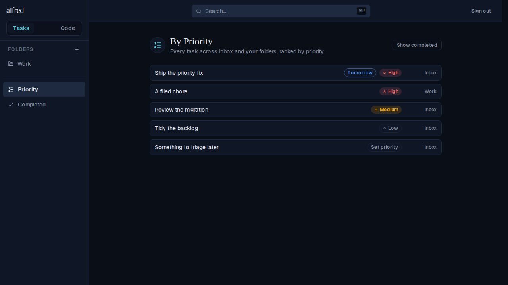

# Fix: non-root tasks pages crashed on a missing priority

*2026-06-25T01:43:46.670Z*

**Symptom.** After ALF-37 merged, every non-root tasks route — `/priority`, `/folders/:id`, `/completed`, and the inbox list (`/?view=inbox`) — failed with a Vercel error page ("This page couldn't load"). The browser console showed the real throw:

> Uncaught TypeError: Cannot destructure property 'label' of '(0 , priorityOption)(...)' as it is undefined

The code module and the bare landing (`/`) worked, because only the views that render a task list reach the priority chip.

**Root cause (data).** `getAllItems()` reads the `task_items` view (`select i.* from items`). PostgreSQL freezes a view's `select *` column list at CREATE time, so columns ADDed to `items` afterwards never appear in the view. `task_items` was created in 0002 — long before `recurrence` (0006) and `priority` (0010) — so it never carried them. Every task came back with `priority` = `undefined` (the key was absent), which slipped past the `!== null` chip guard and destructured an option that wasn't there.

**Fix.** Two parts: (1) make the priority lookup honest — `priorityOption` returns `PriorityOption | undefined` and a new `isPriorityLevel` type guard gates every chip render, so a missing/unknown level degrades to 'unprioritised' instead of crashing; (2) migration 0011 recreates the `task_items` view so `select i.*` re-expands to the current columns (priority + the recurrence columns), restoring the data the feature needs. A real-Postgres assertion now fails if the view ever drops the column again.

The By-Priority view (which previously white-screened) now renders: tasks ranked High → Medium → Low, the unprioritised row showing a 'Set priority' affordance, each labelled with its folder or Inbox.
