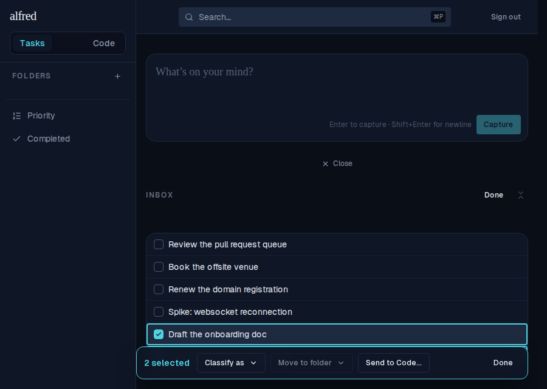
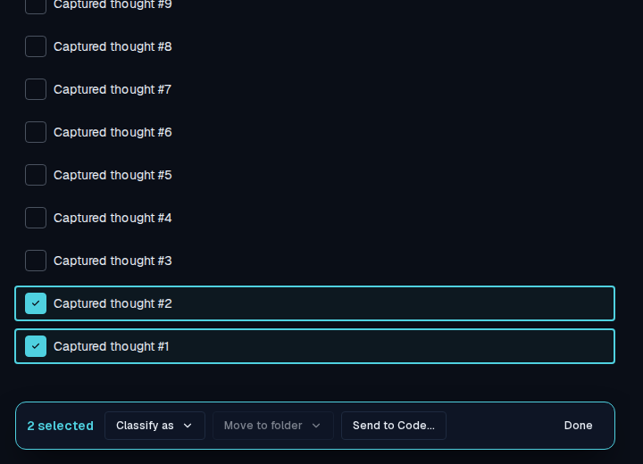

# Inbox bulk-action bar floats at the bottom of the screen

*2026-07-03T16:51:46.187Z*

ALF-91 — the Inbox multi-edit bar used to sit in document flow directly below the task list, so a long selection pushed it off-screen. It is now a fixed, centred pill pinned to the bottom of the viewport: it stays reachable no matter how far the inbox is scrolled, floats above the rows (offset past the desktop sidebar), and its actions are unchanged (Classify as / Move to folder / Send to Code / Done).

Because it is pinned rather than in-flow, the bar stays put while the inbox list scrolls behind it — the reason it is now reachable for any length of selection:

