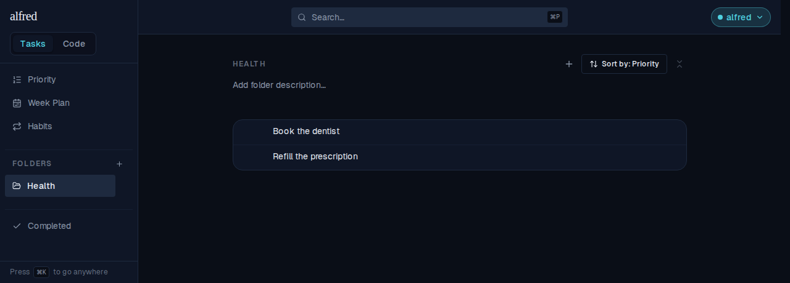
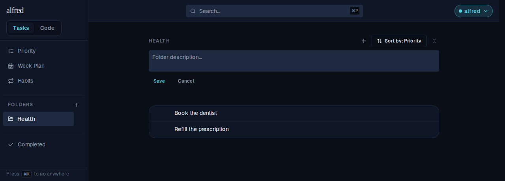
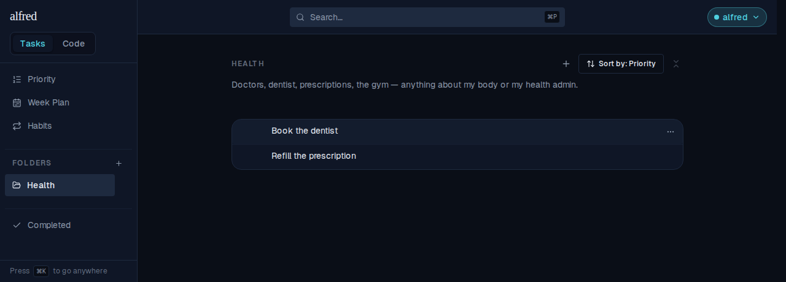
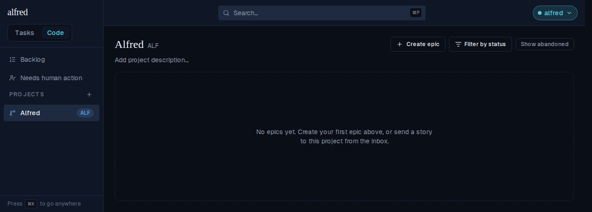
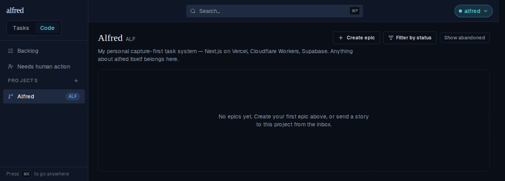
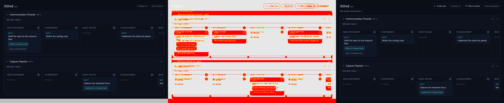
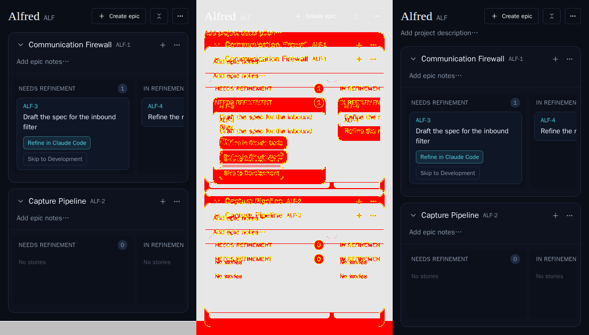

# Folder and project descriptions

*2026-08-08T20:02:20.478Z*

A folder and a project can now carry a **description** — one or two lines, written by the owner, saying what belongs there. It is authored in place from each surface's own header: click the line, it becomes an editor. There is no ⋯ menu entry and no new button, so the `Add …` placeholder is the whole discovery path.

Nothing reads the description yet. It exists so the ALF-158 classifier has more than a bare noun to choose between "Someday" and "Work" — that prompt is a later story.

## 1 · Describing a folder

Every screenshot below is the running app driven through Playwright against the in-memory Supabase backend — the real route handler, the real store, no live database. Starting state: a `Health` folder with two tasks and no description.

**At rest.** The placeholder sits on its own row beneath the header's control cluster (capture ＋, Sort by, Collapse all), which keeps its row and its contents.



**Clicked.** The line is replaced in place by a two-row textarea with Save / Cancel, seeded with the current value (empty here). ⌘↵ saves; Escape and Cancel both restore the display without writing.



**Saved, then reloaded.** The description is a column, not client state — this shot is after a full page reload, so it came back from the server. The tasks below never moved.



## 2 · Describing a project

Same component, same copy pattern, placed under the name/key pair on the board header so the toolbar keeps its own row. The board is full-width, so the line is capped at `max-w-2xl` and wraps rather than running the whole span.



After saving and reloading — the description came back from `projects.description` via the new `PATCH /api/projects/[id]`, which is the first and only writable field a project has (name, key and the repo fields stay immutable).



## 3 · The column, against real PostgreSQL

Migration `0028_entity_descriptions.sql` applied to a throwaway cluster built from `database/migrations/` alone. Both columns are nullable with no default — "undescribed" is a permanently legal state — and each carries the 500-character CHECK that backstops the zod `.max(500)` and the textarea's `maxLength`.

```bash
node docs/demos/folder-and-project-descriptions/describe-columns.mjs
```

```output
folders.description: text, nullable=YES, default=none
projects.description: text, nullable=YES, default=none

stored: Health → "Doctors, dentist, prescriptions, the gym — anything about my body or my health admin."
folders: 501 characters rejected by folders_description_length
projects: 501 characters rejected by projects_description_length
folders: 500 characters accepted
```

## 4 · The board's committed visual baselines move

The board's snapshot target wraps the whole `Board`, header included, so adding the description row shifts four committed baselines down by 28px: `code-board--seeded`, `code-board--mobile-board`, `code-board--with-archived-epic` and `code-board--with-blocked-stories`. That is the intended change, not a regression — here is the auto-emitted 3-panel diff (baseline · changed pixels · received) for the seeded board and for the phone layout, which also shows the toolbar keeping its own row at 390px.





The other two carry the identical 28px shift. All four baselines were regenerated with `npm run test:storybook:update -w frontend` and committed alongside this doc; a new `Code/Board → WithDescription` story adds a fifth baseline showing the described state.
