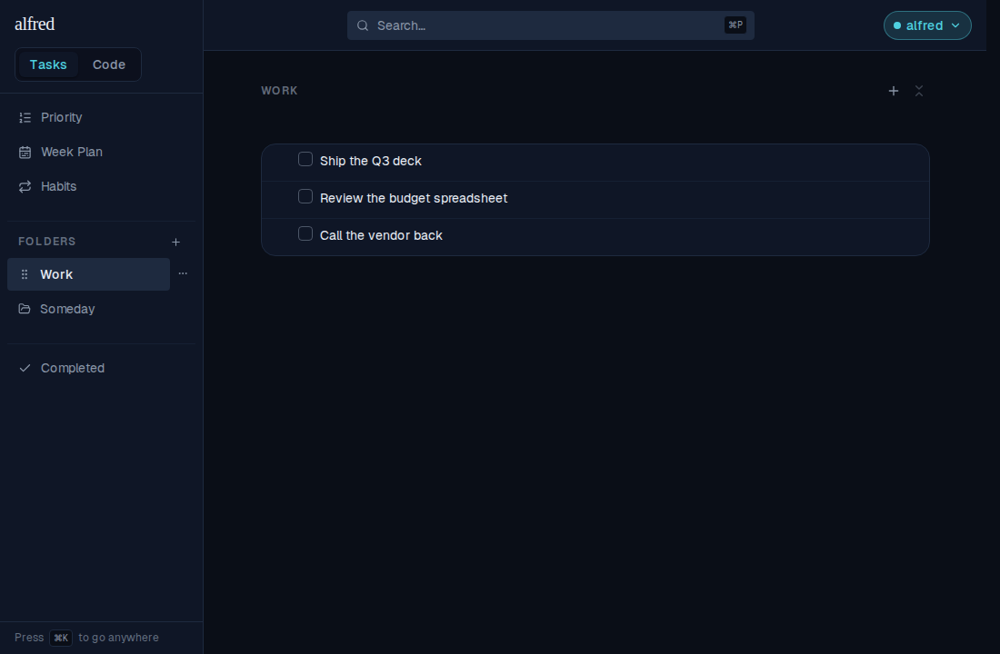
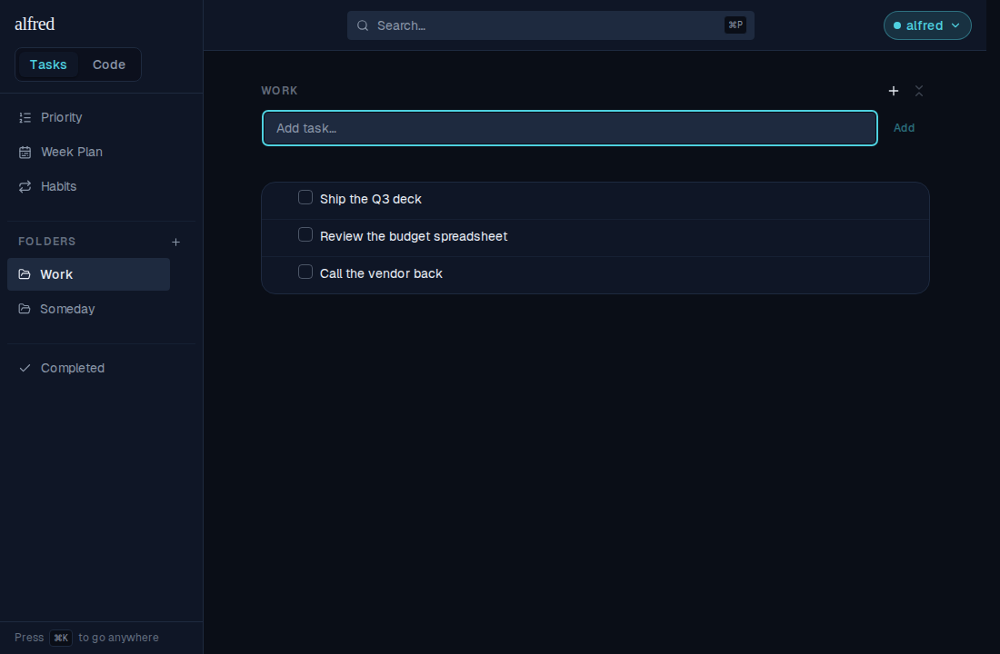
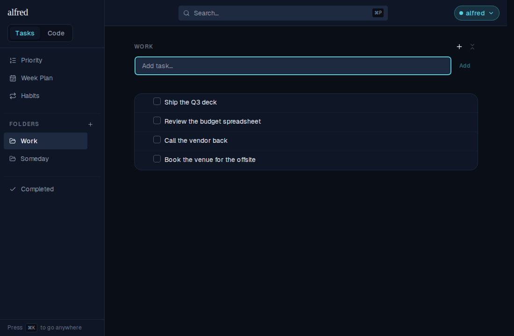
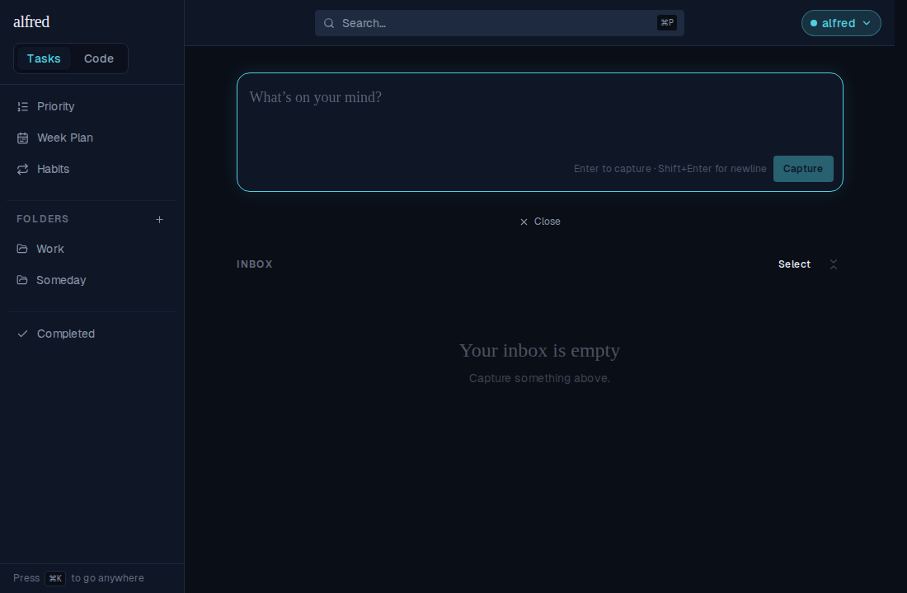
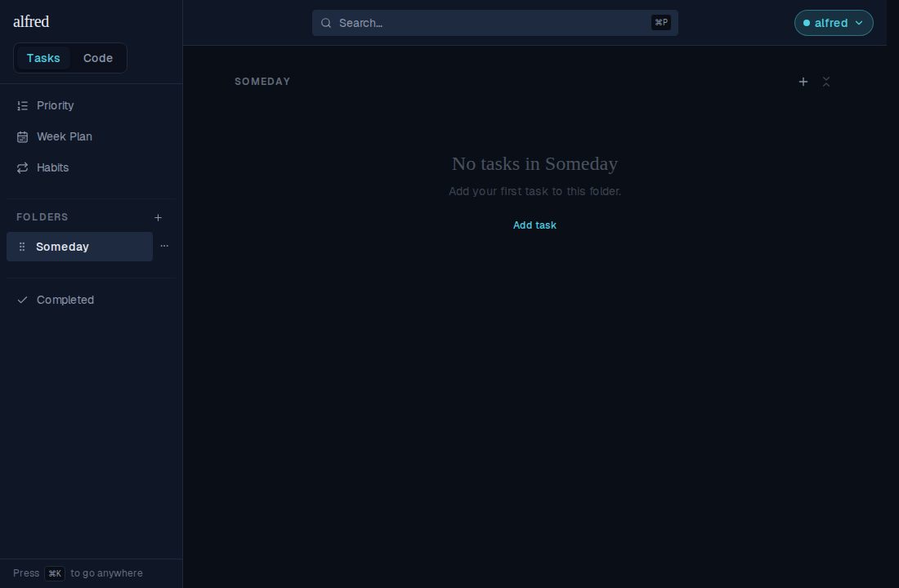
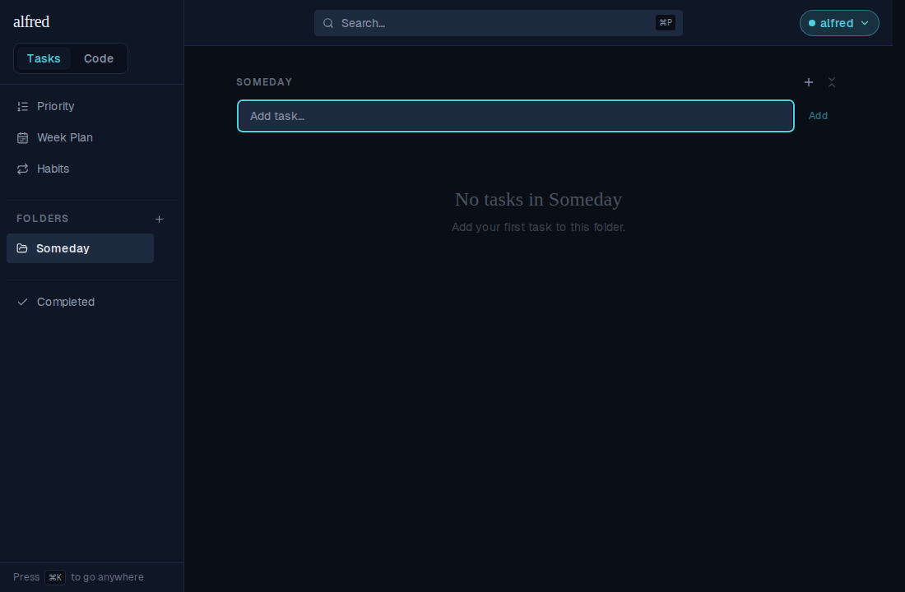
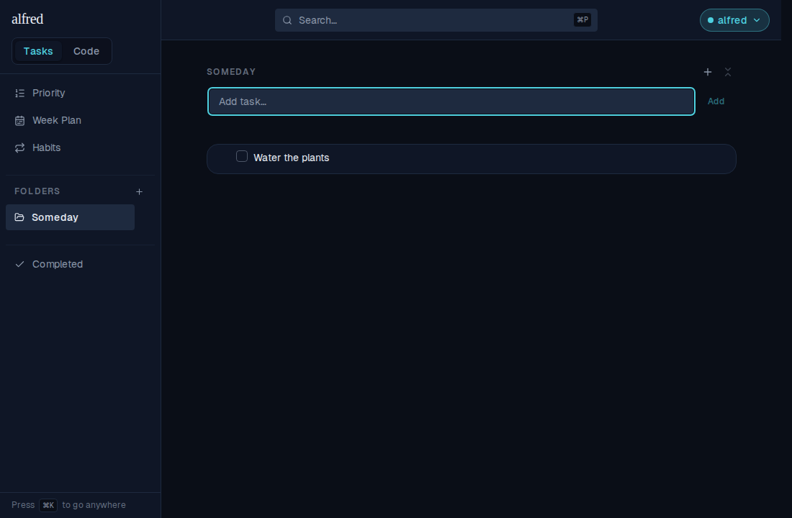

# Create a task from the folder view

*2026-08-07T17:56:41.812Z*

Every task in alfred used to be born in the Inbox: filing a thought you already knew belonged in `Work` meant a trip to `/`, a capture, a walk back to the folder, and a drag. The folder view now has its own capture affordance.

## The folder view, before the "+" is pressed

A "+" sits in the header's right cluster, left of Collapse-all and in the same grey icon-button treatment, so the pair reads as one cluster. It is present at every width.



## Pressing it reveals a compact capture box

The box grows in between the header and the list — the same compact CaptureBox the row-level "Add subtask" affordance renders — and is focused on mount, so the press is the only click needed before typing. Pressing "+" again shrinks it back out.




## Capturing lands the task in this folder

Enter (or "Add") creates the task in the folder being viewed. It takes its natural place in the folder's priority → due date → created_at ranking — with neither a priority nor a due date, that is the end of the list. The box clears and stays open and focused, so several thoughts can be captured in a row.



Note the new row's completion checkbox. That is the visible half of the classification fix: a parentless capture that carries a folder is now created as `item_type: 'task'`, not `'unclassified'`. Completion is task-only, so before this an item created here could never have been ticked off. This is the row the app actually persisted during the run above:

```bash
cat docs/demos/folder-capture/created-row.json
```

```output
{
  "title": "Book the venue for the offsite",
  "item_type": "task",
  "folder_id": "<the Work folder>",
  "parent_id": null,
  "status": "active"
}
```

It was filed, not captured — the Inbox never sees it:



## An empty folder offers its own way in

An empty folder used to read "Capture something above." — copy that is true on the Inbox and false here, where there is nothing above. It now names the folder, points at the action, and offers an "Add task" button that opens the same box the "+" does.



Opening the box withdraws that action — it opens the box already on screen, so leaving it there would be a control that does nothing:



And after the first capture the empty state is gone:


