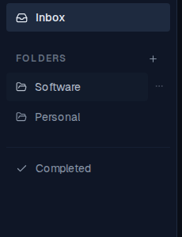
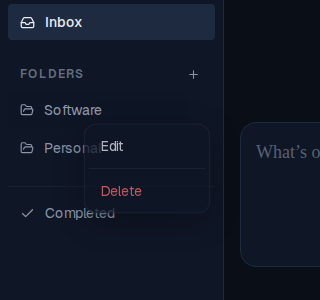
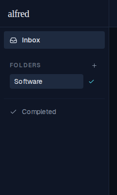

# Folder kebab menu: Edit/Delete dropdown + rename form fix

*2026-06-13T04:35:04.233Z*

Previously the folder nav showed a rename button (MoreHorizontal) and a separate trash/delete button on hover. Two problems: (1) the delete button was always visible on hover instead of being in a menu, and (2) the checkmark confirm button for the rename form was cut off at the sidebar's right edge.

**Fix 1 — dropdown menu.** Hovering a folder now reveals a single kebab button (MoreHorizontal). Clicking it opens a Radix DropdownMenu with Edit and Delete items. Edit opens the inline rename form; Delete removes the folder. The separate, always-visible delete button is gone.

Hover a folder row — the single kebab  button appears at the right edge:

Clicking the kebab opens the menu with Edit and Delete:

**Fix 2 — rename form fully visible.** The rename form overflowed the sidebar because the `<form>` and `<input>` flex items lacked `min-w-0`, causing the browser's default input min-width (~209px) to push the form beyond the sidebar's 207px content area. Added `min-w-0` to both the form and the TextField so the input can shrink to fit. The confirm checkmark is now fully within the sidebar:

