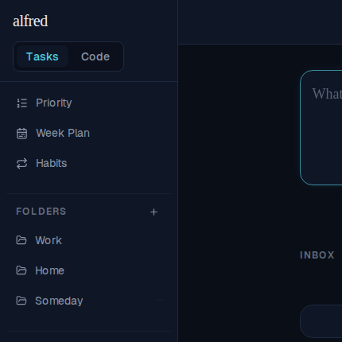
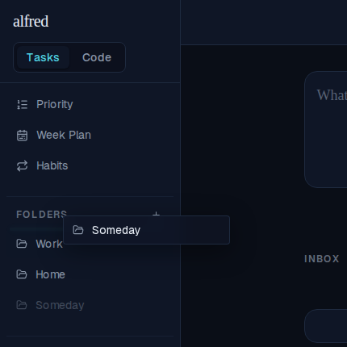
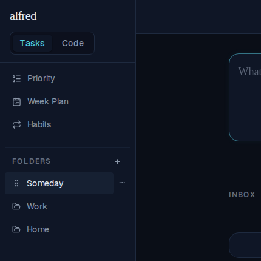
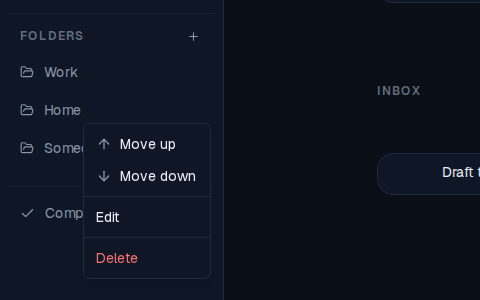
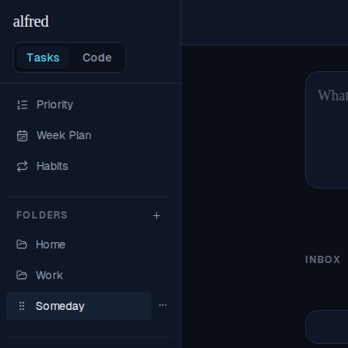
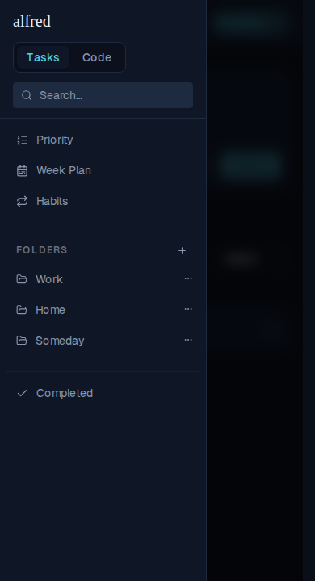
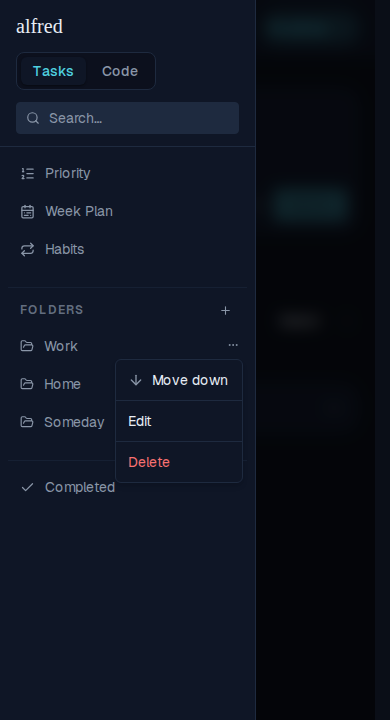

# Reorder task folders — drag on desktop, row menu everywhere (ALF-153)

*2026-07-29T18:02:27.312Z*

The sidebar folder list was fixed in creation order — the only way to move a folder was to delete and recreate it. It now carries a manual rank (folders.sort_order, the same fractional-midpoint grammar subtasks use), rearranged two ways: dragging a row's grip into the gap between two folders, or the row menu's Move up / Move down.

## Drag a folder into a new slot

Three folders in creation order: Work → Home → Someday. Hovering a row swaps its folder icon for a drag grip — no extra gutter, so the list is unchanged until you reach for it. (The grip sits outside the folder link, so pressing it starts a drag instead of navigating.)

Dragging "Someday" up: thin, layout-neutral drop strips sit at each folder boundary, and hovering one reveals a teal insertion line marking the target slot — while dropping on a folder row still means "file this task here", the gesture it has always had. The dragged row lifts as a translucent ghost under the cursor and dims in place beneath it.

Dropping in that gap sets a fractional sort_order from its neighbours (at the top edge there is only one, so the folder lands one rank ahead of it) — one row UPDATE, no renumber. This screenshot is taken AFTER a full page reload: the new order is stored, not client state.

## The pointer-free path: Move up / Move down

Every folder's row menu now leads with Move up / Move down — the deterministic, keyboard- and screen-reader-friendly path, and the only one on touch. Each entry is hidden at the end of the list it can't travel toward (the first folder offers no Move up, the last no Move down), so the middle folder here shows both. Each swaps the folder past one neighbour using the same fractional-midpoint math as a gap drop.

"Move up" on Home lands it above Work — the list re-sorts immediately, before the server responds, and rolls back with a toast if the write fails.

## On mobile, the menu is the reorder path

There is no hover on touch, so in the hamburger drawer each folder's ⋯ button is permanently visible (at desktop widths it still waits for the row hover). The drag grip is desktop-only — it never appears here.

Opening it gives the same reorder entries, so a folder can be moved on a phone with no drag gesture at all.

