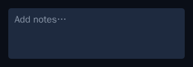
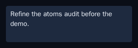
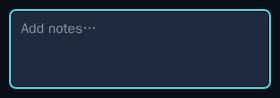
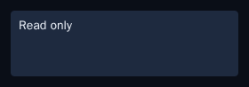

# Phase 1 atoms — Storybook snapshot baselines

*2026-06-20T02:10:36.114Z*

The Phase 1 atoms consolidation (SPEC §1.0) extracted two new shared primitives — `CheckboxButton` (the task-row completion checkbox, now its own atom) and `Textarea` (the shared textarea that `TextareaField` composes). Both ship visual-test stories, but their image-snapshot baselines were never committed because Storybook snapshots couldn't run in the container where Phase 1 was implemented. That left `check:slow` red: `test-storybook --ci` fails on a missing baseline rather than writing one.

Fix: generated the eight missing baselines through the pinned Docker renderer (`npm run test:storybook:update -w frontend`) — never natively, so they stay arch-portable (storybook skill §7). The 34 pre-existing baselines all still pass unchanged; only the two new atoms' snapshots were written. The committed baselines:

```text
ls frontend/__image_snapshots__ | grep -E 'checkboxbutton|textarea'
```

```output
atoms-checkboxbutton--checked.png
atoms-checkboxbutton--focused.png
atoms-checkboxbutton--unchecked.png
atoms-textarea--default.png
atoms-textarea--disabled.png
atoms-textarea--focused.png
atoms-textarea--unstyled.png
atoms-textarea--with-value.png
```

**CheckboxButton** — unchecked (empty bordered box, task-row resting state), checked (teal fill + check), focused (teal `focus-visible` ring):


**Textarea** — default (placeholder), with value, focused (teal ring), disabled (dimmed), and unstyled (transparent — the chrome-less variant the capture box owns):










