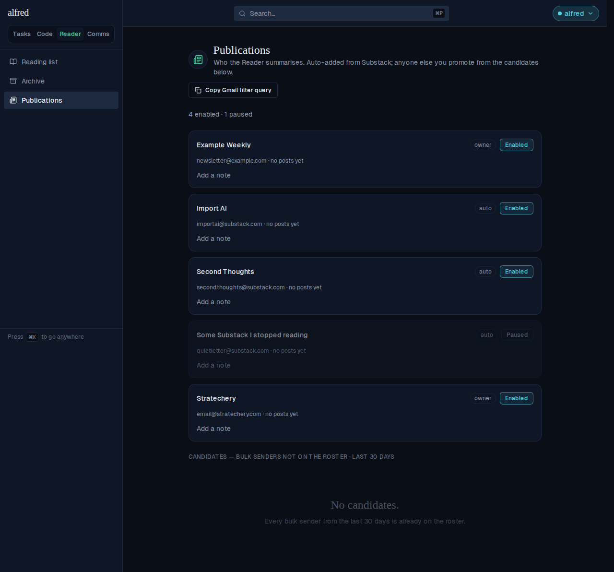
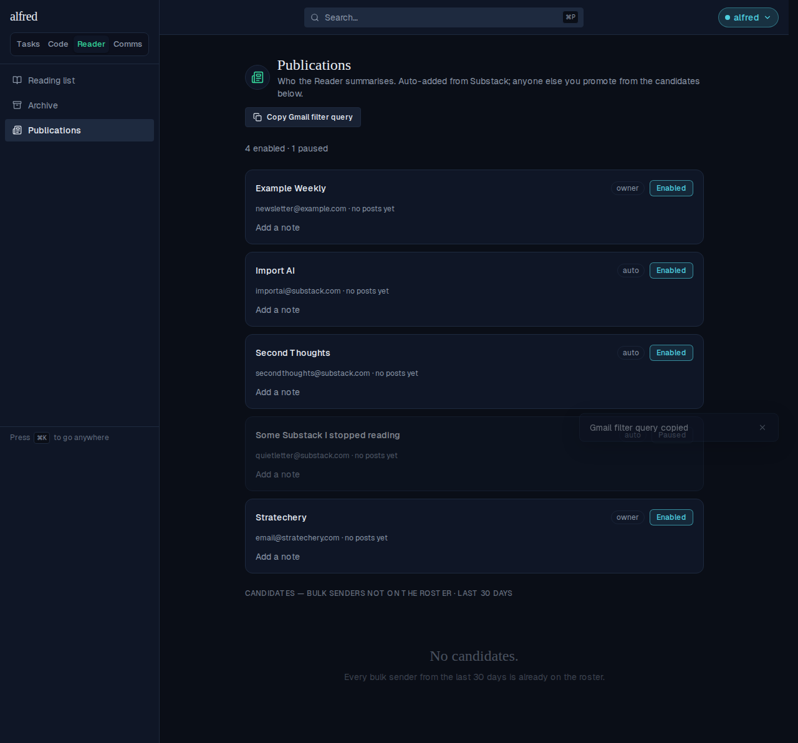

# Gmail filter copy-paste: no from: prefix, substack wildcard, domain-sorted

*2026-09-23T03:42:09.574Z*

ALF-247: the "Copy Gmail filter query" button on the publications roster (`/reader/publications`) changes shape three ways. (1) It no longer carries a `from:` prefix — Gmail's create-filter dialog already scopes its "From" field to `from:`, so pasting `from:(...)` there doubled it into `from:from:(...)`. (2) Every enabled Substack handle now collapses into one wildcard clause, `*@substack.com AND -no-reply@substack.com`, instead of being listed one address at a time — the exclusion keeps Substack's own weekly stats digest out of the archive rule. (3) Every other publication keeps its exact handle, ordered alphabetically by the full address, with the wildcard clause always trailing after them — confirmed against a real, hand-built filter that Gmail's parser misreads the wildcard clause as the leading term of an OR chain if it comes first.

The roster below mixes 4 enabled publications (two Substack senders, and two on their own custom domains) with one paused Substack sender, to exercise every rule at once.



Clicking "Copy Gmail filter query" copies the query and toasts confirmation.



The toast doesn't show the copied text (a clipboard write is invisible), so this reads the browser's real clipboard back through the same Playwright session right after the click above — captured verbatim, this is exactly what a paste into Gmail's "From" field receives:

```bash
cat docs/demos/gmail-filter-copy-paste/copied-query.txt
```

```output
email@stratechery.com OR newsletter@example.com OR *@substack.com AND -no-reply@substack.com
```
