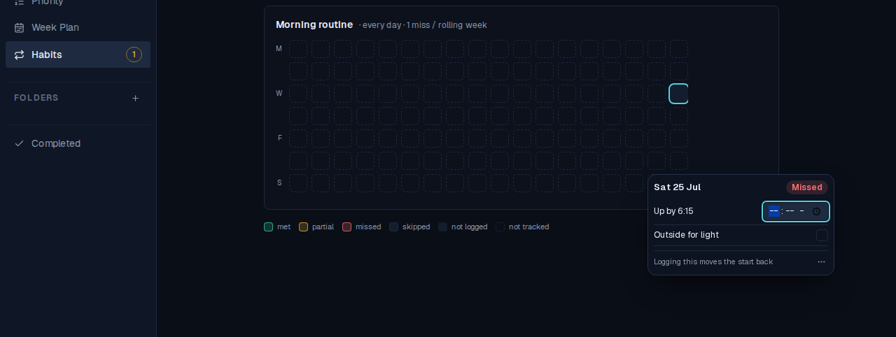
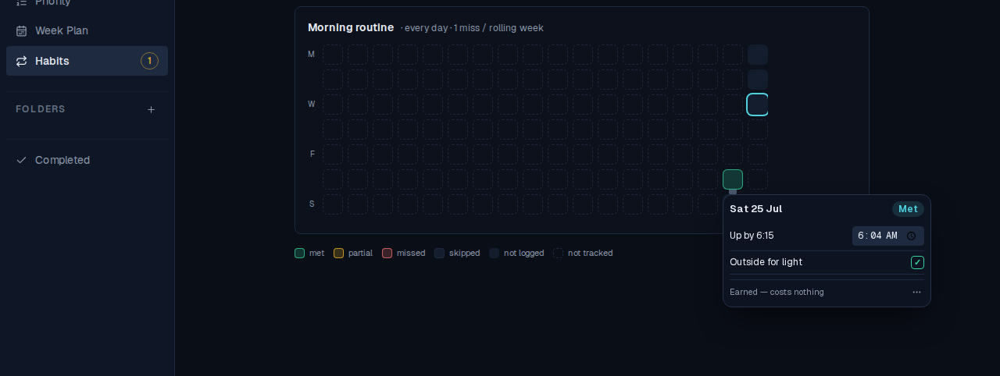
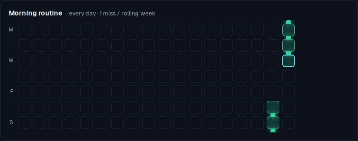

# Backfilling a habit day behind its start date

*2026-07-29T17:13:22.533Z*

Past days in the habit grid were already clickable — but only the ones on or after the habit's `started_on`. Define a habit today over a routine you have been keeping for a week and every day worth filling in sits behind that start: greyed out, out of the tab order, and rejected by the API with `400 Cannot log a day before the habit started`. Which reads, from the owner's chair, as "clicking past days does nothing".

Now a pre-start day is offered like any other, and filling it moves the habit's start back to it — the owner is entering history they actually kept, so the definition follows the evidence.

## 1. A habit defined today, over a routine already running

"Morning routine" — up by 6:15 and outside for light, every day, one forgiven miss per rolling week — started today. Everything behind today is dashed: not tracked, and until this change not reachable either.


## 2. Tapping last Saturday opens it, and says what filling it costs

The cell four days back now carries a button — named `Saturday 25 July — before this habit started. Log it to start the habit here` — and opens the same derived-only editor every other day uses. The footer names the consequence where an ordinary day names its allowance cost, because the start move is the bigger one and the owner has no other way to learn it.



## 3. Recording it moves the start, live

Up at 06:04 and outside: the header re-derives to **Met**. The store applies the same start-move rule the route does, so the grid repaints on the tap — the day is green, the days between it and the old start have stopped being dashed and are now unlogged days of a habit that was running, and the footer has already flipped to the ordinary "Earned — costs nothing".



## 4. The rest of the week, and it survives a reload

The four remaining days filled the same way, then a hard reload that re-reads everything from the database. A five-day chain — connectors, Sunday→Monday wrap stub and all — built entirely out of days the habit had not officially started on.



## 5. The same rule on the keyed path the coach uses

`PUT /api/habits/[id]/entries` takes the ingest key as well as a session, so the productivity coach and a Siri Shortcut log through it. It used to answer a pre-start date with `400`; now it writes the day and moves the start. The entry is written **first** on purpose: a stored entry the habit has not reached yet is invisible and re-logging fixes it, whereas a start moved with no entry behind it turns the days in between into unlogged ones that spend allowance — a broken chain bought for nothing.

```bash
cd frontend
# Boot the app against the in-memory Supabase backend the e2e suite uses — real route
# handler, real Supabase client, no live database. Next inlines NEXT_PUBLIC_* at BUILD
# time, so the build has to happen after the mock's URL is exported, not before.
export MOCK_SUPABASE_PORT=54333 INGEST_API_KEY=demo-ingest-key
export NEXT_PUBLIC_SUPABASE_URL=http://localhost:54333 \
       NEXT_PUBLIC_SUPABASE_ANON_KEY=sb_publishable_mock \
       SUPABASE_SERVICE_ROLE_KEY=sb_secret_mock
npm run build >/dev/null 2>&1
node scripts/mock-supabase.mjs >/dev/null 2>&1 & MOCK=$!
npm run start -- -p 3012 >/dev/null 2>&1 & APP=$!
# `npm run start` spawns next-server as a child, so kill the child too or it outlives the
# block and holds the port.
cleanup() { pkill -P "$APP" 2>/dev/null; kill "$APP" "$MOCK" 2>/dev/null; }
trap cleanup EXIT
until curl -sf localhost:54333/__mock__/health >/dev/null 2>&1; do sleep 0.2; done
until curl -s -o /dev/null localhost:3012/login 2>/dev/null; do sleep 0.5; done

KEY="x-api-key: demo-ingest-key"
HABIT=6f1a2b3c-4d5e-6f70-8192-a3b4c5d6e7f8
day() { date -u -d "$1 days ago" +%F; }
# Every date is relative to whenever this runs, so the captured output masks them back and
# the doc re-verifies on any day. Ids and timestamps are projected out for the same reason.
mask() { sed -e "s/$(day 0)/<today>/g" -e "s/$(day 4)/<today-4>/g" -e "s/$(day 3)/<today-3>/g" \
             -e "s/$(day 2)/<today-2>/g" -e "s/$(day 1)/<today-1>/g"; }
pick() { node -e '
let raw = "";
const keep = process.argv[1].split(",");
process.stdin.on("data", (chunk) => (raw += chunk)).on("end", () => {
  const body = JSON.parse(raw);
  const source = body.habits === undefined ? body : body.habits[0];
  const out = {};
  for (const key of keep) out[key] = source[key];
  console.log(JSON.stringify(out, null, 2));
});' "$1"; }

# The same shape as the screenshots: a habit defined TODAY over a routine already kept.
cat <<JSON | curl -sf -X POST -H "Content-Type: application/json" --data-binary @- localhost:54333/__mock__/seed >/dev/null
{"habits":[{"id":"$HABIT","name":"Morning routine","allowance":1,"started_on":"$(day 0)",
  "criteria":[{"key":"wake","label":"Up by 6:15","kind":"time","target":375,"comparator":"lte"},
              {"key":"light","label":"Outside for light","kind":"boolean"}]}]}
JSON

echo "PUT a day four days behind started_on — the call that used to 400:"
curl -s -X PUT "localhost:3012/api/habits/$HABIT/entries" -H "$KEY" \
  -H 'Content-Type: application/json' \
  -d "{\"date\":\"$(day 4)\",\"results\":{\"wake\":364,\"light\":true}}" \
  | pick entry_date,status,results | mask

echo
echo "GET /api/habits — started_on has followed the evidence back:"
curl -s "localhost:3012/api/habits?from=$(day 6)" -H "$KEY" \
  | pick started_on,stats,entries | mask

echo
echo "A day in the future is still refused — the start only ever moves backwards:"
curl -s -X PUT "localhost:3012/api/habits/$HABIT/entries" -H "$KEY" \
  -H 'Content-Type: application/json' \
  -d '{"date":"2099-01-01","results":{"light":true}}'
```

```output
PUT a day four days behind started_on — the call that used to 400:
{
  "entry_date": "<today-4>",
  "status": "met",
  "results": {
    "wake": 364,
    "light": true
  }
}

GET /api/habits — started_on has followed the evidence back:
{
  "started_on": "<today-4>",
  "stats": {
    "current_streak": 0,
    "longest_streak": 1,
    "average_streak": 1,
    "allowance_remaining": 0,
    "hit_rate": 1,
    "met_days_total": 1,
    "stage": "fully_deliberate",
    "met": 1,
    "partial": 0,
    "missed": 0,
    "skipped": 0,
    "unknown": 4
  },
  "entries": [
    {
      "date": "<today-4>",
      "status": "met",
      "results": {
        "wake": 364,
        "light": true
      },
      "note": null
    }
  ]
}

A day in the future is still refused — the start only ever moves backwards:
{"error":"Cannot log a day in the future"}
```

Note the four `unknown` days and the `current_streak: 0` in that payload — the honest cost of the rule. Backfilling one day four days back makes the three days between it and today part of the habit's life, and with an allowance of one they break the chain until they are filled in too. That is why the editor names the move before you record anything, and why the screenshots above go on to fill the whole run.

## What is not in scope

A day off the habit's weekday set stays unreachable — a Saturday on a weekdays-only habit is not a day the habit was ever running, and no start date makes it one. So do future days, and days after a habit was archived.
