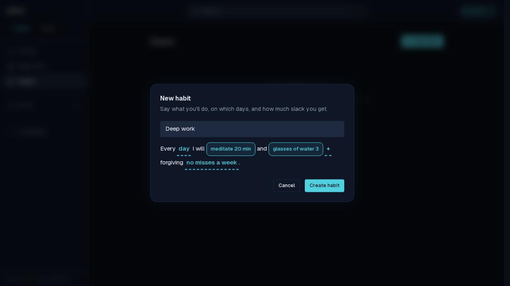
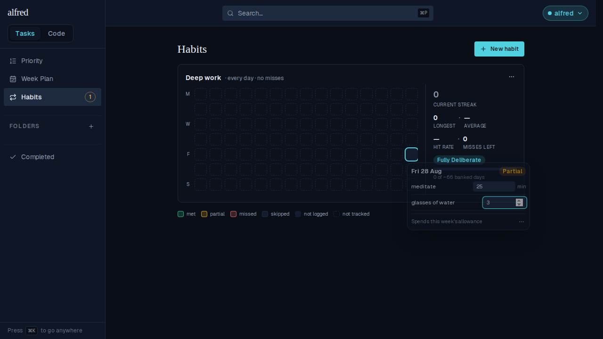

# A habit's duration says the minutes it is counted in (ALF-160)

*2026-08-28T14:50:50.979Z*

A `duration` criterion is stored as plain minutes — nothing on the number itself says so. A `count` gets away with that because its unit lives in the label its owner wrote ("3 glasses"); a duration read back as a bare `20` could be minutes, hours or reps. Every place a duration is shown or typed now carries `min`.

**Defining one.** The target field in the criterion popover is captioned with its unit, so the number is typed against a stated scale rather than a guess.

**The sentence.** The saved chip reads `meditate 20 min`. The count criterion beside it stays bare — `glasses of water 3` already says what it counts, and captioning it again would be noise.

**Logging a day.** The same caption rides the day editor's field, on the duration row only. It is a caption, not content: the field still commits the bare number (`25`), and the unit is wired to the input's `aria-describedby`, so a screen reader announces it with the value instead of leaving it to the sighted reader alone. A day's spoken summary carries it too — the grid cell above now reads "… meditate: met (25 min)".

