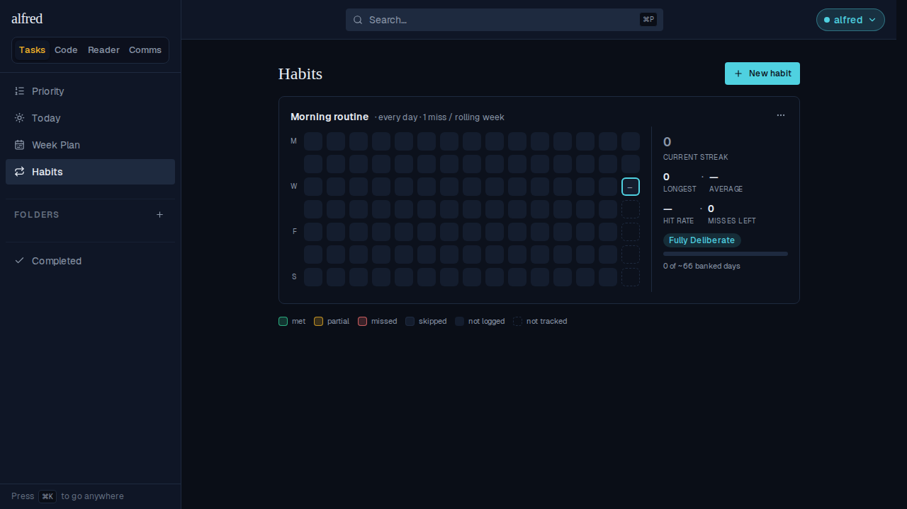
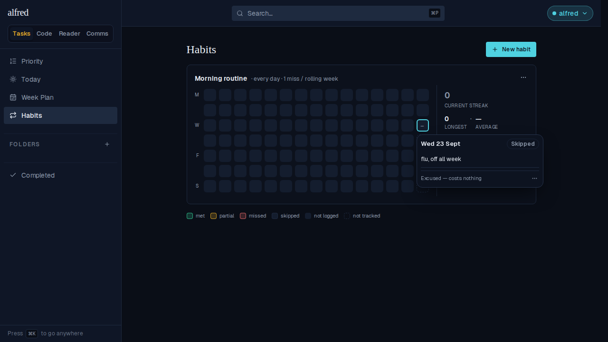

# Skipped habit days show their reason in the day editor

*2026-09-23T03:58:01.936Z*

ALF-225: tapping an already-skipped habit day used to reopen the day editor with the Skipped badge but no sign of *why* the day was excused — the reason typed into the skip confirm step (stored as the entry's `note`) only ever reached the grid cell's tooltip/accessible name, never the popover body. This threads that reason into `DayEditor` and, since the criteria never produced a skipped verdict in the first place, replaces the (always-blank) criteria checkboxes with the reason text when a day is excused.

Seeded through the real stack (Supabase mock, real store, real API routes): a habit with today already logged as `skipped`, reason `flu, off all week`.

Before: the grid, with today's dash (–) marking the skipped, excused day. Its reason is invisible here.

After: tapping that day opens the detail view. It says Skipped, and now shows the reason — 'flu, off all week' — in place of the (never-derived) criteria rows, with no other change to the footer's 'Excused — costs nothing' line.

Covered by unit tests too: `day-editor.test.tsx` pins the reason rendering and the criteria-hiding behavior, plus the defensive case of a skipped day with no reason recorded (an API-key write can send `note: null`); `history-grid.test.tsx` pins that the reason threads through from the store's entry into the opened editor.
