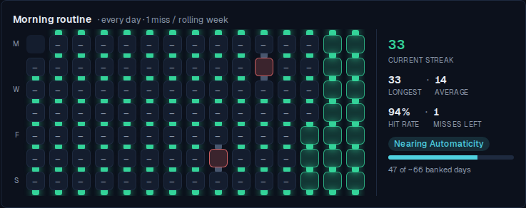
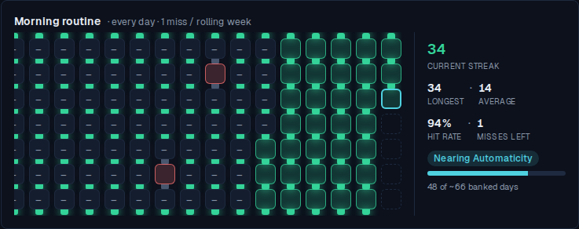
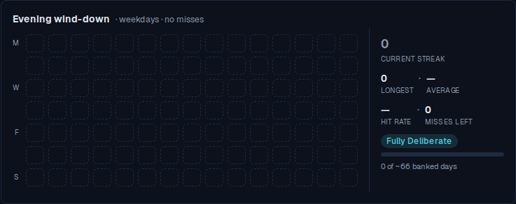
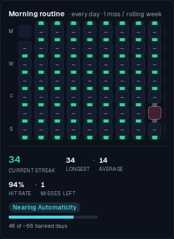
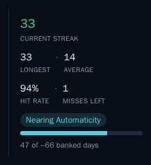
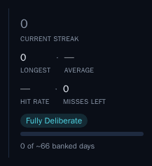
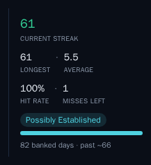

# The habit stats rail

*2026-07-29T17:52:07.481Z*

Six figures beside each habit's history grid, plus the formation badge and its meter. Three of the six are all-history figures, so they come from a server-computed baseline seeded alongside the 120-day window of entries the client holds — the rail nudges that baseline as the owner edits days, and a reload replaces every nudge with the server's own answer.

## A habit with real history

`Morning routine` was seeded with 200 days of history: a 14-day run, a break, a long excused stretch carrying two forgiven misses, then 33 unbroken met days up to yesterday. 47 met days in all — but only 33 of them sit inside the window the client holds.

Every figure is the true all-history one. Walking only the seeded window would report **33** banked days rather than 47, an average of **—** rather than 14 (the 14-day run ended 187 days ago, outside the window), and would demote the badge a whole rung to *Gaining Momentum*. The two window figures — hit rate and misses left — are derived from exactly the span the grid draws, so 94% can be counted off the squares beside it.

## Logging today moves the rail in the same frame

Today's cell was opened and both criteria recorded — no reload, no refetch, no `router.refresh()` between this shot and the one above.

The current streak went 33 → 34 and the caption 47 → 48 banked days, alongside the cell the tap painted. Both moved by exactly the amount the edit moved the window walk: the rail re-walks the window twice — once over the entries as seeded, once over them as they are now — and splices the difference onto the server's baseline. Re-walking rather than applying a delta is what lets a *correction* in the middle of a run break the streak, not only an addition extend it.

## A habit with nothing banked yet

`Evening wind-down` was defined today. Three of the six figures have no value to show, and each renders an em dash rather than a zero — "no runs have ended yet" and "an average of zero" are different claims. It is also a strict habit (allowance 0), and it still shows misses left, at 0: the six figures are non-optional, and a rail whose shape changes per habit is harder to scan than a constant zero.

## On a phone

Below the `sm` breakpoint the rail wraps under the grid and its left rule becomes a top rule. The vertical stack that keeps a wide card one band tall has nothing to buy here, so the first row carries three figures rather than one. The grid keeps its own horizontal scroll either way, so a long history can never push the numbers off-screen.

## The committed Storybook baselines

Three new image baselines pin the states the eye has to tell apart. No existing baseline moved — the card's flex change is additive, and the grid's own stories render the grid alone.

`habits-statsrail--established` — the state above, in isolation.

`habits-statsrail--brand-new` — the em-dash state, where the meter's track is empty.

`habits-statsrail--past-the-marker` — a full meter, and a caption that stops counting toward the marker and starts counting past it. The tilde stays: 66 is the median of a range wide enough that a confident number would be a claim the evidence doesn't support.

