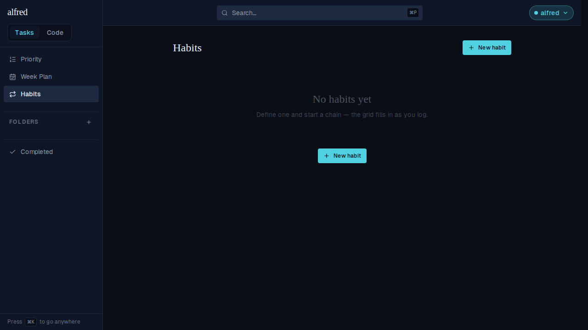
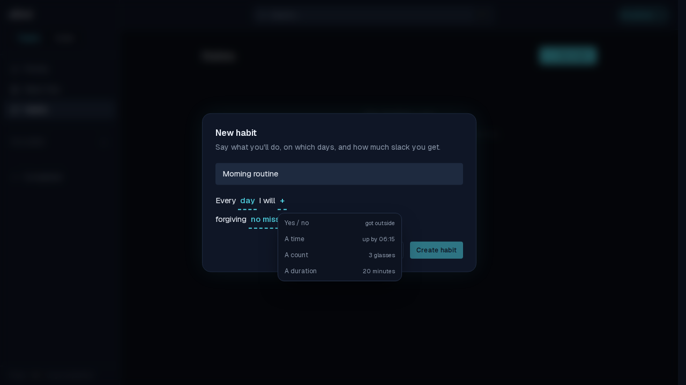
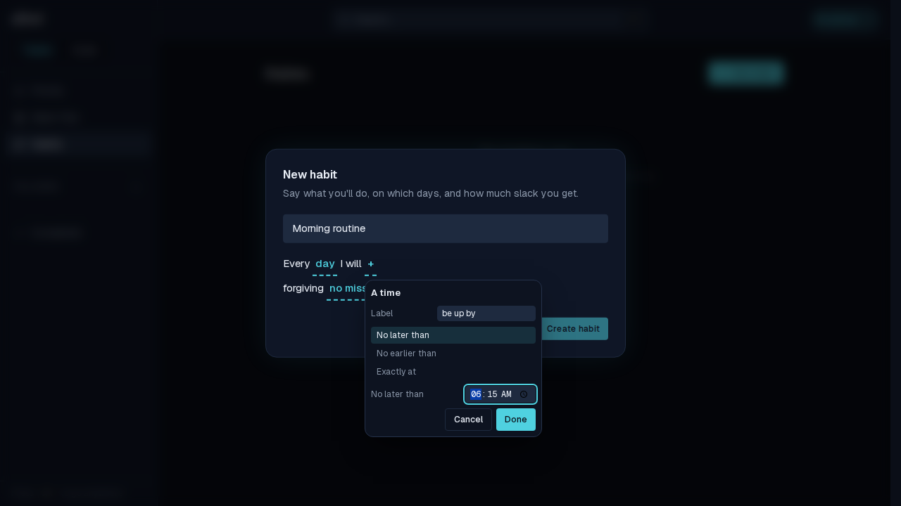
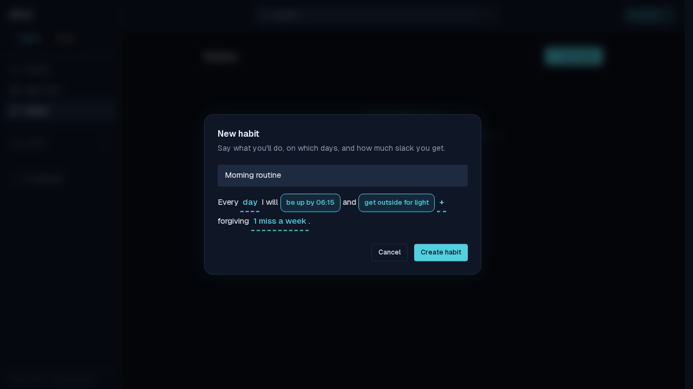
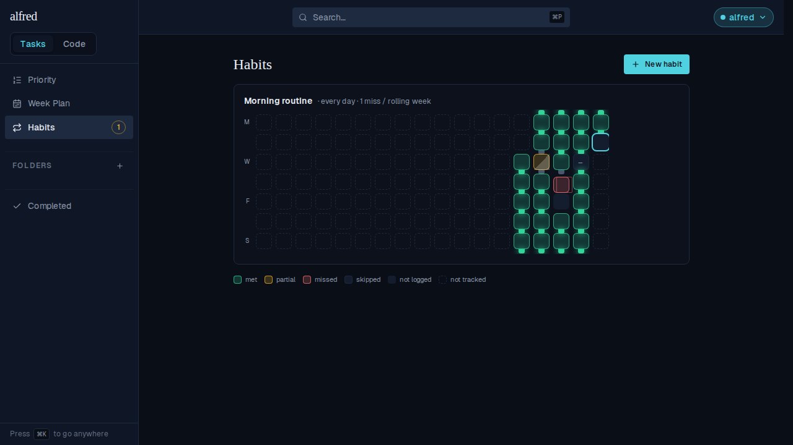
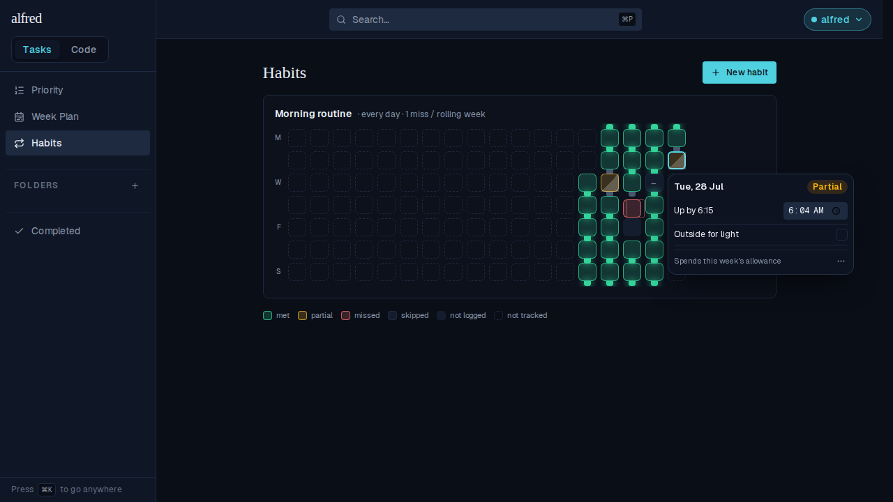
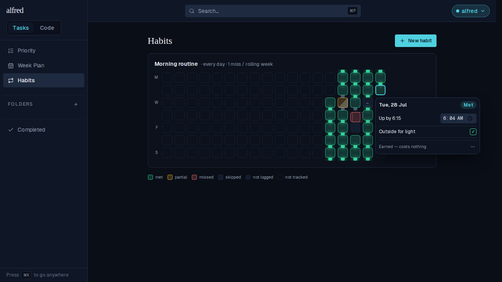
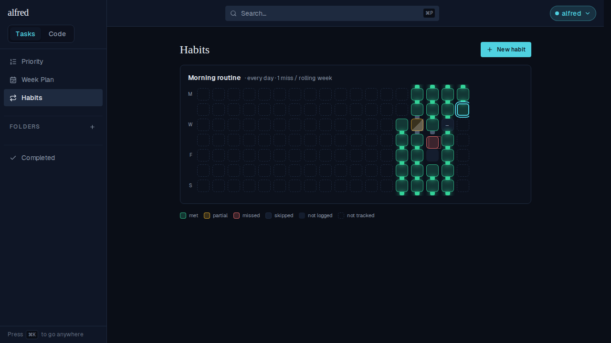
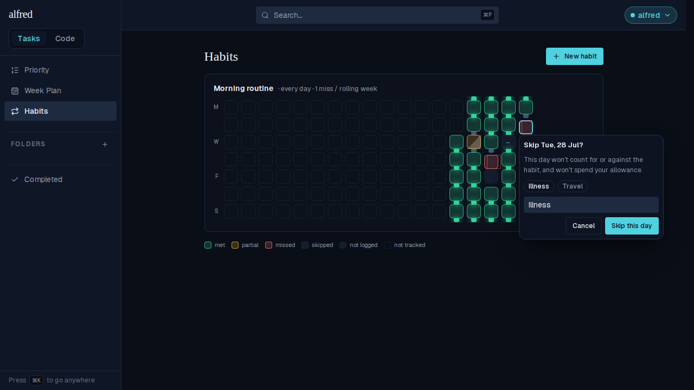

# Habit tracker: define a habit, log a day, watch the chain

*2026-07-28T18:04:52.683Z*

ALF-147 lands the habit tracker's walking skeleton: a habit you can define in the app, a day you can log or excuse, and a chain that draws the streak rules rather than restating them.

## The schema the migration builds

`describe` stands up a throwaway Postgres, applies every committed migration in production's order, and prints what came out — so this is 0023 actually applying, not a reading of the SQL.

```bash
npm run describe -w database -- habits habit_entries 2>/dev/null
```

```output

> database@0.0.0 describe
> node src/describe.ts habits habit_entries

habits
  id           uuid not null default gen_random_uuid()
  name         text not null
  notes        text
  criteria     jsonb not null
  active_days  ARRAY not null default '{1,2,3,4,5,6,7}'::smallint[]
  allowance    smallint not null default 0
  started_on   date not null default CURRENT_DATE
  archived_at  timestamp with time zone
  sort_order   integer
  created_at   timestamp with time zone not null default now()
  constraint habits_active_days_valid: CHECK (((active_days <@ ARRAY[(1)::smallint, (2)::smallint, (3)::smallint, (4)::smallint, (5)::smallint, (6)::smallint, (7)::smallint]) AND (cardinality(active_days) >= 1)))
  constraint habits_allowance_range: CHECK (((allowance >= 0) AND (allowance <= 7)))
  constraint habits_criteria_non_empty: CHECK (((jsonb_typeof(criteria) = 'array'::text) AND (jsonb_array_length(criteria) >= 1)))
  constraint habits_pkey: PRIMARY KEY (id)
  CREATE UNIQUE INDEX habits_pkey ON public.habits USING btree (id)
  row level security: enabled
  policy "authenticated full access" to authenticated
  grant DELETE, INSERT, SELECT, UPDATE to anon
  grant DELETE, INSERT, SELECT, UPDATE to authenticated
  grant DELETE, INSERT, SELECT, UPDATE to service_role

habit_entries
  id          uuid not null default gen_random_uuid()
  habit_id    uuid not null
  entry_date  date not null
  status      habit_day_status not null
  results     jsonb
  note        text
  created_at  timestamp with time zone not null default now()
  updated_at  timestamp with time zone not null default now()
  constraint habit_entries_habit_id_entry_date_key: UNIQUE (habit_id, entry_date)
  constraint habit_entries_habit_id_fkey: FOREIGN KEY (habit_id) REFERENCES habits(id) ON DELETE CASCADE
  constraint habit_entries_pkey: PRIMARY KEY (id)
  CREATE INDEX habit_entries_habit_date_idx ON public.habit_entries USING btree (habit_id, entry_date DESC)
  CREATE UNIQUE INDEX habit_entries_habit_id_entry_date_key ON public.habit_entries USING btree (habit_id, entry_date)
  CREATE UNIQUE INDEX habit_entries_pkey ON public.habit_entries USING btree (id)
  row level security: enabled
  policy "authenticated full access" to authenticated
  grant DELETE, INSERT, SELECT, UPDATE to anon
  grant DELETE, INSERT, SELECT, UPDATE to authenticated
  grant DELETE, INSERT, SELECT, UPDATE to service_role
```

## Defining a habit

`/habits` starts empty, with the only two ways in: the header button and the empty state's own.



The create form is one editable sentence. Its `+` is kind-first: a menu naming what a criterion can *be*, with an example each…



…and only then the fields that kind needs — no irrelevant field is ever on screen.



The finished sentence reads back what it will create: **Every day I will be up by 06:15 and get outside for light, forgiving 1 miss a week.** Every underlined slot is a real button with its own label, reachable by keyboard in reading order.



## The chain

Weekdays down, ISO weeks across. The sidebar carries a **1** — today is scored and not yet logged.



Close up, the connectors are the streak walk made visible. A forgiven `partial` keeps the run alive but its links either side go **grey**; the `missed` day below it is followed by an unlogged one, and two spent days in one rolling week exceed the allowance, so **nothing crosses** — the run restarts underneath. The `skipped` day (the dash) costs nothing, so its links stay **lit**. Today carries the teal ring.


## Logging a day

Tapping today's cell opens the editor. Recording a 06:04 wake-up passes one of two criteria, so the header derives **Partial** and names what that costs. There is no Save button and no way to type the verdict.



Ticking the second criterion re-derives the header to **Met** — the header is a consequence of the criteria beneath it, so it cannot be made to disagree with them.



Closing the editor leaves today green and the sidebar badge gone.



## Excusing a day

`Mark as skipped…` opens a confirm step rather than skipping. It states the consequence in the owner's terms, offers the two cases the epic names as one-tap prefills, and keeps **Skip this day** disabled until a reason is there — a frictionless skip would be a button that launders a broken streak into an intact one.



The reason is what makes requiring one worth anything, so it rides the cell's accessible name and its tooltip — a skipped day answers "why is this here?" months later without opening anything:

```bash
cat docs/demos/habit-tracker/skipped-cell-name.txt
```

```output
Tuesday 28 July — skipped: flu, off all week
```

## The keyed write

`PUT /api/habits/<id>/entries` takes a session **or** the ingest key, so a Shortcut or the coach can log a morning. The transcript below was captured by driving the real route through the running app (`e2e` harness, mock database) and is replayed here verbatim.

```bash
cat docs/demos/habit-tracker/api-transcript.txt
```

```output
$ curl -X PUT .../api/habits/<id>/entries -H 'x-api-key: …' -d '{"date":"2026-07-27","results":{"wake":364,"light":true}}'
200 {"id":"d51225ef-8ab4-48c2-9186-02922532e991","habit_id":"11111111-1111-4111-8111-111111111111","entry_date":"2026-07-27","status":"met","results":{"wake":364,"light":true},"note":null,"created_at":"2026-07-28T18:01:16.045Z","updated_at":"2026-07-28T18:01:16.043Z"}

$ curl -X PUT … -d '{"date":"2026-07-27","results":{"wake":700,"light":true}}'   # same day, corrected
200 {"id":"d51225ef-8ab4-48c2-9186-02922532e991","habit_id":"11111111-1111-4111-8111-111111111111","entry_date":"2026-07-27","status":"partial","results":{"wake":700,"light":true},"note":null,"created_at":"2026-07-28T18:01:16.045Z","updated_at":"2026-07-28T18:01:16.066Z"}

$ curl -X PUT … -d '{"results":{"wake":700,"light":false},"status":"met"}'
400 {"error":"Invalid request body","details":[{"code":"invalid_value","values":["skipped"],"path":["status"],"message":"Invalid input: expected \"skipped\""}]}

$ curl -X PUT … -d '{"status":"skipped"}'   # no reason
400 {"error":"Invalid request body","details":[{"code":"custom","path":["note"],"message":"Skipping a day requires a non-empty \"note\" — the reason"}]}
```

Four things in that exchange: the server **derives** `met` from the evidence rather than being told it; re-logging the same day returns **the same row id** with the verdict re-derived to `partial`, which is the correction path; an explicitly asserted `met` is a **400**, because a row that reads met while carrying evidence of a miss can never be told apart afterwards; and a reasonless skip is a **400** too, enforced at the route so a keyed caller can't route around the UI.

## Reproducing it

`npm run demo -- verify docs/demos/habit-tracker/habit-tracker.md` re-runs the schema dump and both transcripts. The screenshots come from `frontend/e2e` against the in-memory Supabase mock — no credentials, no live database.
