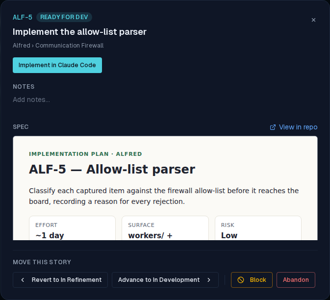

# Refinement produces rich HTML plans, not markdown specs

*2026-06-23T19:36:57.626Z*

Following Claude Code's "unreasonable effectiveness of HTML" guidance, the refinement flow now has the spec-writing agent author a single, self-contained HTML plan instead of a markdown file. The deep-link prompts (frontend/lib/code/links.ts) and the refinement skill (.claude/skills/refinement/SKILL.md) carry the instruction; the spec path moves to docs/specs/<REF>.html; and the story-detail modal renders the snapshot in a sandboxed iframe. The instruction prose stays plain text — only the *artifact the agent produces* becomes HTML.

The REFINEMENT prompt (launched in needs_refinement) now directs a rich HTML plan — real structure, an SVG diagram for data flow, annotated code snippets, a mockup where a UI is involved — saved to docs/specs/<REF>.html. The alfred frontmatter block's spec-path follows. All the existing agentic guardrails (ground in the repo, the clarification gate, the verbatim-block self-check) are intact.

```bash
node --experimental-strip-types --input-type=module -e "import { buildRefinementUrl } from './frontend/lib/code/links.ts'; const u = buildRefinementUrl({ repo_owner: 'ac3charland', repo_name: 'alfred' }, { ref: 'ALF-58', title: 'Add a dark-mode toggle', notes: null }); console.log(decodeURIComponent(new URL(u).searchParams.get('q')));" 2>/dev/null
```

````output
ALF-58: Add a dark-mode toggle

You are refining the ticket ALF-58. Produce a SPEC ONLY — describe the concrete change in enough detail that a later session can build it, but do NOT implement anything yet (no app or source changes).

Author the spec as a single, self-contained HTML plan — NOT a markdown file. Do what Claude Code's "unreasonable effectiveness of HTML" guidance shows: a rich, easy-to-read document a human will actually open and review. Use real structure (headings, sections, tables), an SVG diagram for any data flow or state machine, annotated snippets of the key code a reviewer would want to see, and a small mockup where a UI is involved. Inline all CSS so it opens directly in a browser with no build step or dependencies, and make it easy to read and digest.

1. Ground yourself first: skim the repo and honor its own conventions — read any CONTRIBUTING or CLAUDE.md — and base the spec on the code that already exists.
2. If the title and context don't pin down the scope and acceptance criteria, ASK ME HERE before writing the spec — you don't need to guess, I'm in this tab. Otherwise go ahead.
3. Write the spec following the refinement skill at `.claude/skills/refinement/SKILL.md` (it auto-loads in a refinement session). If it's absent, cover these sections in the HTML: Title, Context/problem, Proposed change, Acceptance criteria, Out of scope / open questions. Save it to `docs/specs/ALF-58.html`.
4. Open a pull request whose description carries this machine-readable block verbatim — a CI check enforces it, so reproduce the fence exactly:

```alfred
alfred-ticket: ALF-58
phase: refinement
spec-path: docs/specs/ALF-58.html
```

5. Before opening the PR, confirm the spec is saved at `docs/specs/ALF-58.html` and the block above is reproduced exactly.
````

The IMPLEMENTATION prompt (launched in ready_for_dev, after the spec PR merged) points at the merged HTML plan at the recorded spec_path and tells the agent it's a self-contained HTML plan to open in a browser (or read the source) before building.

```bash
node --experimental-strip-types --input-type=module -e "import { buildImplementationUrl } from './frontend/lib/code/links.ts'; const u = buildImplementationUrl({ repo_owner: 'ac3charland', repo_name: 'alfred' }, { ref: 'ALF-58', title: 'Add a dark-mode toggle', spec_path: 'docs/specs/ALF-58.html', notes: null }); console.log(decodeURIComponent(new URL(u).searchParams.get('q')));" 2>/dev/null
```

````output
ALF-58: Add a dark-mode toggle

You are implementing the ticket ALF-58. Implement the merged spec committed at `docs/specs/ALF-58.html` in this repo — it's a self-contained HTML plan, so open it in a browser (or read the source) first, then build it.

Ground yourself first: skim the repo and honor its own conventions (read any CONTRIBUTING or CLAUDE.md). If the merged spec is ambiguous or has drifted from the current code, ASK ME HERE before building rather than guessing — I'm in this tab.

When done, open a pull request whose description carries this machine-readable block verbatim — a CI check enforces it, so reproduce the fence exactly:

```alfred
alfred-ticket: ALF-58
phase: implementation
spec-path: docs/specs/ALF-58.html
```

Before opening the PR, confirm your changes satisfy the spec's acceptance criteria and the block above is reproduced exactly.
````

When the refinement PR merges, the Worker snapshots the spec file into the story. The detail modal's SpecBody sniffs the snapshot: a full HTML document renders in a sandboxed iframe (srcDoc, sandbox="" — no allow-scripts, so any <script> stays inert and its own CSS can't leak into the app), while legacy markdown specs keep rendering via react-markdown. This is unit-tested in story-detail-modal.test.tsx (the iframe gets the HTML in srcDoc and is NOT routed through the markdown renderer); the Storybook + Playwright snapshot gates in check:slow exercise the rendered output.

Here is a sample HTML plan (the kind the agent now produces) rendered in the story-detail modal: the rich, light document sits inside the dark app in its own isolated frame, styling and SVG intact — exactly the readable artifact the HTML guidance is after.


