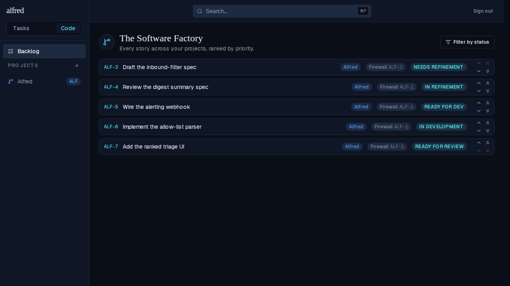
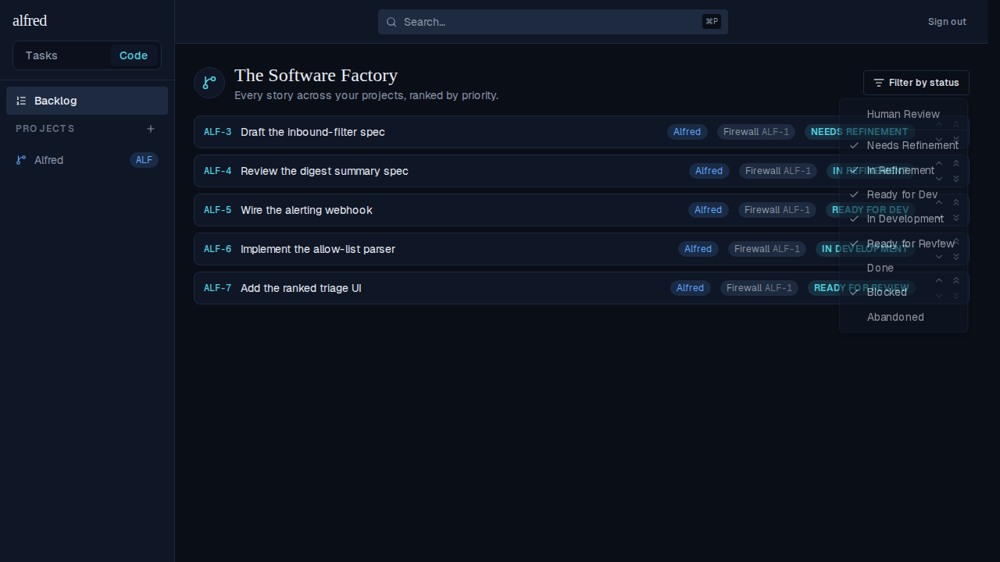
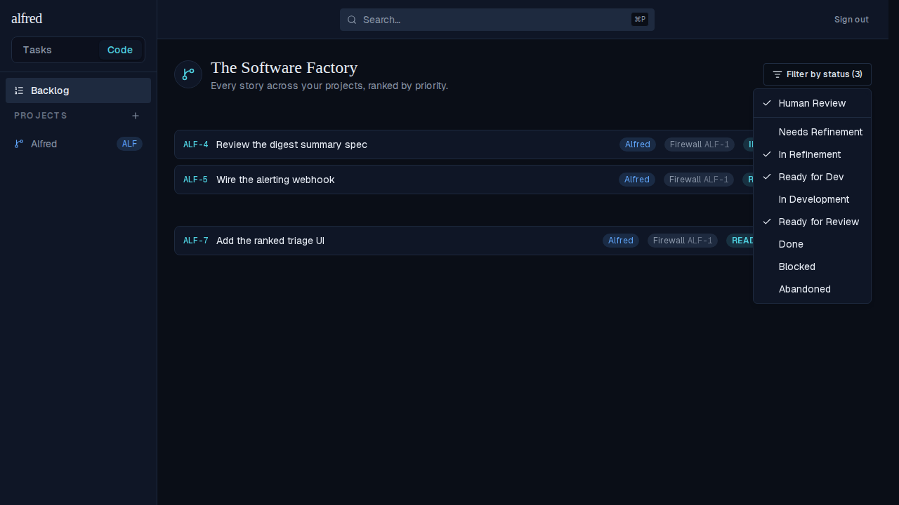
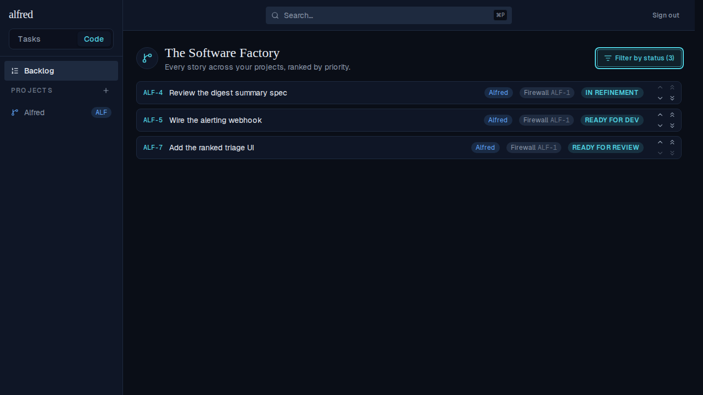

# Human Review filter shortcut narrows the Backlog to the human-gated states

*2026-07-01T04:25:22.801Z*

ALF-74 adds a "Human Review" macro to the Backlog's *Filter by status* dropdown. It sits above the per-status list, split off by a subtle divider, and one click narrows the list to exactly the states where a story is parked awaiting the owner's eyes: **In Refinement**, **Ready for Dev**, and **Ready for Review**. Checking or unchecking any individual status auto-unchecks the macro the moment the selection stops matching its preset.

**1. The Backlog by default** — every outstanding story, ranked by priority (needs-refinement through ready-for-review, plus in-development).

**2. The status dropdown open** — the new "Human Review" macro sits at the top, above a subtle divider, ahead of the full per-status checklist (the default outstanding states checked).

**3. After clicking "Human Review"** — the macro is checked and the selection collapses to exactly In Refinement + Ready for Dev + Ready for Review; every other status is deselected, and the trigger shows the (3) filtering count.

**4. The narrowed Backlog** — only the three human-gated stories remain (ALF-4 In Refinement, ALF-5 Ready for Dev, ALF-7 Ready for Review); the teal trigger flags the active filter.

