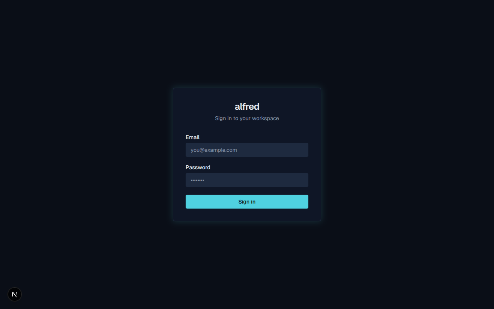

# Capturing the live UI in a demo doc

*2026-06-10T19:40:24.777Z*

Demo docs can embed screenshots of the running app. We reuse the sandbox-aware Playwright Chromium the E2E suite already installs — no new dependency — via the `frontend` `screenshot` helper.

With the dev server running (`npm run dev -w frontend`), this page was captured with `npm run screenshot -w frontend -- http://localhost:3000/login shot.png` and embedded via `npm run demo -- image <doc> shot.png`. The PNG is copied next to the doc under a generated name; `verify` skips image entries, so screenshots never make a demo flaky.



The captured image now lives alongside the doc in the repo:

```bash
ls docs/demos/image-capture-image-1.png
```

```output
docs/demos/image-capture-image-1.png
```
