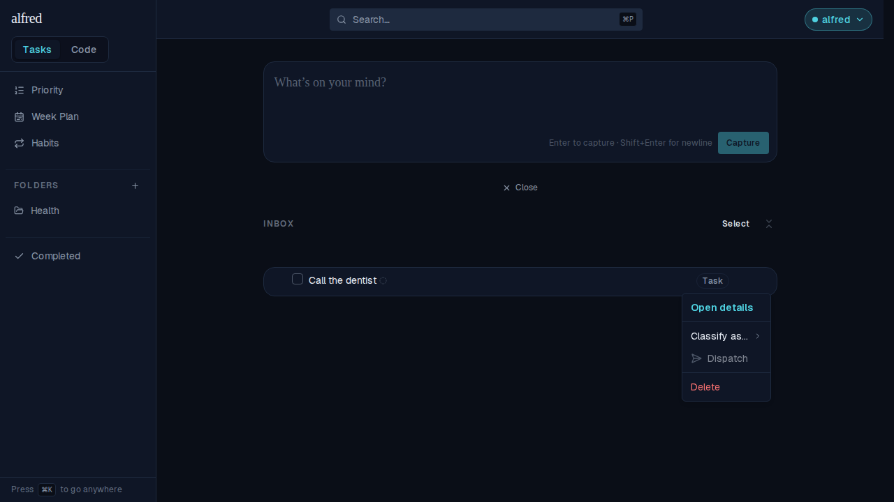
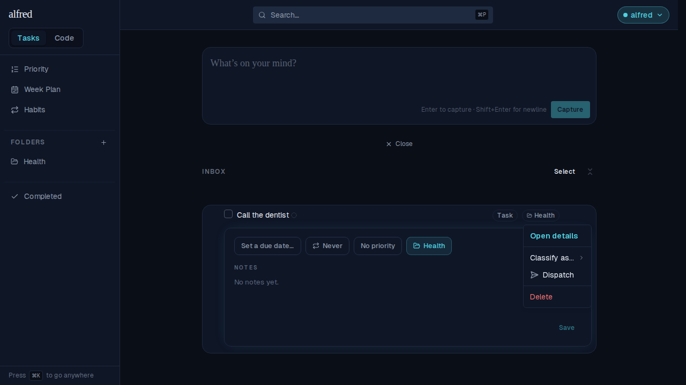
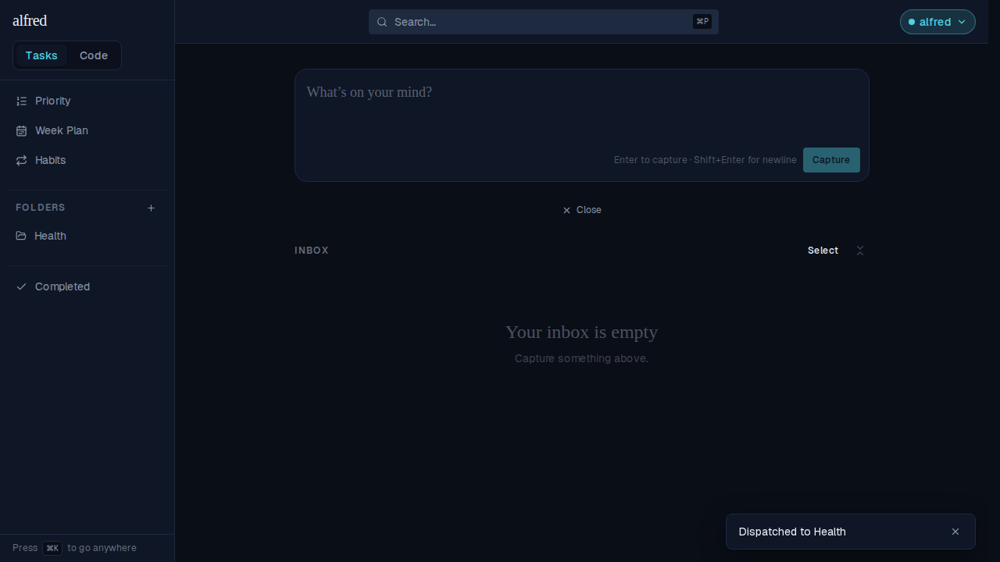
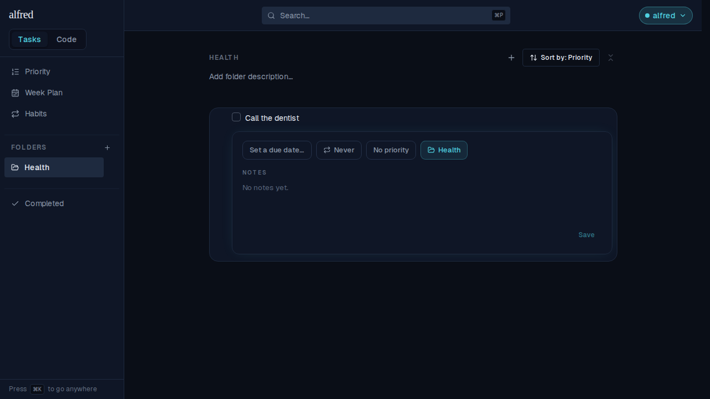
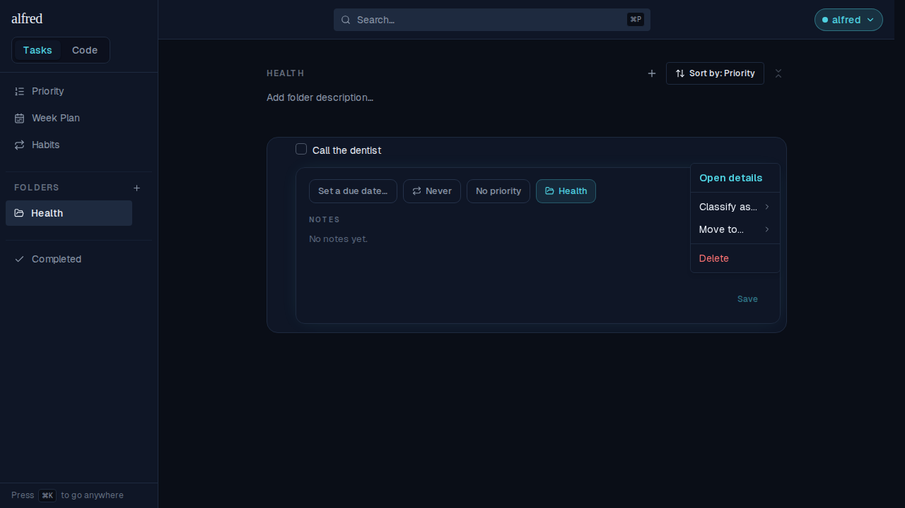
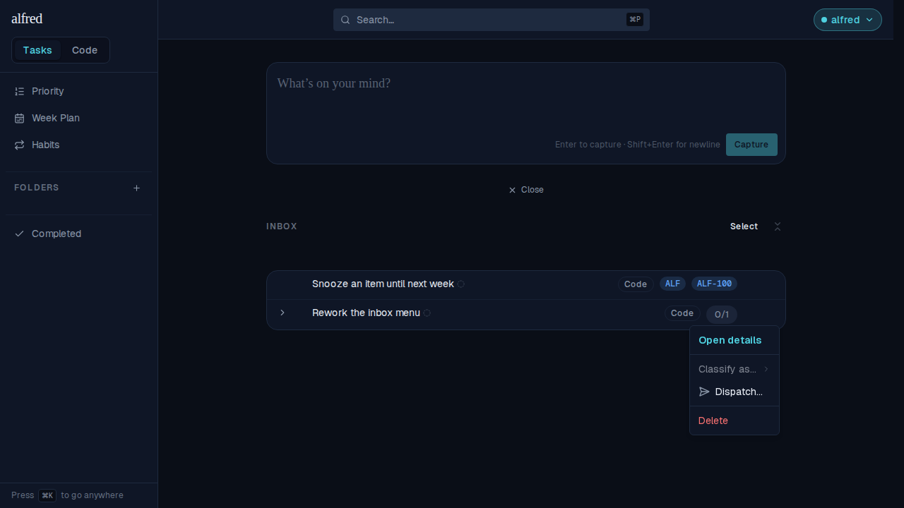
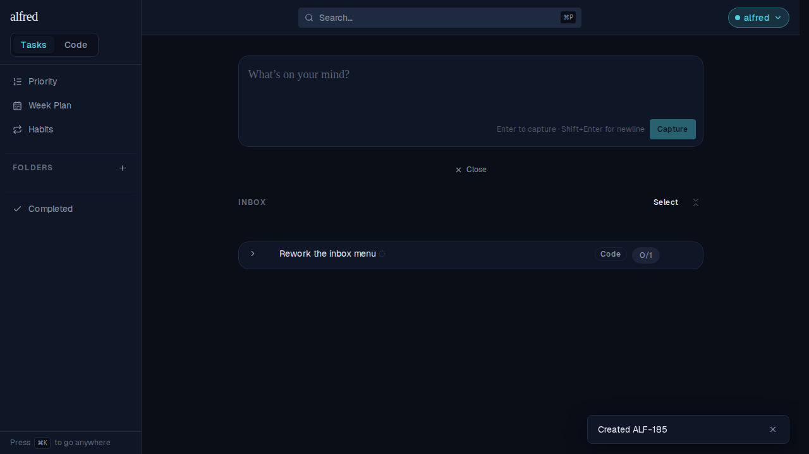

# The Inbox row menu dispatches

*2026-08-28T15:02:56.226Z*

ALF-185 simplifies the inbox row's ⋯ menu around the dispatch flow. "Send to Code module…", "Convert to Code Story…", "Convert to Code Epic…" and "Move to…" are gone from an Inbox row; one **Dispatch** entry replaces them all, sending the row wherever its labels already say it goes.

## An Inbox row with nothing set yet

The whole menu is now Open details · Classify as… · Dispatch · Delete. Dispatch is there but disabled, and its tooltip is the blocker itself — `Not ready — needs a folder` — the same words the bulk bar's readiness line uses.

## Label it, and Dispatch wakes up

The folder is set on the chip — a label, not a move: the row stays in the Inbox wearing it. With the label complete, Dispatch is enabled.

One press sends it. The toast names the destination and links to it.

Following the toast: the task is in Health.

## Once it has left, a folder is a move again

A dispatched row offers **Move to…** where Dispatch used to be — the two are complementary, and the folder chip is hidden here because the row already lives in that folder.

## Code rows dispatch too — including the epic-shaped ones

A code root with stories under it is an epic under construction; its Dispatch runs the epic conversion. The "…" says a dialog will open, because this one carries no project yet.

A childless code row wearing both hints (project ALF, epic ALF-100) needs no dialog at all: Dispatch sends it straight through the factory gate and the toast carries its allocated ref, deep-linked to the board.

