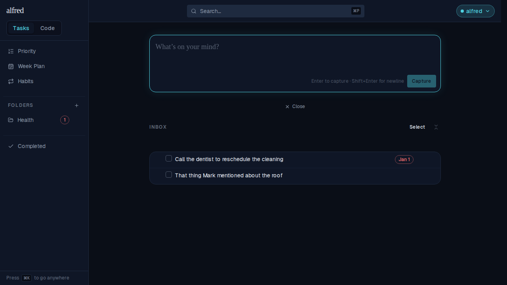
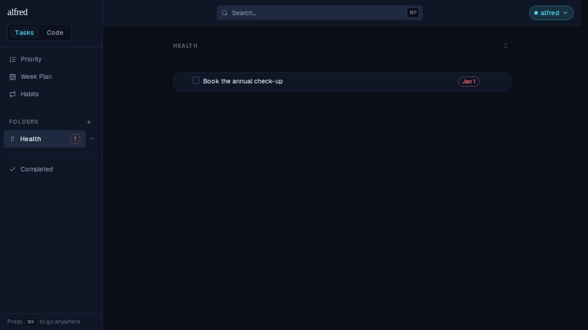

# Inbox residency becomes its own column

*2026-08-07T01:15:47.423Z*

Being "in the Inbox" used to be a derived fact: `folder_id is null`. That identity — having no folder means waiting for triage — only holds while nothing but a human can write `folder_id`. The LLM classifier is about to write its guesses onto an item's real fields, folder included, and under the old rule an item would silently vanish from the Inbox into a folder before its owner had ever seen it.

So residency (`dispatched_at`) and location (`folder_id`) become two separate facts. An item is in the Inbox while `dispatched_at` is null, whatever folder it carries, and only a human act stamps it. Nothing user-visible changes today — nothing in the app writes a folder without also dispatching — which is exactly what makes this safe to land on its own.

## The migration, against real Postgres

The change has no visual surface at the database layer, so its evidence is Postgres's own answers. The script below stands up a throwaway cluster, replays the migration history up to the point residency existed, seeds the world as it stood then, and applies the migration over those pre-existing rows — the only way to judge a backfill. Everything it prints is derived from whether `dispatched_at` is null, never from its value, so the run is identical every time.

```bash
node docs/demos/inbox-dispatch/inspect-residency.mjs
```

```output
After the backfill — no row changed which view it renders in:
  Book the check-up        folder=Health   renders in: Health
  Call the dentist         folder=—        renders in: Inbox
  Find the referral        folder=Health   renders in: Health

A folder filled in on an item nobody has triaged — it stays in the Inbox:
  Book the check-up        folder=Health   renders in: Health
  Call the dentist         folder=Health   renders in: Inbox
  Find the referral        folder=Health   renders in: Health

Residency is filled in at insert, by the database:
  created inside a folder                     → in the Inbox: false
  created under a parent that is in the Inbox → in the Inbox: true

A task dispatched with no folder would render nowhere → items_dispatched_needs_folder
Deleting the folder returns all 5 of its items to the Inbox
```

## The same rule in the running app

Seeded through the app's own backend: a folder (`Health`) with one genuinely filed task, and one task whose `folder_id` already points at Health while `dispatched_at` is still null. Both are overdue, so both would count toward Health's red badge if the tally read location instead of residency.

The Inbox lists the undispatched item beside a plain capture — the two rows are indistinguishable, because nothing in this slice renders either field. In the sidebar, **Health's overdue badge reads 1**, not 2: the item sitting in the Inbox does not count toward the folder it merely points at.



Opening Health shows only the task that was actually filed there. The undispatched one is nowhere to be found — it is still waiting in the Inbox, and every item remains reachable from exactly one view.


