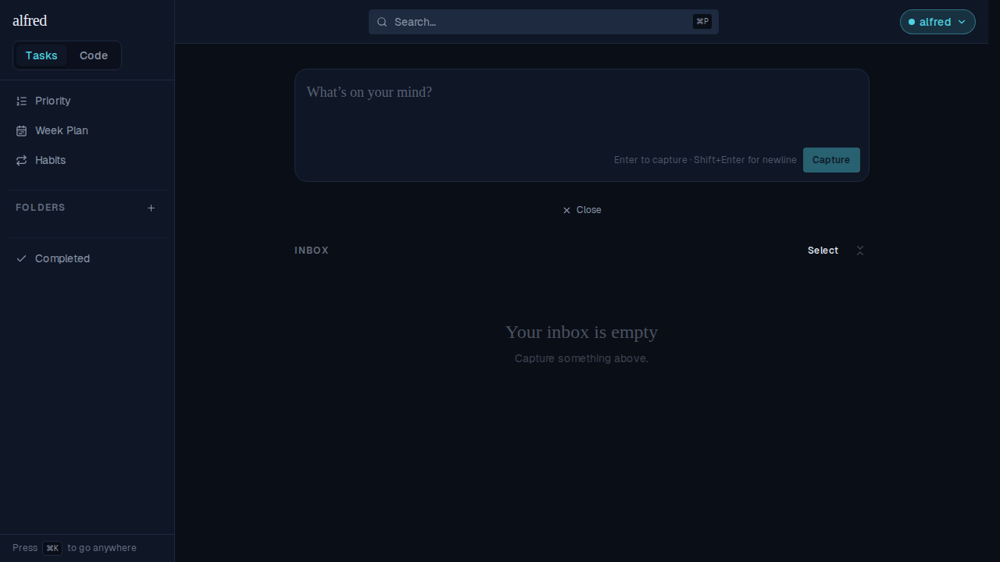
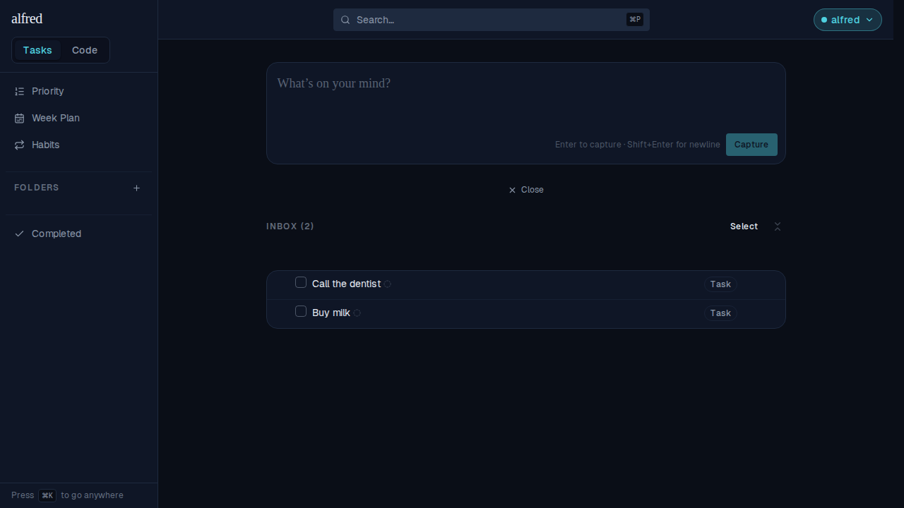
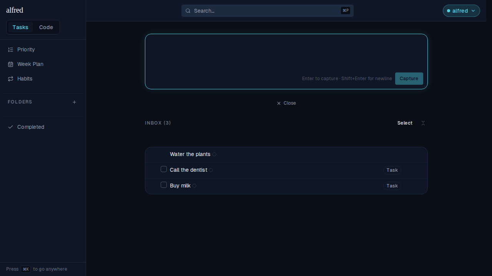

# The Inbox header carries how many items are waiting

*2026-08-28T14:48:14.630Z*

ALF-175: the Inbox list's eyebrow now reads `INBOX (n)` — the number of items waiting for triage sits right beside the title, so the size of the pile is legible without counting rows.

The tally counts the rows the list actually renders: active, undispatched roots. Subtasks nested under a row don't inflate it, and an item already filed into a folder has left the Inbox and drops out.

**Empty inbox — a bare `INBOX`, no `(0)`.** The empty state already says the inbox is empty; a zero in the header would only add noise (the same 'nothing at zero' rule the folder count badges follow).

**Two items waiting — `INBOX (2)`.**

**The tally is live.** Capturing "Water the plants" into the box above adds a third row, and the header follows it up to `INBOX (3)` in the same optimistic update — it reads the same store selector the list does, so the two can't disagree.

Screenshots captured through the Playwright mock-backend harness (the logged-in app at `/?view=inbox`), so every state above is the real screen.
