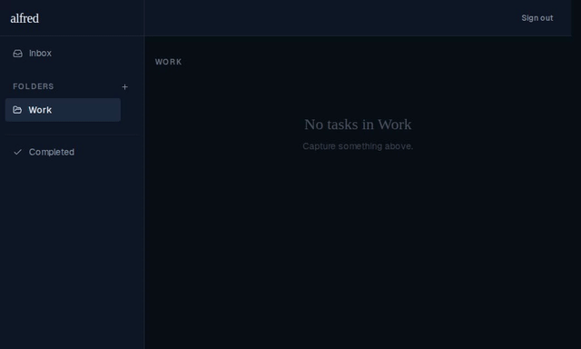
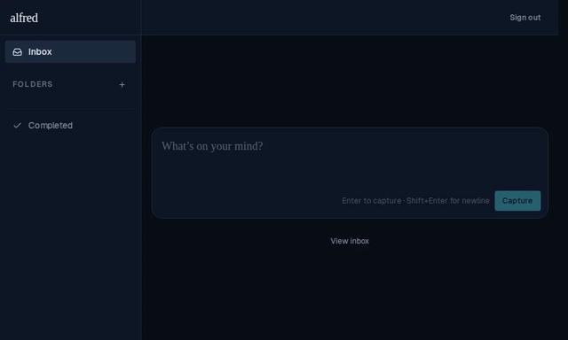

# Inbox skips expand animation on direct navigation

*2026-06-14T18:33:00.002Z*

Navigating from a folder to the inbox (or loading /?view=inbox directly) used to play the expand animation on mount. This fix makes the inbox appear immediately in those cases — the expand animation only fires when the user explicitly toggles it open from the landing page.

**Fix: folder → inbox navigation — inbox appears immediately (no expand animation)**

**Normal toggle behavior preserved — clicking 'View inbox' from the landing page still animates**

