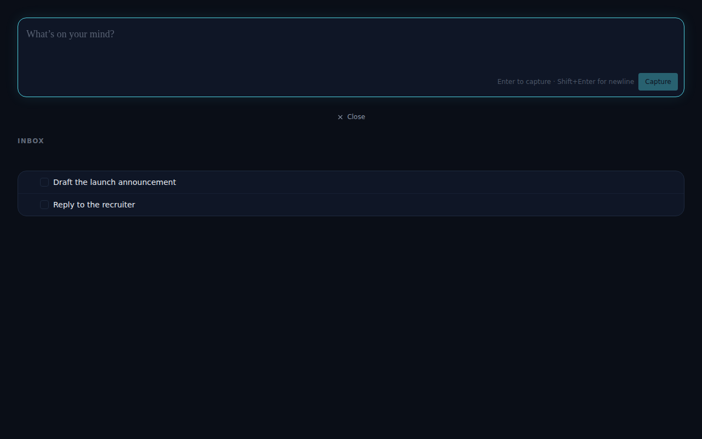
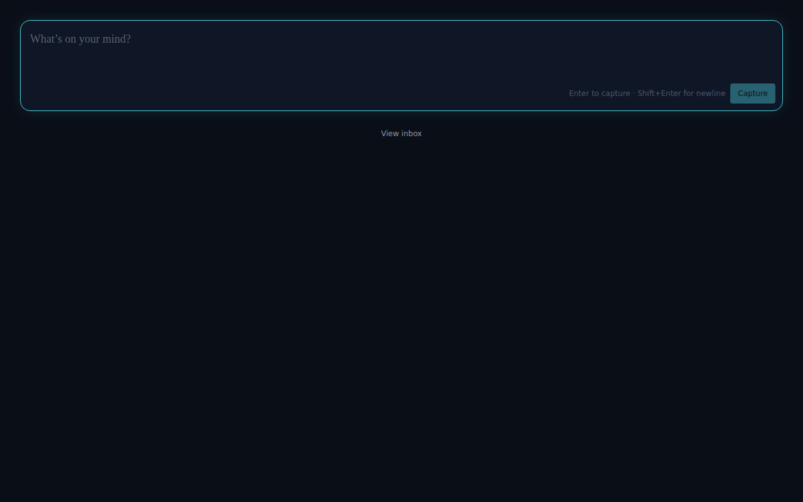

# Inbox skips expand animation on direct navigation

*2026-06-14T17:56:55.154Z*

Previously, navigating from a folder view (or loading /?view=inbox directly) caused the inbox list to play its expand animation on mount. The animation should only play when the user toggles the inbox open from the landing page — not when the inbox is already the destination.

The inbox component mounted with open=true (direct navigation or hard load of /?view=inbox) now appears immediately at full height — no expand animation:

The expand animation still fires when the user explicitly toggles the inbox open from the landing page (closed → open transition). The landing page (open=false):

