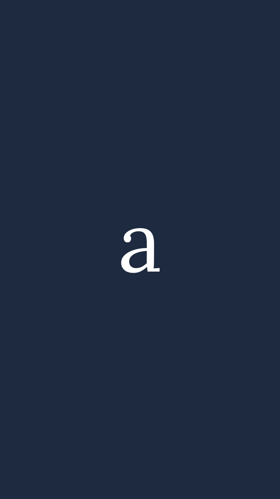

# iPhone standalone splash screen (centered a on navy)

*2026-07-13T13:34:08.408Z*

ALF-114 adds the iOS Home-Screen launch ("splash") image for the standalone web app: a centered serif "a" on the navy brand background (#1E2A3F), matching apple-icon.tsx and icon.svg. The root layout advertises one apple-touch-startup-image per modern iPhone via appleWebApp.startupImage, each pointing at the new public /splash generator sized to that device's exact physical pixels (iOS only shows the image on an exact-resolution media-query match).


The same generator serves every covered device at its own physical-pixel size — e.g. iPhone SE at 750×1334:



The document head opts into standalone chrome (mobile-web-app-capable) and lists an apple-touch-startup-image link per device, each gated by a portrait media query matching that iPhone's points + pixel ratio:

```bash
curl -s http://localhost:3000/login | grep -oE '<meta name="mobile-web-app-capable"[^>]*>|<link href="/splash[^>]*apple-touch-startup-image[^>]*>' | sed 's/&amp;/\&/g'
```

```output
<meta name="mobile-web-app-capable" content="yes"/>
<link href="/splash?w=750&h=1334" media="screen and (device-width: 375px) and (device-height: 667px) and (-webkit-device-pixel-ratio: 2) and (orientation: portrait)" rel="apple-touch-startup-image"/>
<link href="/splash?w=1125&h=2436" media="screen and (device-width: 375px) and (device-height: 812px) and (-webkit-device-pixel-ratio: 3) and (orientation: portrait)" rel="apple-touch-startup-image"/>
<link href="/splash?w=828&h=1792" media="screen and (device-width: 414px) and (device-height: 896px) and (-webkit-device-pixel-ratio: 2) and (orientation: portrait)" rel="apple-touch-startup-image"/>
<link href="/splash?w=1242&h=2688" media="screen and (device-width: 414px) and (device-height: 896px) and (-webkit-device-pixel-ratio: 3) and (orientation: portrait)" rel="apple-touch-startup-image"/>
<link href="/splash?w=1170&h=2532" media="screen and (device-width: 390px) and (device-height: 844px) and (-webkit-device-pixel-ratio: 3) and (orientation: portrait)" rel="apple-touch-startup-image"/>
<link href="/splash?w=1179&h=2556" media="screen and (device-width: 393px) and (device-height: 852px) and (-webkit-device-pixel-ratio: 3) and (orientation: portrait)" rel="apple-touch-startup-image"/>
<link href="/splash?w=1206&h=2622" media="screen and (device-width: 402px) and (device-height: 874px) and (-webkit-device-pixel-ratio: 3) and (orientation: portrait)" rel="apple-touch-startup-image"/>
<link href="/splash?w=1284&h=2778" media="screen and (device-width: 428px) and (device-height: 926px) and (-webkit-device-pixel-ratio: 3) and (orientation: portrait)" rel="apple-touch-startup-image"/>
<link href="/splash?w=1290&h=2796" media="screen and (device-width: 430px) and (device-height: 932px) and (-webkit-device-pixel-ratio: 3) and (orientation: portrait)" rel="apple-touch-startup-image"/>
<link href="/splash?w=1320&h=2868" media="screen and (device-width: 440px) and (device-height: 956px) and (-webkit-device-pixel-ratio: 3) and (orientation: portrait)" rel="apple-touch-startup-image"/>
```
