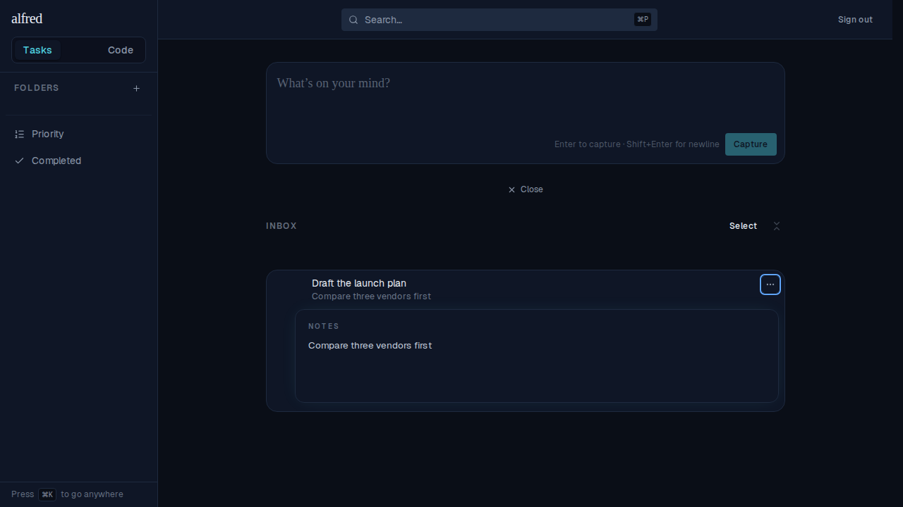
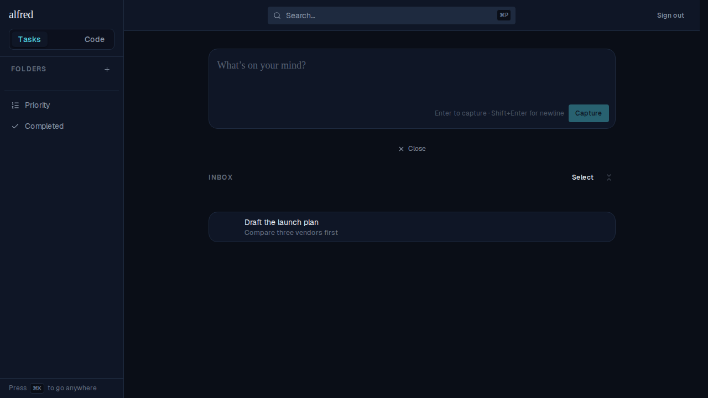

# Close item details on Escape / click outside (ALF-78)

*2026-07-03T00:35:34.921Z*

The inline detail panel (the ⋯ menu's "Open details") could previously only be closed by re-opening the ⋯ menu and choosing "Open details" again. ALF-78 lets you dismiss it the way every other transient surface dismisses: press **Escape**, or click **outside the row**. Interacting with the panel itself — its Due/Repeat/Priority pickers or the Notes field — never closes it, and while a picker popover is open the first Escape closes the popover, not the panel.

### Escape closes the panel

Pressing **Escape** dismisses it — the row returns to its resting state:

### Clicking outside the row closes the panel

A pointer press anywhere outside the row — here, the empty space below it — dismisses the panel:

