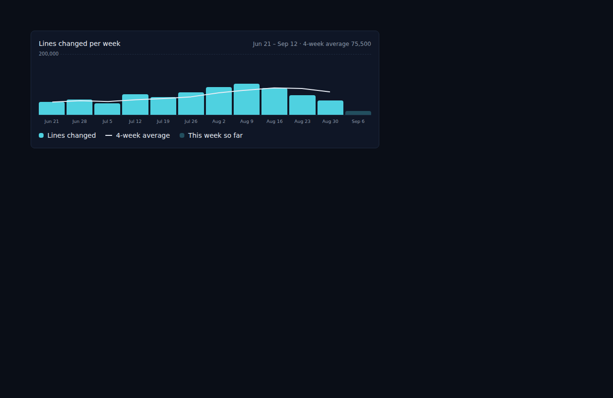
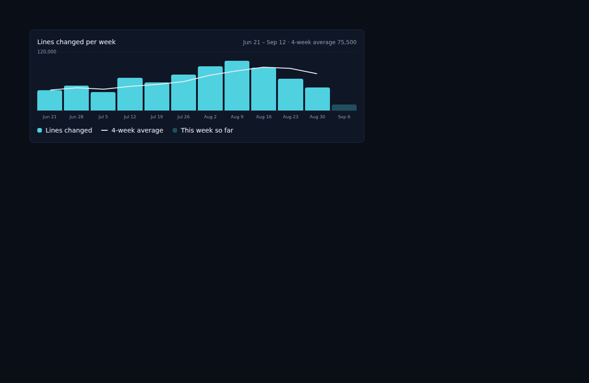

# Code module LoC graph rounds a six-digit max to the nearest 20,000

*2026-09-12T12:52:50.045Z*

ALF-230: the lines-changed chart on the Code dashboard rounds its axis maximum up to a "nice" number (`niceCeiling` in `frontend/components/atoms/bar-line-chart.tsx`). For a six-digit weekly total it rounded up to the next multiple of 100,000 — so a week of 102,000 lines changed capped the axis at 200,000, nearly doubling the real max and squashing every bar into the bottom half of the plot.

↑ Before: the `Code/LocVelocity` Storybook story `HighVolumeWeek` (a 12-week series peaking at 102,000 lines), rendered with the un-fixed `niceCeiling`. The axis reads 200,000 and every bar is squashed into the bottom half of the plot.

↑ After: the same story with the fix in place. `niceCeiling` now rounds a six-digit max to the nearest 20,000, so the axis caps at 120,000 — close to the real 102,000-line max — instead of 200,000.

Regression coverage: `niceCeiling` gets a unit test in `frontend/components/atoms/bar-line-chart.test.tsx` pinning the six-digit rounding (`niceCeiling(102000)` now returns `120000`, not `200000`), and the `HighVolumeWeek` Storybook story above is a new committed visual snapshot so a future regression here fails `check:slow` too.
