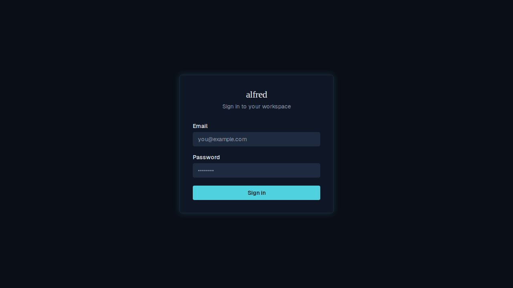

# Login screen: serif wordmark

*2026-06-12T18:51:12.758Z*

The 'alfred' wordmark on the login screen now uses font-serif (Instrument Serif / Georgia fallback), matching the wordmark in the app's sidebar and mobile header.

