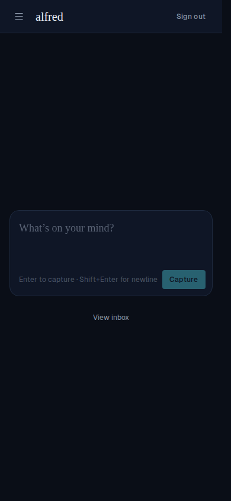
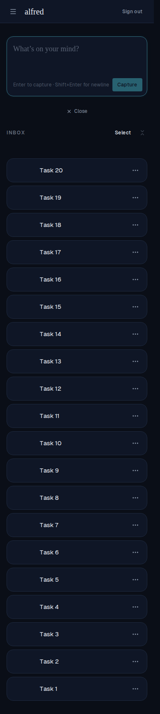

# Mobile: the landing fits the viewport until the inbox is opened

*2026-07-03T01:12:54.306Z*

On mobile the capture-first landing screen — just the capture box with a *View inbox* link below it — was overflowing the viewport and scrolling before the inbox was ever opened, despite all the empty space in the screenshot. The shell was sized to `min-h-screen` (100vh), which on mobile is the **address-bar-retracted** height: whenever the browser chrome is showing, a page sized to 100vh is taller than the visible area, so it scrolls with nothing below the fold. The whole height chain (`<html>`, `<body>`, and the shell root) shared that bug.

The fix sizes those elements to the **dynamic** viewport (`dvh`) instead — it tracks the currently-visible viewport, so the landing fits exactly. `min-h-*` (not a fixed `h-*`) keeps the frame growable, so once the inbox list is opened the document grows past the viewport and scrolls normally — the one case where scrolling is wanted. Keeping it a document-level (not inner-pane) scroll preserves the swipe-to-scroll touch gesture over the task list.

### The height chain now keys off the dynamic viewport

```bash
grep -n 'min-h-dvh\|min-h-screen' frontend/components/shell/app-shell.styles.ts frontend/app/layout.tsx frontend/app/login/page.tsx
```

```output
frontend/components/shell/app-shell.styles.ts:5: * Sized to the *dynamic* viewport (`min-h-dvh`), never the large viewport (`min-h-screen` =
frontend/components/shell/app-shell.styles.ts:13:export const shellRootClass = 'flex min-h-dvh bg-background';
frontend/app/layout.tsx:35:      className={`${geistSans.variable} ${geistMono.variable} min-h-dvh antialiased scrollbar-gutter-stable`}
frontend/app/layout.tsx:37:      <body className="min-h-dvh flex flex-col bg-background text-foreground">{children}</body>
frontend/app/login/page.tsx:26:    <main className="min-h-dvh flex items-center justify-center bg-background px-4">
```

### The landing fits the visible viewport (inbox closed)

Driven through the running app at a phone viewport (390×844) with a thought already waiting in the inbox. Only the capture box and the *View inbox* link show — the page ends at the fold, no scroll:



### Opening the inbox lets the page scroll (the intended exception)

With the inbox opened on a full list, the document grows past the viewport and scrolls — a full-page capture shows the capture box at the top followed by the whole inbox list running well below the fold:



### An e2e locks both behaviours at a phone viewport (390×844)

```bash
grep -n "test(\|documentOverflowsViewport(page)).toBe" frontend/e2e/inbox-viewport.spec.ts
```

```output
26:test('the landing screen does not overflow the viewport', async ({ page, seed }) => {
34:  expect(await documentOverflowsViewport(page)).toBe(false);
37:test('opening the inbox with a full list lets the page scroll', async ({ page, seed }) => {
49:    expect(await documentOverflowsViewport(page)).toBe(true);
```
