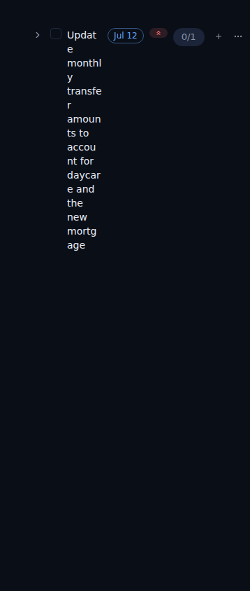
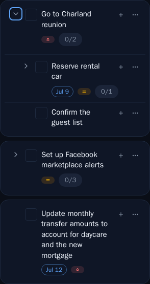
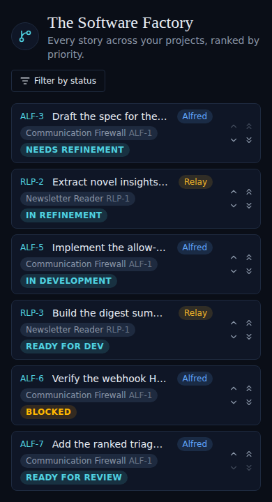
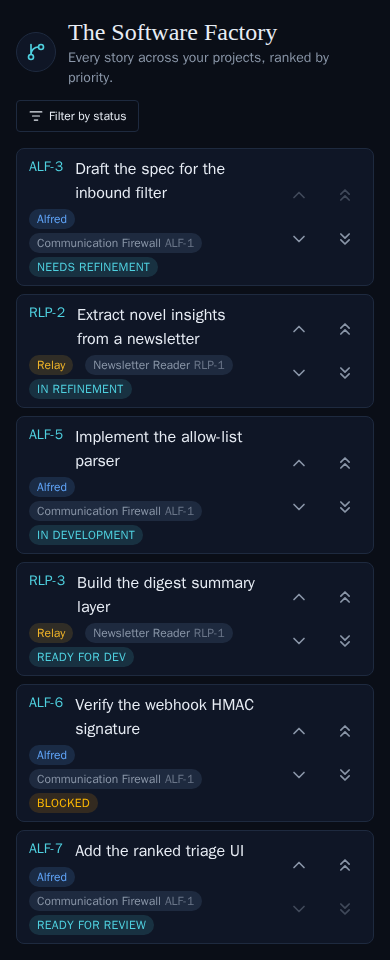

# Larger, tappable item & backlog cards on mobile (ALF-86)

*2026-07-02T18:22:53.930Z*

On a phone the task list and the Code backlog both read small and cramped: 16px checkboxes are hard to tap and the date / priority / subtask-count badges crowd in from the right on the *same line as the title*, squeezing long titles into many narrow wrapped lines (and truncating backlog titles to "Draft t…"). ALF-86 makes each top-level task a large, tappable **card** on mobile — subtasks nested *inside the same card* — and gives Code backlog rows the same head/footer treatment. Everything is gated behind the app's `md` breakpoint via pure Tailwind responsive classes, so desktop density is unchanged. Screenshots below are captured at a 390px (phone) viewport.

## Task list — before (phone width)

The badges (Jul 12, priority, 1/2) sit on the title's line, so a long title collapses into a ~10-line, word-broken column and the 16px checkbox is well under the ~44px touch-target guideline.

## Task list — after (phone width)

Each top-level task is now a rounded surface card with a gap between cards, a ≥24px checkbox (≥44px hit area) and a compact 15px / snug-leading title that takes the card's full width. The due / priority / subtask-count badges move to a footer *below* the title. Expanding a card nests its subtasks **inside the same card** — indented, hairline-separated — each with its own metadata footer, never a card of its own. (This is the committed mobile-viewport Storybook snapshot; the first card is expanded.)

## Code backlog — before (phone width)

The ref, project / epic / status badges and the reorder chevrons all share the title's line, so every title truncates hard — "Draft the spec for the…", "Implement the allow-…", "Verify the webhook H…" — and the 14px reorder chevrons are tiny tap targets.

## Code backlog — after (phone width)

Each row now gives its ref + full title its own line (wrapping at text-base, no more truncation), drops the project / epic / status badges into a footer below, and enlarges the four reorder chevrons to ≥44px tap targets. Backlog rows have no checkbox or nesting, so this is purely the head/footer restructure + sizing. (Committed mobile-viewport Storybook snapshot.)

At `md` and above both surfaces are unchanged: the tasks list is one rounded, hairline-divided panel of compact single-line rows, and the backlog row is its single crowded line — the `md:`-gated classes restore today's desktop layout exactly (the 67 existing desktop snapshots pass unchanged).
