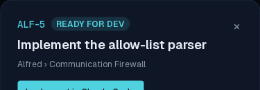
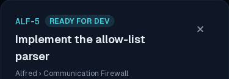
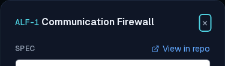
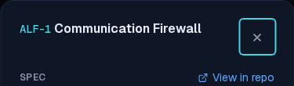
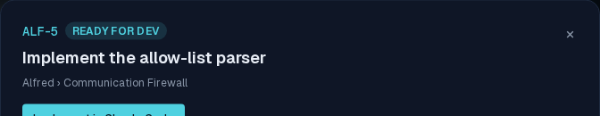

# ALF-138 — the modal close is a real tap target on mobile

*2026-07-26T04:09:20.565Z*

The story detail modal's dismiss was `p-1` around a text glyph — about 24px square. That's the one control every reader of the modal reaches for, and on a phone it sat well under the 44px target the rest of alfred's mobile controls use (the capture box's Add button, the backlog's reorder chevrons). This enlarges the button's own box on mobile and reverts it at `md:`, so the dense desktop header is untouched.

The epic spec modal carried a byte-identical copy of the same close, so both are now the one shared control — a `dialog` variant on the existing `CloseButton` atom, wrapped as `DialogCloseButton` in the dialog atom. Neither modal can drift from the other again.

Every shot below is the live app at a phone viewport (390×844), driven through the Playwright mock harness.

## Story detail modal, phone (390px)

**Before** — the × is a ~24px box tucked into the corner.



**After** — a 44px box. The title reflows onto a second line to make room, which is the mobile behaviour the rest of the app already uses (ALF-86 wraps mobile titles rather than truncating them).



## Epic spec modal, phone (390px)

The second surface that carried the duplicated close. Its dismiss takes focus when the modal opens, so the focus ring traces the tap target exactly.

**Before**



**After**



## Desktop (1280px) is unchanged

The enlargement is `md:`-gated, so a pointer device still gets today's dense header.

**Before**



**After** — pixel-for-pixel the same close.


## One control, not two copies

Both modals now render the shared atom — neither carries its own close classes, so the next change to the dismiss lands in one place.

```bash
grep -n 'DialogCloseButton' frontend/components/code/story-detail-modal.tsx frontend/components/code/epic-spec-modal.tsx
```

```output
frontend/components/code/story-detail-modal.tsx:6:import { DialogCloseButton, DialogTitle, FormDialog } from '@/components/atoms/dialog';
frontend/components/code/story-detail-modal.tsx:210:        <DialogCloseButton />
frontend/components/code/epic-spec-modal.tsx:3:import { DialogCloseButton, DialogTitle, FormDialog } from '@/components/atoms/dialog';
frontend/components/code/epic-spec-modal.tsx:23:        <DialogCloseButton />
```

```bash
sed -n '/dialog:/,+1p' frontend/components/atoms/close-button.tsx
```

```output
        dialog:
          'inline-flex h-11 w-11 items-center justify-center text-2xl leading-none md:h-auto md:w-auto md:p-1 md:text-lg',
```
