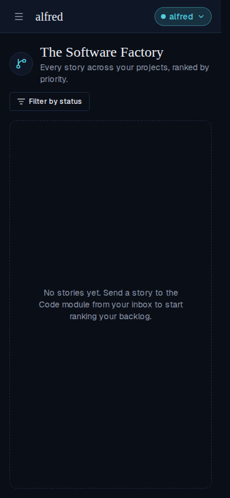
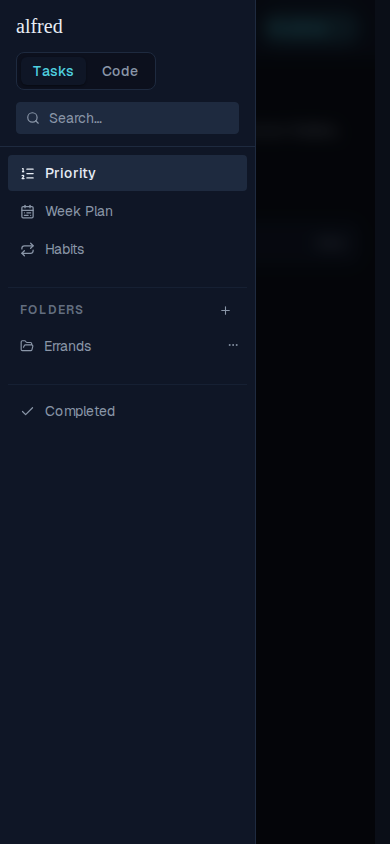
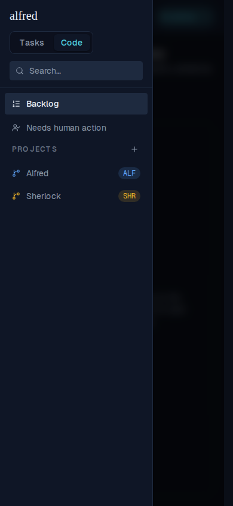
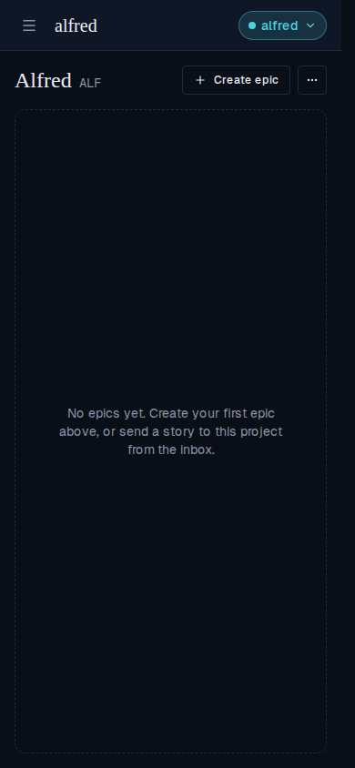

# Mobile: the nav drawer stays open when switching modules

*2026-07-30T16:18:19.273Z*

On a phone the sidebar lives behind the hamburger, and the Tasks ⇄ Code switcher sits inside it. Tapping the other module used to close the whole drawer, dropping the user on that module's default screen — so reaching, say, a project meant re-opening the menu. ALF-157 makes the switch a move *within* the menu: the drawer stays open and swaps in the other module's nav.

All shots below are the real app at a 390×844 phone viewport, driven through the Playwright mock harness.

### Before: tapping Code closed the menu

One tap on `Code` from the open drawer, and the drawer was gone — the user is on the backlog with no nav in sight.

### After, step 1: open the hamburger on Tasks

The drawer shows the switcher (Tasks active), search, and the Tasks nav — Priority, Week Plan, Habits, folders, Completed.

### After, step 2: tap Code — the drawer stays open

Same open drawer, Code now the active segment, and the nav beneath it has become the Code module's: Backlog, Needs human action, and the project list.

### After, step 3: picking a destination still closes it

Only arriving somewhere closes the drawer. Tapping the *Alfred* project from that same open drawer lands on its board — the two-tap journey that previously took four.

