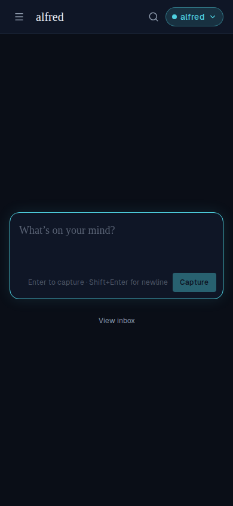
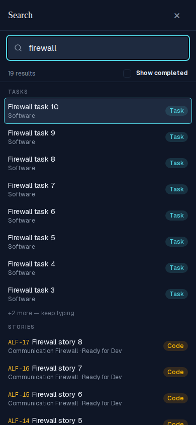
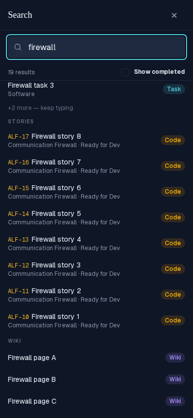
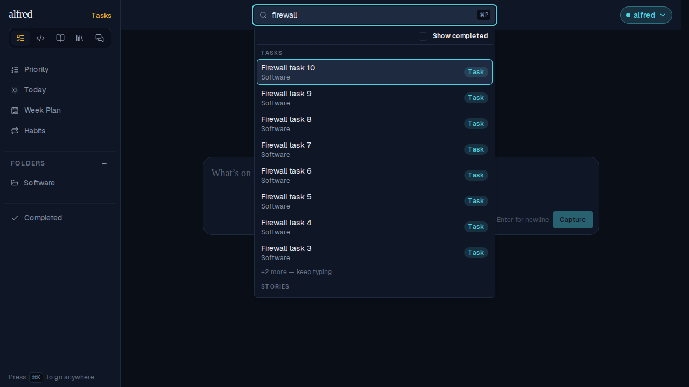

# Mobile-friendly global search (ALF-251)

*2026-09-28T12:31:10.977Z*

On phones, global search moves out of the hamburger drawer. There, its results were a ~190px popover portalled outside the drawer's modal dialog, so the dialog's scroll lock swallowed every touch and wheel event on it: results were tiny and couldn't scroll. Now a search icon in the header opens a full-screen sheet whose results render inside the dialog, full width, 44px rows, scrollable. Desktop is unchanged. Captured with Playwright phone emulation (390×844, isMobile + touch) against the mock backend, seeded with 10 tasks, 8 stories and 3 wiki pages matching "firewall".

**1 · The header gains a search icon**, just before the account pill (below md only).

**2 · Tapping it opens a full-screen Search sheet** with the 44px, 16px-text field already focused (so the keyboard comes up) and no ⌘P hint.

**3 · Typing fills the sheet with full-width, touch-sized results.** Same groups, ranking and 8-per-group cap ("+2 more — keep typing") as desktop; the count and Show completed sit in a status row above the list instead of the desktop key-hint footer. The first result keeps the active ring, so the keyboard's Go key opens it.

**4 · The list scrolls** — the fix for "you can't scroll". The GIF wheels the list down to the very last result and taps it; the still below is the list scrolled to the end.

**5 · Choosing a result navigates exactly as before and closes the sheet** (here a wiki page).

**6 · Show completed** reveals completed matches, de-emphasised.

**7 · The hamburger drawer no longer carries a search field** — one entry point.

**8 · Desktop is unchanged**: ⌘P focuses the header field and the anchored dropdown opens as before. The existing shell-searchbox--open-with-results Storybook baseline still passes untouched, and the two new phone baselines (shell-mobilesearch--open-with-results, shell-mobilesearch--show-completed) were added.

