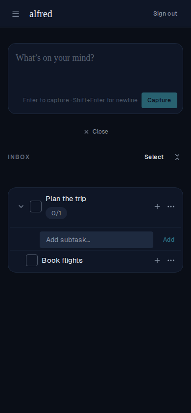

# Adding a subtask via the Add button works on mobile

*2026-07-06T20:11:34.231Z*

ALF-102 — Bug: on mobile, adding a subtask via the 'Add' button did nothing; only the Enter key worked. On desktop both Enter and Add worked (even when dev-tools emulated a mobile width).

Root cause: the inline 'Add subtask' field (compact CaptureBox) tears itself down on blur when focus leaves the box. On iOS/touch, a <button> does not take focus on tap, so tapping 'Add' blurred the input with a null relatedTarget — the onBlur guard read that as 'focus left the box', cleared the value and dismissed the field before the form submit could run. Enter never blurs the input, so it was unaffected. Desktop clicks focus the button (relatedTarget = the button, which is inside the form), so the guard correctly skipped the dismiss there.

Fix: track a pointer-press on the 'Add' button (its onPointerDown fires before that blur) and skip the blur-dismiss while the button is being pressed, so the submit lands. Below: on a 390×844 mobile viewport, typing a subtask and TAPPING 'Add' now creates it, nested under the parent.

