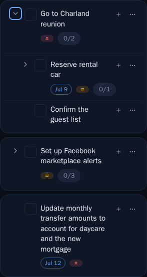
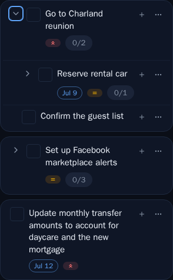
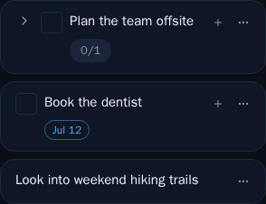

# Compact mobile task cards: halved padding + collapsing chevron/checkbox columns

*2026-07-03T00:45:57.907Z*

Three mobile-only refinements to the task card (all gated behind the `md` breakpoint, so desktop is unchanged):

1. **Halved card padding** — the depth-0 card chrome goes from `p-2` to `p-1`, so each card hugs its rows more tightly.
2. **No chevron column when a row has no children** — the expand toggle was previously kept as an `invisible` spacer (reserving its width at every screen size). On mobile it is now removed from layout entirely, so the title slides left into the reclaimed space. At `md`+ it stays an invisible spacer so the desktop list keeps its aligned columns.
3. **No checkbox column for unclassified/code inbox items** — same treatment for the completion checkbox: an item with no checkbox no longer reserves the empty column on mobile, so its title moves left. The mobile metadata footer indent tracks these dropped columns so the badges stay lined up under the title.

## Halved padding + reclaimed title width (requests 1 & 2)

The `MobileCards` Storybook story rendered at a 390px phone viewport. **Before** — the current build: generous card padding, and every childless row still reserves the chevron column.

**After** — the card padding is halved (`p-1`) so each card hugs its rows, and the childless "Update monthly transfer…" card drops the chevron column, giving its title more width (it now wraps in 3 lines instead of 4).

## Columns collapse per row (requests 2 & 3)

A new `MobileColumnCollapse` story makes the per-row behavior explicit as a staircase — each title only indents past the columns its row actually has:

- **"Plan the team offsite"** has children *and* is a task, so it keeps **both** the chevron and the checkbox — its title is the most indented.
- **"Book the dentist"** is a childless task: the chevron column is gone, but the checkbox stays — the title shifts one column left.
- **"Look into weekend hiking trails"** is an unclassified inbox item with neither control, so its title sits flush against the card edge.

The metadata footers ("0/1", "Jul 12") stay lined up under their titles because the footer indent tracks the same dropped columns. At `md`+ each dropped column becomes an invisible spacer again, so the desktop list keeps its aligned columns.

