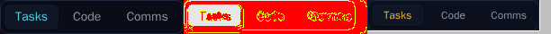
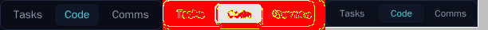
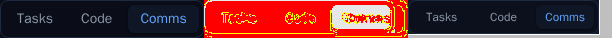
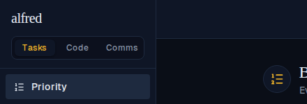
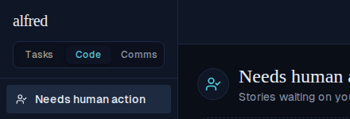
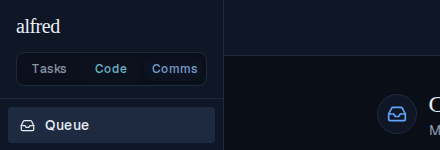
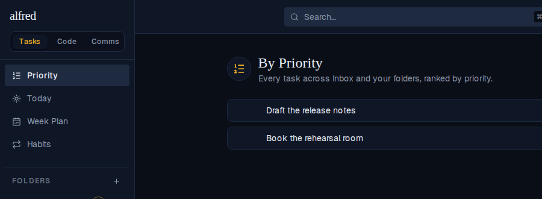

# Module switcher: fits the sidebar, and Tasks goes yellow

*2026-09-12T03:03:24.744Z*

ALF-219 asked for two things. The switcher **overflowed the desktop sidebar** — it has hugged its content since ALF-93, when Tasks ⇄ Code were the only two segments, and adding Comms pushed the natural width to 237px inside a sidebar that offers 191px. And **Tasks and Code both wore the app's teal**, so an active Tasks segment was indistinguishable from an active Code one.

The control is now full-width with equal thirds, and the shared module-accent table gives Tasks the palette's yellow (`accent-amber`).

## Before → after, side by side

The visual-snapshot gate writes a three-panel diff on any intended baseline move: **left** the committed baseline, **middle** the changed pixels in red, **right** the new render. Tasks active — the old control hugs three segments and runs past its box; the new one divides the sidebar's 191px into even thirds, with the active segment in yellow.



Code active — same resize, and Code keeps the teal it has always had. Put beside the panel above, this is the whole point of the colour change: the two active states no longer look alike.



Comms active — unchanged in colour (it was already the blue module), resized along with the rest.



## In the running app

Storybook shows the control; these are the real authenticated app at 1280×720, cropped to the sidebar's top-left square plus a slice of main content — so the sidebar's right border, the edge the old control spilled over, is visible in every shot.

**Tasks** — the switcher sits well inside that border, and the active segment is yellow.



**Code** — a click away, still inside the border, and unmistakably a different colour from the shot above.



**Comms** — the third module, blue as before.



## The colour comes from one table, so it reaches the headings too

`MODULE_ACCENT` is the single answer to "what colour is this module?" — the switcher reads it, and so does every view heading's circled glyph. Moving Tasks to amber there carries through to the Tasks views without a second edit: the By Priority glyph is yellow now, matching its segment.



Here is that table — one colour per module, none shared:

```bash
sed -n '/^export const MODULE_ACCENT/,/^};/p' frontend/lib/modules.ts
```

```output
export const MODULE_ACCENT: Record<ModuleId, ModuleAccent> = {
  tasks: {
    text: 'text-accent-amber',
    ring: 'ring-accent-amber',
    dot: 'bg-accent-amber',
    border: 'border-accent-amber',
    glow: 'glow-amber',
  },
  code: {
    text: 'text-accent-teal',
    ring: 'ring-accent-teal',
    dot: 'bg-accent-teal',
    border: 'border-accent-teal',
    glow: 'glow-teal',
  },
  comms: {
    text: 'text-accent-blue',
    ring: 'ring-accent-blue',
    dot: 'bg-accent-blue',
    border: 'border-accent-blue',
    glow: 'glow-blue',
  },
};
```

### One thing that only showed up on screen

`ViewHeading`'s `accent` prop defaults to Tasks. The two **Code** views — the Software Factory and Needs human action — never passed it, which was harmless only because Tasks and Code happened to share teal. Moving Tasks to amber turned those Code headings yellow, and no test caught it: every assertion named a colour, not a module. The screenshot above is what caught it. Both call sites now name `accent="code"` explicitly, pinned by a test in each view's suite, so the Code heading below is teal beside a teal segment.

## What guards it from here

The overflow lives in the box model, which jsdom does not have — so a class-level unit test can say `w-full` is present but never that nothing spills. `frontend/e2e/module-switcher-fit.spec.ts` measures the real thing in Chromium: the control's right edge against the sidebar's, its width against the sidebar's 191px of usable space, and every segment against its siblings. Reverted against the old switcher it fails with `237 <= 224` — the exact overflow in the ticket screenshot.
