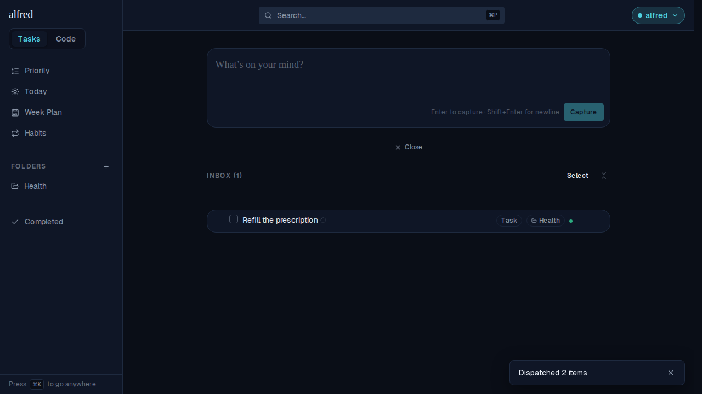
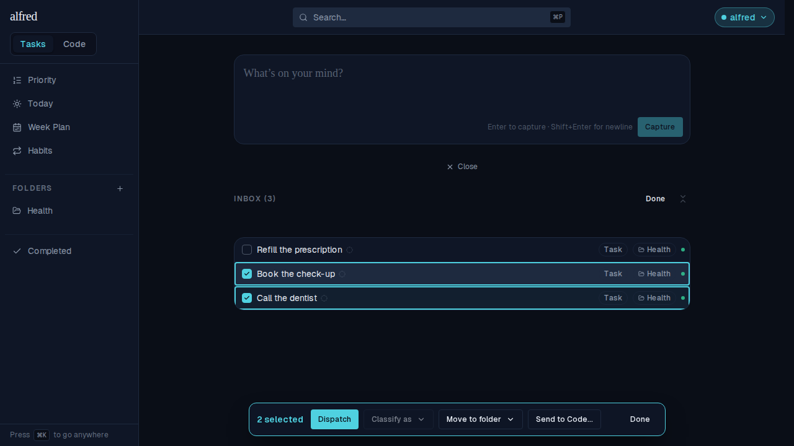
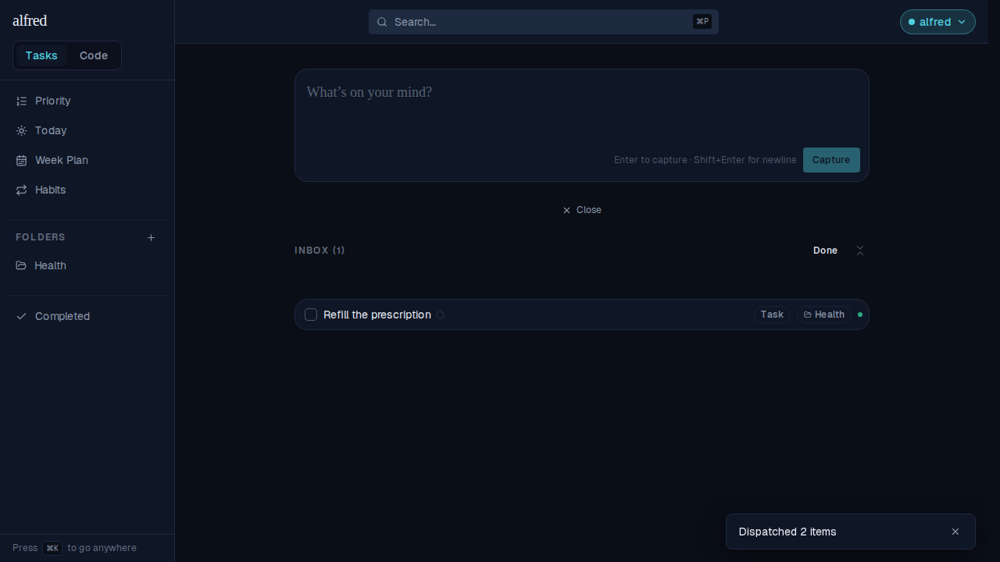
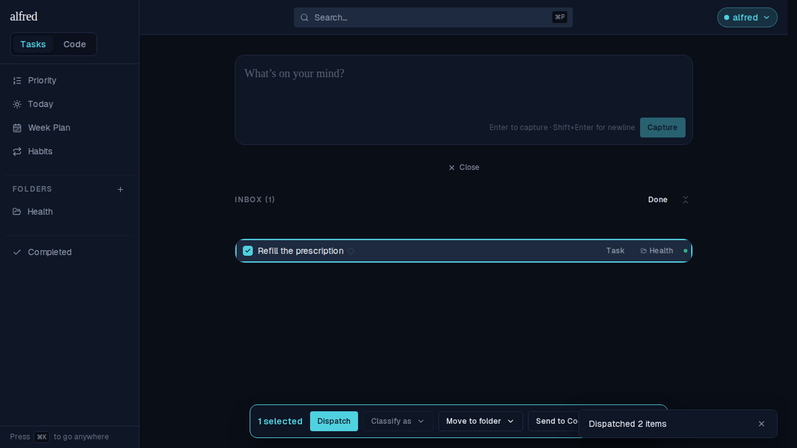

# Multi-select stays open after a mass dispatch

*2026-09-07T19:00:18.536Z*

Dispatch is the Inbox's sweep action: pick a batch of ready rows, press once, and each goes to its own destination. Until now a clean sweep also switched select mode OFF — so the reward for a batch that went perfectly was a trip back through the header's Select button before you could pick the next one. Dispatch now keeps the mode open: it empties the selection (the bar folds away at zero) and leaves every row a selection control.

## Before — the sweep dropped you out of select mode

Two ready rows dispatched. The toast confirms both went, but the header has flipped back to **Select** and the row left behind is an ordinary row again: to carry on triaging you had to re-enter the mode.

## After — the mode survives the sweep

**1. Pick the batch.** Select mode is on, two of the three Inbox rows are checked, and the bulk bar leads with Dispatch.

**2. Press Dispatch.** Both rows leave for their folder and the toast counts them. Nothing is selected any more, so the bar folds away — but the header still reads **Done** and "Refill the prescription" still wears its selection checkbox. The mode is still on.

**3. Straight on to the next batch.** One click on the row left behind brings the bar back at "1 selected" — no re-entry through the header.

Only Dispatch behaves this way. Classify as, Move to folder, and Send to Code… still exit on a clean run, as before — and Dispatch's partial outcome is unchanged too: whatever did not go (unready or failed) stays selected with the readiness line naming what it is missing.
