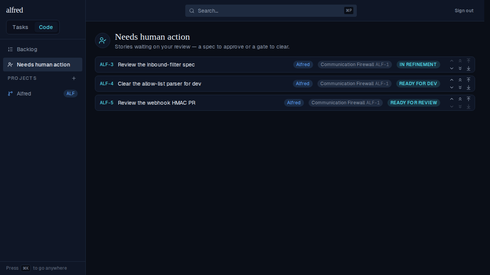
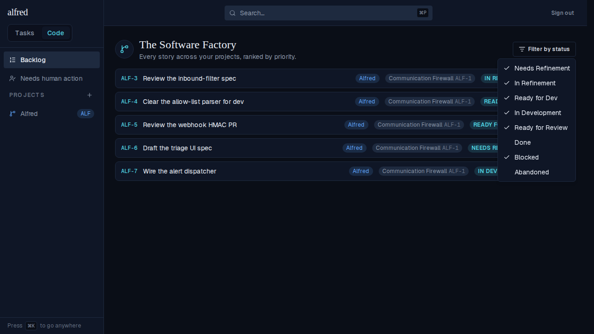

# Needs human action view + cleared-out filter (ALF-103)

*2026-07-16T21:13:28.751Z*

ALF-103 promotes the Backlog's old "Human Review" filter macro into its own navigation destination in the Code sidebar — a la "Backlog" — and removes that option from the filter menu. The new view lists every story in a human-review state (In Refinement, Ready for Dev, Ready for Review) across all projects, ranked by global priority, reusing the Backlog's reorder controls.

**1. The new sidebar destination + view.** Navigating to `/code/needs-human-action` (the "Needs human action" link is highlighted in the sidebar, right under "Backlog"). The list shows only the three human-review states — ALF-3 (In Refinement), ALF-4 (Ready for Dev), ALF-5 (Ready for Review) — while the seeded `needs_refinement` and `in_development` stories are filtered out. Each row keeps the Backlog's reorder chevrons.

**2. The filter menu no longer offers "Human Review".** On the Backlog, opening "Filter by status" now shows only the per-status checkboxes — the "Human Review" macro row and its separator are gone (cleared out of the filters, per the ticket).

