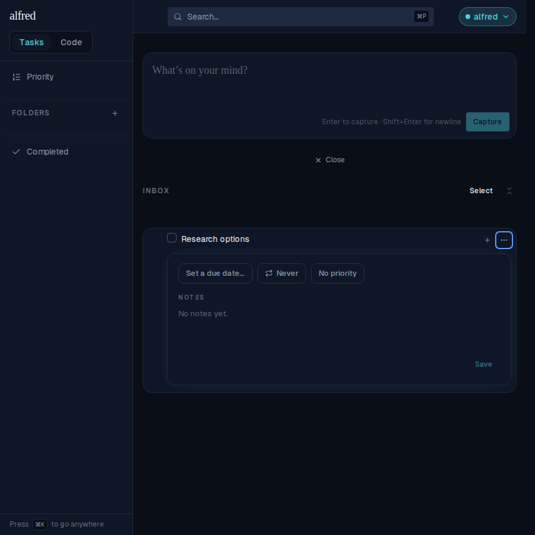
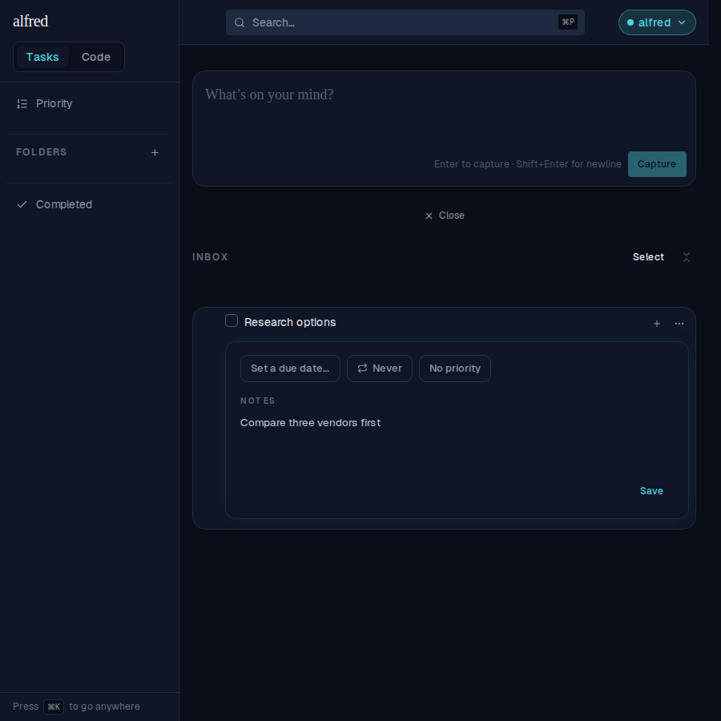
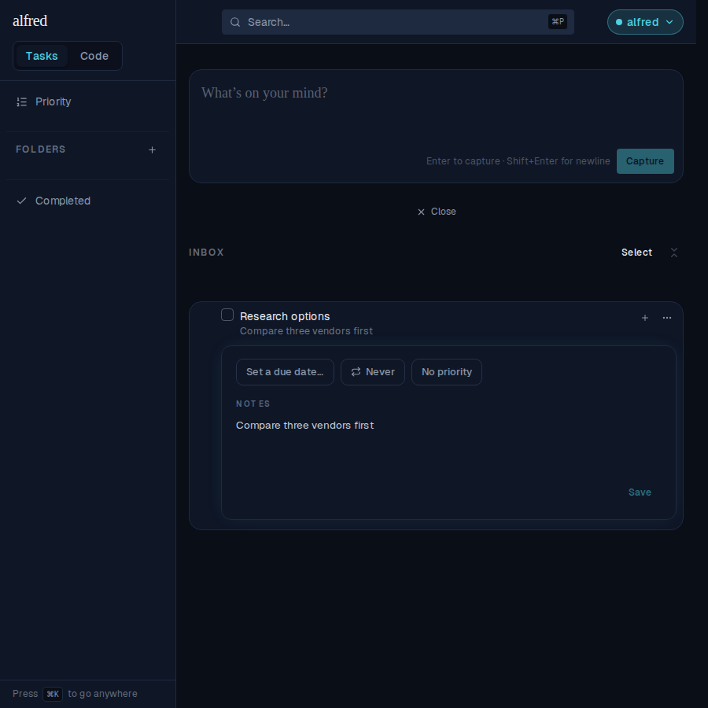
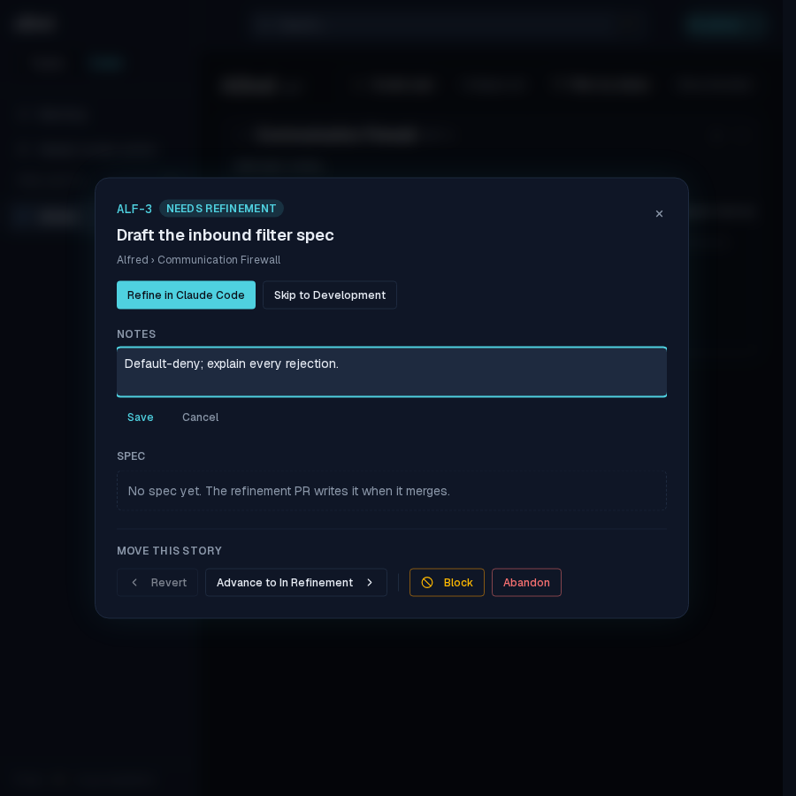
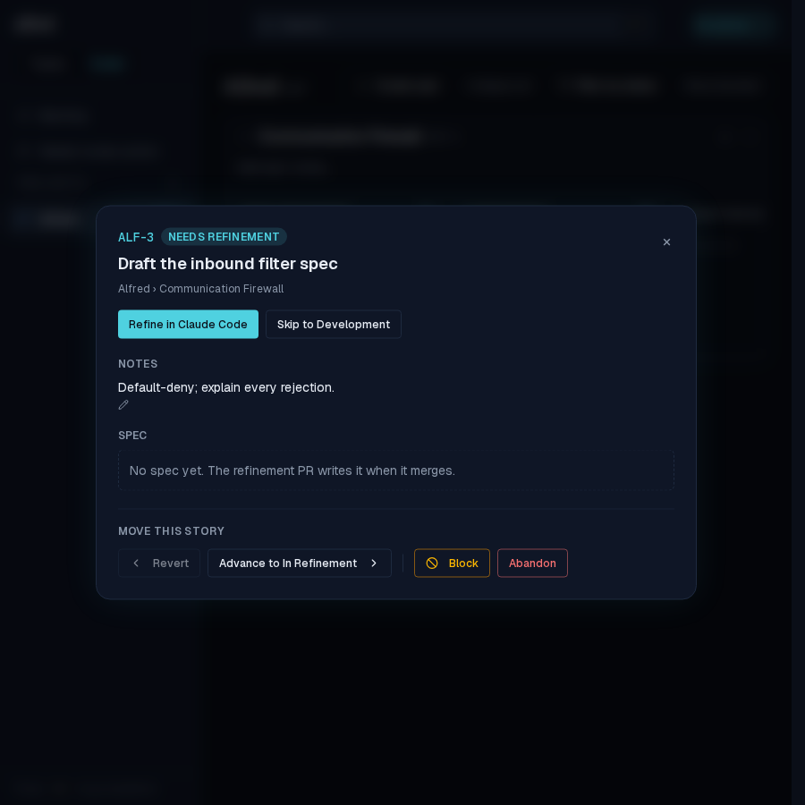

# Notes save button and ⌘↵ shortcut (ALF-125)

*2026-07-25T21:07:04.777Z*

Notes could only be saved implicitly. Task notes auto-saved on blur (with an unmount commit from ALF-126), and the code-story notes editor had a Save button but no keyboard path. ALF-125 adds an explicit **Save** button to the task detail panel and a **⌘↵ / Ctrl+↵** shortcut to *both* notes editors. The existing auto-save stays, so nothing typed is ever lost.

## Task notes

Opening a row's detail panel now shows a **Save** action under the notes body. With nothing typed there is nothing to persist, so it renders disabled (dimmed teal).

Typing a draft enables it — the same brighter teal the code module's Save uses, now a shared `ghostAccent` button variant rather than a per-call-site class override.

Pressing **⌘↵** (Ctrl+↵ off macOS) commits in place: the row's one-line notes preview appears under the title, the field keeps focus so typing can continue, no newline is inserted, and Save greys back out because the draft now matches what is stored. Clicking Save does exactly the same thing.

## Code story notes

The story detail modal's notes editor already had Save / Cancel; it now takes the same chord. Opening it and typing a draft:

**⌘↵** commits and leaves edit mode, exactly as the Save button does — the notes render back as text under the NOTES heading. The shortcut lives in the shared `TextareaField` atom, so the epic-notes editor and the block-reason field pick it up too.

## Reproducing it

Both journeys above are pinned by Playwright specs that reload the page after saving, so they prove the notes reached the backend rather than sitting in the client store:

- `frontend/e2e/task-row.spec.ts` — the Save button (disabled until the draft differs) and the ⌘↵ chord.
- `frontend/e2e/code-detail-modal.spec.ts` — the chord in the story detail modal.

The modifier ladder itself lives in `frontend/lib/ui/save-shortcut.ts` (a sibling of `plain-click.ts`): Enter with ⌘ or Ctrl, and never with Shift or Alt, so a bare Enter stays a newline.
