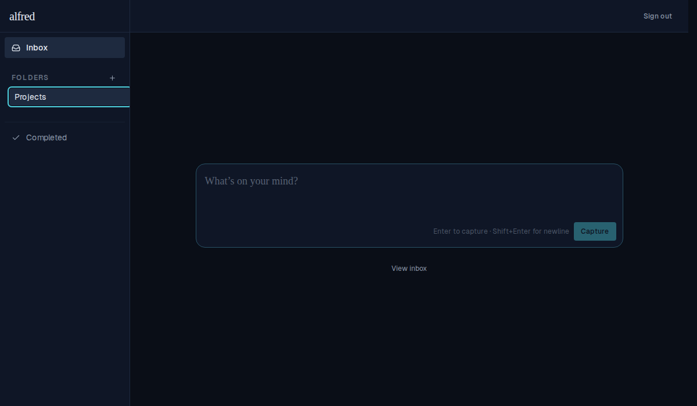
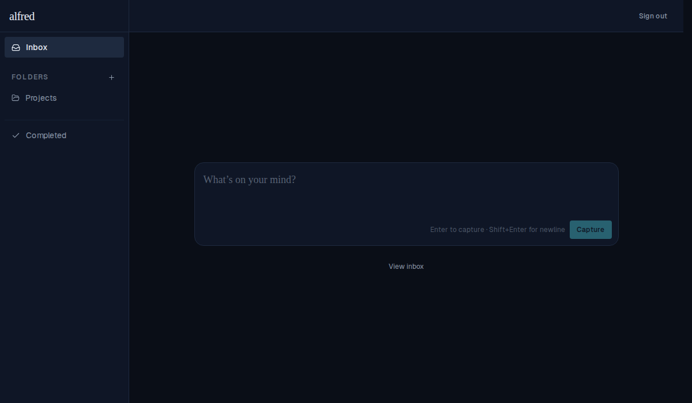
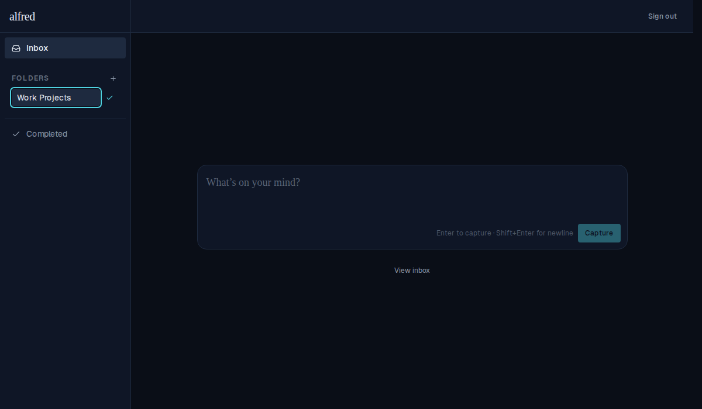
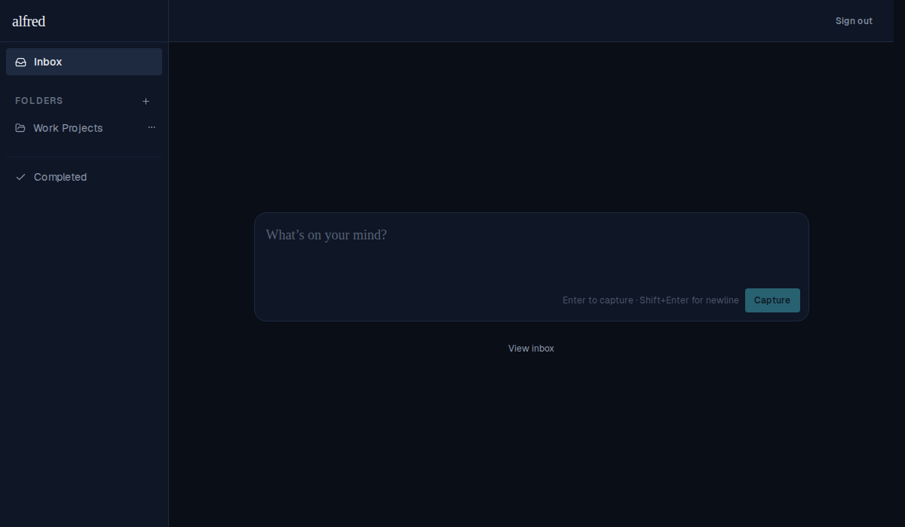

# Folder create and rename close forms optimistically

*2026-06-14T18:01:05.995Z*

Previously, the create and rename forms stayed open while the API call was in-flight (waiting for the server response before closing). This made the UI feel laggy: you'd see the form sitting there with a disabled save button until the network round-trip completed.

Now folder creation and rename follow the same optimistic pattern as task creation and task title editing: the form closes immediately on submit, the store inserts / patches the item right away, and the network call reconciles in the background. On failure the store rolls back and the form re-opens with the original input so the user can retry.

## Create folder — form open with name typed

## Create folder — form gone, folder in nav immediately after submit

The folder link appears and the create form is gone in the same React flush as the submit — before the API responds.

## Rename folder — rename form open with new name typed

## Rename folder — new name in nav immediately after submit

The updated name shows as a nav link and the rename form is gone immediately on submit.
