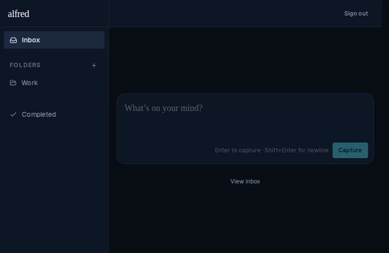

# Folder create and rename close forms optimistically

*2026-06-14T18:50:54.665Z*

The create and rename forms previously stayed open while the API call was in-flight, making the UI feel laggy. Now they follow the same optimistic pattern as task creation and title editing: the form closes immediately on submit, the store inserts/patches the item right away, and the network call reconciles in the background. On failure the store rolls back and the form re-opens with the original name for retry.

Both forms are now implemented through a shared FolderNameForm component that also fixes the layout bug where the checkmark button was clipped at the sidebar edge (missing min-w-0 on the form wrapper).

## Create folder — form closes before the API responds

## Rename folder — new name appears before the API responds

