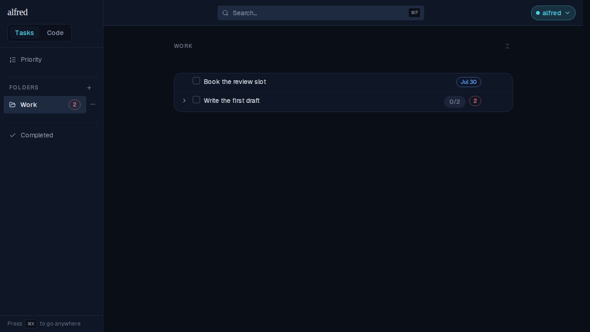
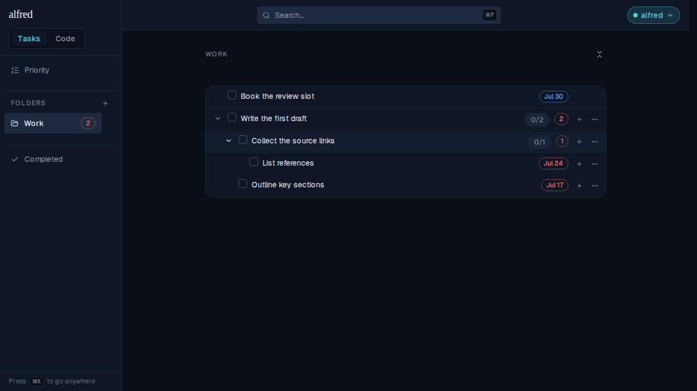
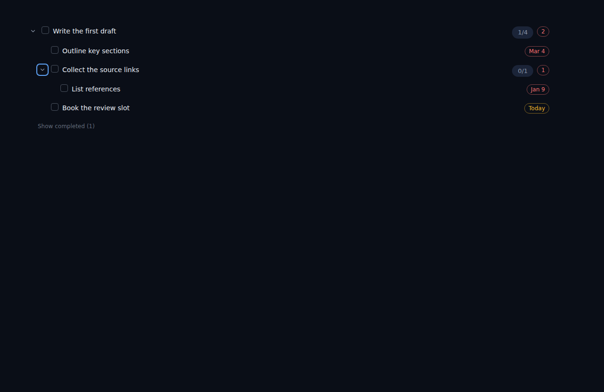

# A task row tallies the overdue work hiding inside it

*2026-07-26T04:04:00.895Z*

A collapsed task told you nothing about how late its subtasks were: you had to expand every parent to find the red due chips. Now the row carries a **red count of the active, past-due subtasks anywhere in its subtree**, beside the existing `completed/total` count.

The tally follows four rules, all shown below:

- it spans the **whole subtree**, not just the direct children — a late grandchild still surfaces on the root;
- a **completed** subtask never counts, however far past its due date;
- a subtask due **today** never counts — today is not yet late;
- the row's **own** due date never counts — its red due chip already says that.

## In the live app

The Work folder holds one clean task (`Book the review slot`, due Jul 30) and one parent, `Write the first draft`, whose subtasks are late. Collapsed, the parent shows `0/2` — and now a red **2** next to it. Nothing is expanded, yet the row already says *two things in here are late*.

Expanding two levels shows where the 2 came from: one direct child (`Outline key sections`, Jul 17) and one **grandchild** (`List references`, Jul 24), both red. The tally is a running total on every ancestor — the root keeps its **2** while the middle row, `Collect the source links`, reports the single overdue subtask beneath it as **1**.

## The exclusion rules, in Storybook

The live folder above covers the depth rule. The remaining rules need a subtask that is completed and one due today, so the `Tasks/TaskRow` stories pin them. `WithOverdueSubtasks` gives the parent four subtasks — one overdue direct child, one overdue grandchild, one **completed** and long past due, one due **today**. It reads `1/4` with a red **2**: only the first two count.

Expanded, the excluded two are visible: `Book the review slot` carries an amber **Today** chip and is not counted, and the completed `Pick a working title` sits behind `Show completed (1)` with its past due date ignored.

And the control — a parent whose one subtask has no due date shows `0/1` and **no red tally at all**. A task with nothing late stays clean, exactly like a folder with no overdue count.

## Screen readers get the meaning, not just the digit

The badge shows a bare number, so the meaning rides its accessible name — `1 overdue subtask` / `2 overdue subtasks`, matching how the folder tallies announce themselves (`2 overdue`) rather than reading out a naked "2".
