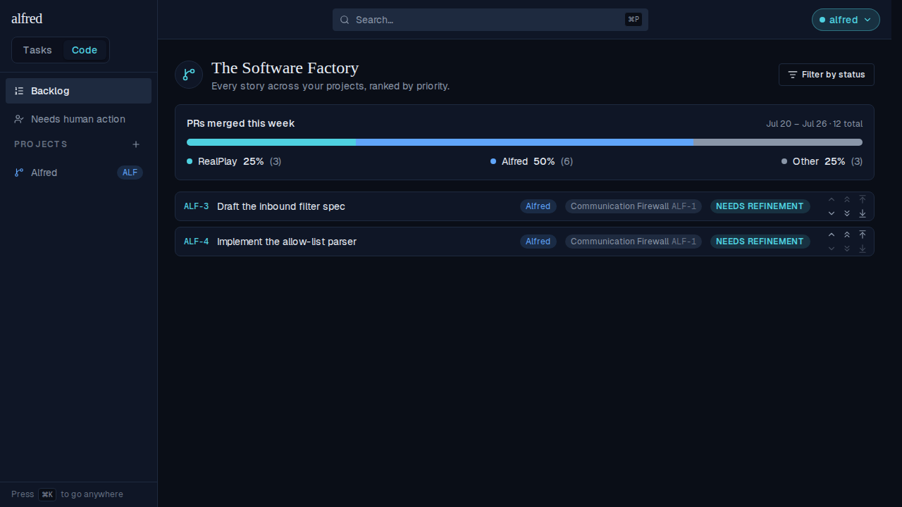
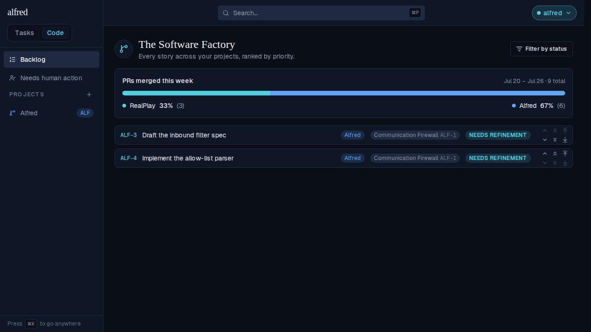

# An "Other" bucket on the weekly PR ratio (ALF-135)

*2026-07-26T03:53:30.518Z*

The Backlog's weekly PR-ratio card (ALF-131) only ever counted the repos named in `PR_RATIO_REPOS`. A PR merged anywhere else was invisible: it didn't appear as a segment, and — worse — it didn't appear in the denominator either, so "67% Alfred" silently meant "67% of the PRs I happened to be measuring", not "67% of the PRs I merged".

ALF-135 adds a final **Other** segment: every PR merged this week in a repo *not* in `PR_RATIO_REPOS`. It shares the same 100 as the measured repos, so the percentages now answer the question the card looks like it's answering.

## The card on the Backlog

`/code/backlog`, above the story list. Other always sits **last**, after the configured repos, and wears a de-emphasized neutral rather than one of the named accent tokens — the accents belong to the repos the owner deliberately chose to measure, and the catch-all shouldn't compete with them for attention. The bar segment and its legend dot share the one class, so Other reads the same in both places.



### An empty Other is dropped, not shown at 0%

A week where everything merged inside the configured repos is the common case, and `Other 0% (0)` would be a permanent row that tells the reader nothing. So the entry is dropped entirely — the card falls back to exactly the ALF-131 layout. Same seeded Backlog, same endpoint, `other: { count: 0, percentage: 0 }`:



The configured repos are *not* dropped at zero, though — the owner asked for them by name, so `RealPlay 0% (0)` stays. Only the catch-all earns its place by being non-empty.

## The endpoint

`GET /api/code/pr-ratio` carries the new bucket as a top-level `other`, alongside `repos`. It has no `repo` field, because it isn't one repo — but its `percentage` is inside the same largest-remainder rounding, so the shares still sum to exactly 100.

Below, a real `next dev` server answers a real HTTP request through the real route. Only the hop to `api.github.com` is faked — by a preload that returns a fixed `total_count` and records the query it was handed — because nothing here may call GitHub.

```bash
cd frontend
# Next caches the search fetch for 5 minutes (`next: { revalidate: 300 }`), so the build
# output has to go before a re-run reaches the stub at all. Removing only
# `.next/cache/fetch-cache` is NOT enough — dev restores the cached entries and answers from
# them, so the stub never fires and the numbers below would be a previous run's.
rm -rf .next

# Answer GitHub's search API locally and record every query the route issues. Everything
# downstream — auth, env parsing, the query builders, the largest-remainder math, the route —
# is the real code; only the hop to github.com is faked, because nothing here may call GitHub.
# The stub answers by *shape*: the Other sweep is the query carrying `-repo:`.
cat > /tmp/alf135-stub.mjs <<'STUB'
import { appendFileSync } from 'node:fs';
const realFetch = globalThis.fetch;
globalThis.fetch = async (input, init) => {
  const url = typeof input === 'string' ? input : input.url;
  if (!url.startsWith('https://api.github.com/search/issues')) return realFetch(input, init);
  const q = new URL(url).searchParams.get('q') ?? '';
  appendFileSync('/tmp/alf135-queries.txt', q + '\n');
  const total = q.includes('-repo:') ? 3 : q.includes('/realplay') ? 3 : 6;
  return new Response(JSON.stringify({ total_count: total }), {
    status: 200,
    headers: { 'content-type': 'application/json' },
  });
};
STUB
rm -f /tmp/alf135-queries.txt

export NEXT_PUBLIC_SUPABASE_URL=http://127.0.0.1:54421
export NEXT_PUBLIC_SUPABASE_ANON_KEY=sb_publishable_demo
export SUPABASE_SERVICE_ROLE_KEY=sb_secret_demo
export INGEST_API_KEY=demo-ingest-key
export NODE_OPTIONS=--import=file:///tmp/alf135-stub.mjs
export GITHUB_TOKEN=ghp_demo_token
export PR_RATIO_REPOS='ac3charland/realplay:RealPlay,ac3charland/alfred:Alfred'
export PR_RATIO_AUTHORS=ac3charland

node ../node_modules/.bin/next dev -p 3231 >/dev/null 2>&1 &
SERVER=$!
trap 'kill $SERVER 2>/dev/null' EXIT
until curl -s -o /dev/null --max-time 180 http://127.0.0.1:3231/api/code/pr-ratio; do sleep 0.5; done

echo '== GET /api/code/pr-ratio — 3 PRs merged outside the configured repos =='
# The week's timestamps are stood down to their weekday so this capture doesn't go stale
# next Monday.
curl -s -H 'x-api-key: demo-ingest-key' http://127.0.0.1:3231/api/code/pr-ratio | node -e '
  let raw = "";
  process.stdin.on("data", (c) => (raw += c)).on("end", () => {
    const body = JSON.parse(raw);
    const weekday = (iso) =>
      "<" +
      new Date(iso.slice(0, 10) + "T00:00:00Z").toLocaleDateString("en-US", { weekday: "long", timeZone: "UTC" }) +
      ">" + iso.slice(10);
    body.week = { ...body.week, start: weekday(body.week.start), end: weekday(body.week.end) };
    console.log(JSON.stringify(body, null, 2));
  });
'

echo
echo '== the searches that answer cost, one per segment =='
sed -E 's/merged:[^ ]+/merged:<this Monday>..<next Monday>/' /tmp/alf135-queries.txt | sort
```

```output
== GET /api/code/pr-ratio — 3 PRs merged outside the configured repos ==
{
  "week": {
    "start": "<Monday>T00:00:00+00:00",
    "end": "<Monday>T00:00:00+00:00",
    "timezone": "UTC"
  },
  "total": 12,
  "repos": [
    {
      "repo": "ac3charland/realplay",
      "label": "RealPlay",
      "count": 3,
      "percentage": 25
    },
    {
      "repo": "ac3charland/alfred",
      "label": "Alfred",
      "count": 6,
      "percentage": 50
    }
  ],
  "other": {
    "count": 3,
    "percentage": 25
  }
}

== the searches that answer cost, one per segment ==
is:pr is:merged merged:<this Monday>..<next Monday> author:ac3charland -repo:ac3charland/realplay -repo:ac3charland/alfred
repo:ac3charland/alfred is:pr is:merged merged:<this Monday>..<next Monday> author:ac3charland
repo:ac3charland/realplay is:pr is:merged merged:<this Monday>..<next Monday> author:ac3charland
```

### Where the bucket comes from, and why it needs `PR_RATIO_AUTHORS`

Look at the third query above: the Other sweep is `author:…` **minus** every measured repo. That subtraction is the whole design constraint. GitHub Search has no "everywhere except these repos" — `-repo:` exclusions are only meaningful next to some qualifier that bounds the search, or the query means *every merged PR on GitHub this week*. The `author:` allowlist is that anchor, which makes Other precisely "my merged PRs elsewhere".

So a deployment with no `PR_RATIO_AUTHORS` can't measure the bucket, and the endpoint **omits `other` entirely** rather than reporting a misleading zero — no third search is issued at all. The card then renders exactly what it rendered before ALF-135:

```bash
cd frontend
# Same full reset — otherwise this run is answered from the previous block's cached searches.
rm -rf .next

cat > /tmp/alf135-noauthors-stub.mjs <<'STUB'
import { appendFileSync } from 'node:fs';
const realFetch = globalThis.fetch;
globalThis.fetch = async (input, init) => {
  const url = typeof input === 'string' ? input : input.url;
  if (!url.startsWith('https://api.github.com/search/issues')) return realFetch(input, init);
  const q = new URL(url).searchParams.get('q') ?? '';
  appendFileSync('/tmp/alf135-noauthors-queries.txt', q + '\n');
  return new Response(JSON.stringify({ total_count: q.includes('/realplay') ? 3 : 6 }), {
    status: 200,
    headers: { 'content-type': 'application/json' },
  });
};
STUB
rm -f /tmp/alf135-noauthors-queries.txt

export NEXT_PUBLIC_SUPABASE_URL=http://127.0.0.1:54422
export NEXT_PUBLIC_SUPABASE_ANON_KEY=sb_publishable_demo
export SUPABASE_SERVICE_ROLE_KEY=sb_secret_demo
export INGEST_API_KEY=demo-ingest-key
export NODE_OPTIONS=--import=file:///tmp/alf135-noauthors-stub.mjs
export GITHUB_TOKEN=ghp_demo_token
export PR_RATIO_REPOS='ac3charland/realplay:RealPlay,ac3charland/alfred:Alfred'
# PR_RATIO_AUTHORS deliberately unset — nothing to anchor the sweep on.

node ../node_modules/.bin/next dev -p 3232 >/dev/null 2>&1 &
SERVER=$!
trap 'kill $SERVER 2>/dev/null' EXIT
until curl -s -o /dev/null --max-time 180 http://127.0.0.1:3232/api/code/pr-ratio; do sleep 0.5; done

echo '== GET /api/code/pr-ratio with PR_RATIO_AUTHORS unset =='
curl -s -H 'x-api-key: demo-ingest-key' http://127.0.0.1:3232/api/code/pr-ratio | node -e '
  let raw = "";
  process.stdin.on("data", (c) => (raw += c)).on("end", () => {
    const body = JSON.parse(raw);
    console.log("keys:            ", Object.keys(body).join(", "));
    console.log("has an `other`?  ", Object.hasOwn(body, "other"));
    console.log("total:           ", body.total);
    console.log("shares:          ", body.repos.map((r) => r.label + " " + r.percentage + "%").join(", "));
  });
'

echo
echo '== every search this deployment issued =='
sed -E 's/merged:[^ ]+/merged:<this Monday>..<next Monday>/' /tmp/alf135-noauthors-queries.txt | sort
echo "(no unanchored sweep: $(grep -c -- '-repo:' /tmp/alf135-noauthors-queries.txt) query carries a -repo: exclusion)"
```

```output
== GET /api/code/pr-ratio with PR_RATIO_AUTHORS unset ==
keys:             week, total, repos
has an `other`?   false
total:            9
shares:           RealPlay 33%, Alfred 67%

== every search this deployment issued ==
repo:ac3charland/alfred is:pr is:merged merged:<this Monday>..<next Monday> -author:app/dependabot -author:app/renovate -author:app/github-actions
repo:ac3charland/realplay is:pr is:merged merged:<this Monday>..<next Monday> -author:app/dependabot -author:app/renovate -author:app/github-actions
(no unanchored sweep: 0 query carries a -repo: exclusion)
```

## Failure posture is unchanged

Other is a segment like any other, so its search failing sinks the whole call the same way a measured repo's does — the card shows its one muted line rather than a bar whose segments were counted under different rules. And the bar's accessible label names Other alongside the repos, so the legend and the assistive-technology description never disagree: *"RealPlay 25 percent, 3 pull requests; Alfred 50 percent, 6 pull requests; Other 25 percent, 3 pull requests"*.
