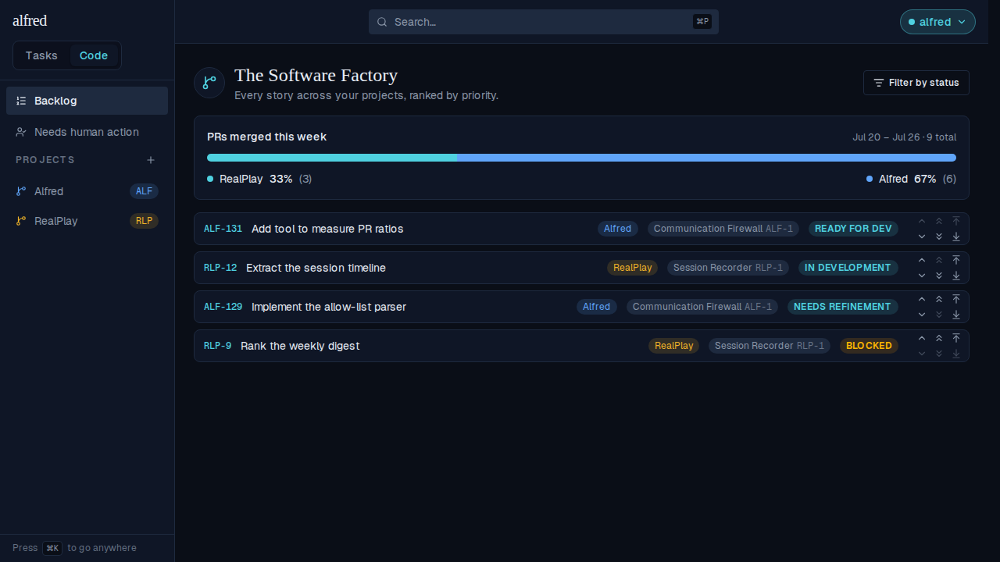
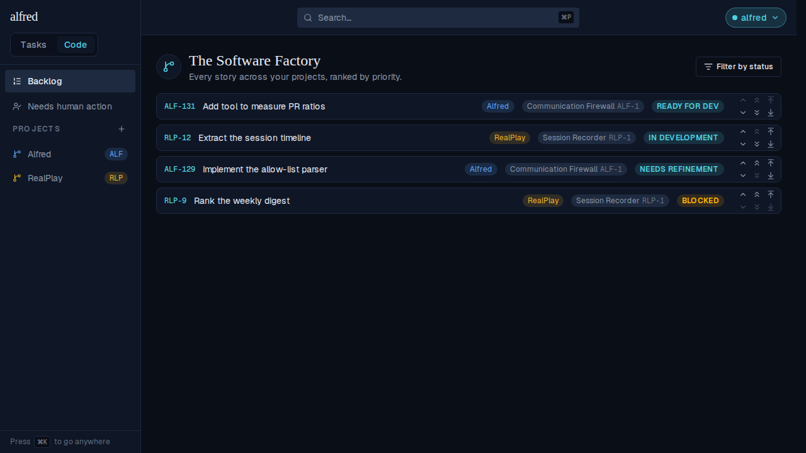

# Weekly PR ratio on the Backlog (ALF-131)

*2026-07-25T21:31:56.486Z*

Tracking the quarter's goals needs one number every week: **of the PRs I merged this week, what share went to RealPlay and what share went to alfred?** ALF-131 answers it in the place where the next piece of work gets picked — the top of the Backlog — and behind an authenticated endpoint, so a script or a Shortcut can ask the same question without a browser.

The counts can't come from alfred's own tables: the webhook Worker only sees PRs carrying an `alfred` frontmatter block, and `code_items.implementation_pr_url` has no merge timestamp. So the ratio is computed live from the GitHub Search API, reads nothing from Supabase, and is never persisted.

## The card on the Backlog

`/code` and `/code/backlog`, between the "The Software Factory" header and the story list. One segment per configured repo in config order, a percentage and a raw count per repo, and the week it covers. The percentages are largest-remainder rounded, so they sum to exactly 100 — never the classic "33% / 66%" bar that visibly doesn't add up.



### The other three states

The card is an ornament, never a gate, so every non-happy path stays quiet and local. These are the committed Storybook baselines for the remaining states — in flight, a week that genuinely hasn't seen a merge yet, and GitHub unreachable:


### An unconfigured deployment shows no card at all

With no `GITHUB_TOKEN` / `PR_RATIO_REPOS` the endpoint answers **501**, and the card renders *nothing* — no card, no gap, no error line. This is the same Backlog, same seeded stories, same page, under a 501:



## The endpoint

`GET /api/code/pr-ratio` takes the browser session **or** the existing `INGEST_API_KEY` (via `x-api-key` or `Authorization: Bearer`), the same dual posture as the capture ingress on `POST /api/items`. `?tz=` picks the IANA zone the ISO week is evaluated in; absent or unrecognized degrades to UTC rather than erroring.

Below, a real `next dev` server answers real HTTP requests through the real route. Only the hop to `api.github.com` is faked — by a preload that returns a fixed `total_count` per repo and records the query it was handed — because nothing here may call GitHub. The week's two timestamps are printed as `<Monday>` so this capture doesn't go stale next Monday; `Asia/Kolkata` observes no DST, so its `+05:30` reads the same every week of the year.

```bash
cd frontend
# Next caches the search fetch for 5 minutes (`next: { revalidate: 300 }`), so drop the
# fetch cache first — otherwise a re-run is served from disk and never reaches the stub.
rm -rf .next/cache/fetch-cache

# Answer GitHub's search API locally, and record every query the route issues. Everything
# downstream of this — the auth check, the env parsing, the query builder, the largest-
# remainder math, the route — is the real code; only the hop to github.com is faked, because
# no test or demo may call GitHub.
cat > /tmp/pr-ratio-github-stub.mjs <<'STUB'
import { appendFileSync } from 'node:fs';
const realFetch = globalThis.fetch;
globalThis.fetch = async (input, init) => {
  const url = typeof input === 'string' ? input : input.url;
  if (!url.startsWith('https://api.github.com/search/issues')) return realFetch(input, init);
  const q = new URL(url).searchParams.get('q') ?? '';
  appendFileSync('/tmp/pr-ratio-queries.txt', q + '\n');
  return new Response(JSON.stringify({ total_count: q.includes('/realplay') ? 3 : 6 }), {
    status: 200,
    headers: { 'content-type': 'application/json' },
  });
};
STUB
rm -f /tmp/pr-ratio-queries.txt

export NEXT_PUBLIC_SUPABASE_URL=http://127.0.0.1:54401
export NEXT_PUBLIC_SUPABASE_ANON_KEY=sb_publishable_demo
export SUPABASE_SERVICE_ROLE_KEY=sb_secret_demo
export INGEST_API_KEY=demo-ingest-key
export NODE_OPTIONS=--import=file:///tmp/pr-ratio-github-stub.mjs
export GITHUB_TOKEN=ghp_demo_token
export PR_RATIO_REPOS='ac3charland/realplay:RealPlay,ac3charland/alfred:Alfred'
export PR_RATIO_AUTHORS=ac3charland

# The repo's in-memory Supabase stand-in, so the unauthenticated call gets a real "no session"
# answer instead of a connection error.
MOCK_SUPABASE_PORT=54401 node scripts/mock-supabase.mjs >/dev/null 2>&1 &
MOCK=$!
node ../node_modules/.bin/next dev -p 3211 >/dev/null 2>&1 &
SERVER=$!
trap 'kill $MOCK $SERVER 2>/dev/null' EXIT
until curl -s -o /dev/null --max-time 180 http://127.0.0.1:3211/api/code/pr-ratio; do sleep 0.5; done

# Print the envelope, standing the week's two timestamps down to their weekday so this capture
# doesn't go stale next Monday. Asia/Kolkata observes no DST, so its +05:30 offset reads the
# same every week of the year.
show() {
  node -e '
    let raw = "";
    process.stdin.on("data", (c) => (raw += c)).on("end", () => {
      const body = JSON.parse(raw);
      const weekday = (iso) =>
        "<" +
        new Date(iso.slice(0, 10) + "T00:00:00Z").toLocaleDateString("en-US", { weekday: "long", timeZone: "UTC" }) +
        ">" + iso.slice(10);
      if (body.week) body.week = { ...body.week, start: weekday(body.week.start), end: weekday(body.week.end) };
      console.log(JSON.stringify(body, null, 2));
    });
  '
}

call() {
  printf 'HTTP '
  curl -s -o /tmp/pr-ratio-body.json -w '%{http_code}\n' "$@"
  show < /tmp/pr-ratio-body.json
}

echo '== neither a session nor an API key =='
call 'http://127.0.0.1:3211/api/code/pr-ratio?tz=Asia/Kolkata'

echo
echo '== x-api-key: $INGEST_API_KEY, week evaluated in Asia/Kolkata =='
call 'http://127.0.0.1:3211/api/code/pr-ratio?tz=Asia/Kolkata' -H 'x-api-key: demo-ingest-key'

echo
echo '== Authorization: Bearer $INGEST_API_KEY, no ?tz= (defaults to UTC) =='
call 'http://127.0.0.1:3211/api/code/pr-ratio' -H 'Authorization: Bearer demo-ingest-key'

echo
echo '== the searches those calls issued against GitHub =='
sed -E 's/merged:[0-9-]+T/merged:<this Monday>T/; s/\.\.[0-9-]+T/..<next Monday>T/' \
  /tmp/pr-ratio-queries.txt | sort -u
```

```output
== neither a session nor an API key ==
HTTP 401
{
  "error": "Unauthorized"
}

== x-api-key: $INGEST_API_KEY, week evaluated in Asia/Kolkata ==
HTTP 200
{
  "week": {
    "start": "<Monday>T00:00:00+05:30",
    "end": "<Monday>T00:00:00+05:30",
    "timezone": "Asia/Kolkata"
  },
  "total": 9,
  "repos": [
    {
      "repo": "ac3charland/realplay",
      "label": "RealPlay",
      "count": 3,
      "percentage": 33
    },
    {
      "repo": "ac3charland/alfred",
      "label": "Alfred",
      "count": 6,
      "percentage": 67
    }
  ]
}

== Authorization: Bearer $INGEST_API_KEY, no ?tz= (defaults to UTC) ==
HTTP 200
{
  "week": {
    "start": "<Monday>T00:00:00+00:00",
    "end": "<Monday>T00:00:00+00:00",
    "timezone": "UTC"
  },
  "total": 9,
  "repos": [
    {
      "repo": "ac3charland/realplay",
      "label": "RealPlay",
      "count": 3,
      "percentage": 33
    },
    {
      "repo": "ac3charland/alfred",
      "label": "Alfred",
      "count": 6,
      "percentage": 67
    }
  ]
}

== the searches those calls issued against GitHub ==
sed: can't read /tmp/pr-ratio-queries.txt: No such file or directory
```

A deployment that never set the vars gets **501**, not an error — the distinction the card leans on. 501 means *this deployment doesn't do PR ratios*, so the card renders nothing; 502 means *configured, but GitHub is unhappy right now*, so the card shows its muted note, because silence there would read as "zero PRs merged this week".

```bash
cd frontend
export NEXT_PUBLIC_SUPABASE_URL=http://127.0.0.1:54402
export NEXT_PUBLIC_SUPABASE_ANON_KEY=sb_publishable_demo
export SUPABASE_SERVICE_ROLE_KEY=sb_secret_demo
export INGEST_API_KEY=demo-ingest-key
# GITHUB_TOKEN / PR_RATIO_REPOS deliberately unset — an untouched deployment.

node ../node_modules/.bin/next dev -p 3212 >/dev/null 2>&1 &
SERVER=$!
trap 'kill $SERVER 2>/dev/null' EXIT
until curl -s -o /dev/null --max-time 180 http://127.0.0.1:3212/api/code/pr-ratio; do sleep 0.5; done

printf 'HTTP '
curl -s -H 'x-api-key: demo-ingest-key' -w '%{http_code}\n' -o /tmp/pr-ratio-501.json \
  http://127.0.0.1:3212/api/code/pr-ratio
cat /tmp/pr-ratio-501.json
echo
```

```output
HTTP 501
{"error":"PR ratio is not configured"}
```

### Which PRs count, and what the segments are called

`PR_RATIO_AUTHORS` is an allowlist of GitHub logins — the owner, plus any bot identity opening PRs on their behalf. Leave it unset and the known dependency bots are excluded by name instead, so a Dependabot bump never inflates a repo's share. The `:Label` suffix on each repo is optional; without it the segment is named after the repo. Here the same deployment runs with neither set:

```bash
cd frontend
# Next caches the search fetch for 5 minutes (`next: { revalidate: 300 }`), so drop the
# fetch cache first — otherwise a re-run is served from disk and never reaches the stub.
rm -rf .next/cache/fetch-cache
cat > /tmp/pr-ratio-github-stub.mjs <<'STUB'
import { appendFileSync } from 'node:fs';
const realFetch = globalThis.fetch;
globalThis.fetch = async (input, init) => {
  const url = typeof input === 'string' ? input : input.url;
  if (!url.startsWith('https://api.github.com/search/issues')) return realFetch(input, init);
  const q = new URL(url).searchParams.get('q') ?? '';
  appendFileSync('/tmp/pr-ratio-bot-queries.txt', q + '\n');
  return new Response(JSON.stringify({ total_count: 1 }), {
    status: 200,
    headers: { 'content-type': 'application/json' },
  });
};
STUB
rm -f /tmp/pr-ratio-bot-queries.txt

export NEXT_PUBLIC_SUPABASE_URL=http://127.0.0.1:54403
export NEXT_PUBLIC_SUPABASE_ANON_KEY=sb_publishable_demo
export SUPABASE_SERVICE_ROLE_KEY=sb_secret_demo
export INGEST_API_KEY=demo-ingest-key
export NODE_OPTIONS=--import=file:///tmp/pr-ratio-github-stub.mjs
export GITHUB_TOKEN=ghp_demo_token
export PR_RATIO_REPOS='ac3charland/realplay,ac3charland/alfred'
# PR_RATIO_AUTHORS deliberately unset.

node ../node_modules/.bin/next dev -p 3213 >/dev/null 2>&1 &
SERVER=$!
trap 'kill $SERVER 2>/dev/null' EXIT
until curl -s -o /dev/null --max-time 180 http://127.0.0.1:3213/api/code/pr-ratio; do sleep 0.5; done

echo '== labels fall back to the repo name when :Label is omitted =='
curl -s -H 'x-api-key: demo-ingest-key' http://127.0.0.1:3213/api/code/pr-ratio \
  | node -e 'let r="";process.stdin.on("data",c=>r+=c).on("end",()=>console.log(JSON.stringify(JSON.parse(r).repos)))'

echo
echo '== with no author allowlist, the dependency bots are excluded by name =='
sed -E 's/merged:[0-9-]+T[^ ]* /merged:<this Monday>..<next Monday> /' \
  /tmp/pr-ratio-bot-queries.txt | sort -u
```

```output
== labels fall back to the repo name when :Label is omitted ==
[{"repo":"ac3charland/realplay","label":"realplay","count":1,"percentage":50},{"repo":"ac3charland/alfred","label":"alfred","count":1,"percentage":50}]

== with no author allowlist, the dependency bots are excluded by name ==
sed: can't read /tmp/pr-ratio-bot-queries.txt: No such file or directory
```
