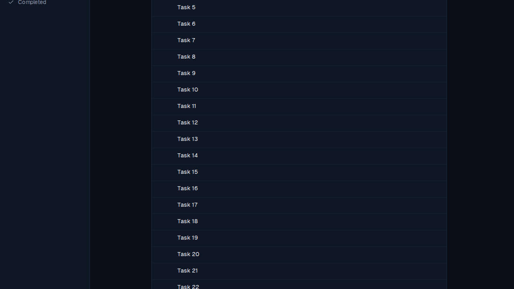
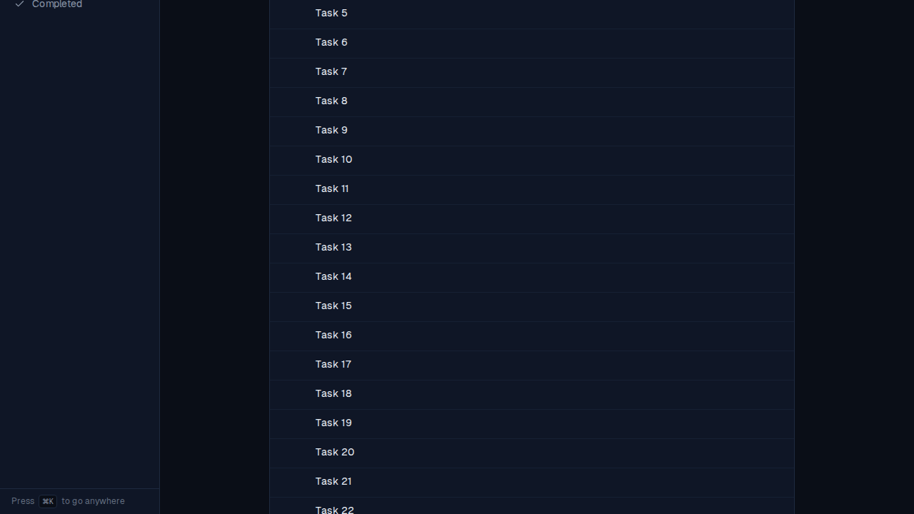

# Press ⌘K hint stays pinned to the viewport bottom

*2026-09-10T21:52:21.553Z*

ALF-207: the sidebar's "Press ⌘K to go anywhere" hint is the last child of the desktop sidebar. The app frame's document (not an inner pane) is what scrolls, so the sidebar stretches to match however tall the main content column grows — on a long task list, far past one screen. Before this fix, the hint sat in-flow at the bottom of that stretched sidebar, which put it below the fold of the whole *page* rather than the bottom of the *viewport*.

Below: the same folder (60 seeded tasks) scrolled 400px down, before and after the fix. Same scroll position, same viewport — before, the sidebar area is just empty space; after, the hint is pinned to the bottom of the screen.

**Before** — hint has scrolled off past the viewport, only empty sidebar space is visible:

**After** — hint is stuck to the bottom of the viewport at the same scroll position:

The fix: `sidebarShortcutHintClass` (frontend/components/shell/app-shell.styles.ts) adds `sticky bottom-0` (plus `bg-surface` so it repaints opaque over whatever is now behind it). A locked-down e2e regression test (`frontend/e2e/sidebar-shortcut-hint.spec.ts`) seeds 60 tasks and asserts the hint's bounding box stays fully inside the viewport at multiple scroll positions.
