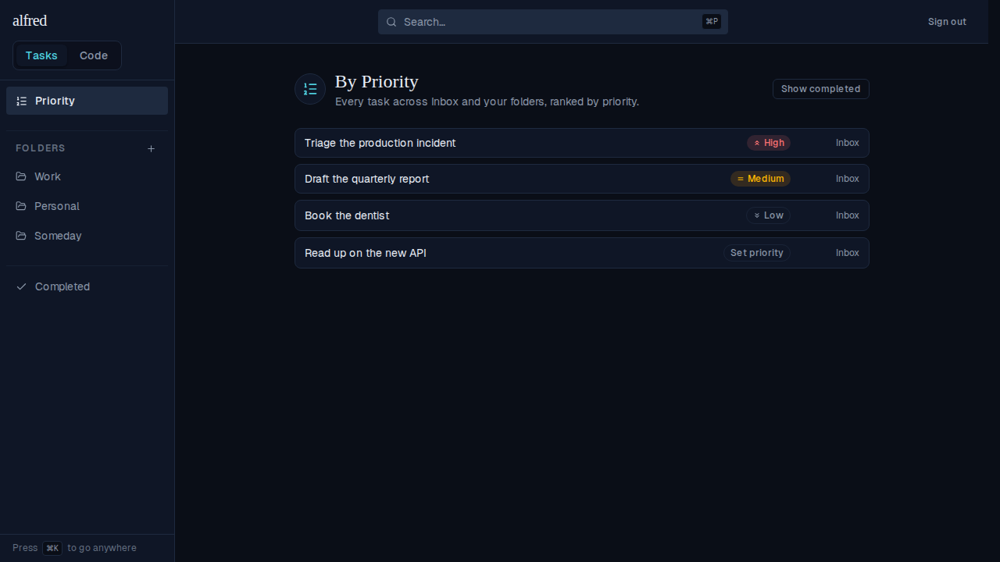
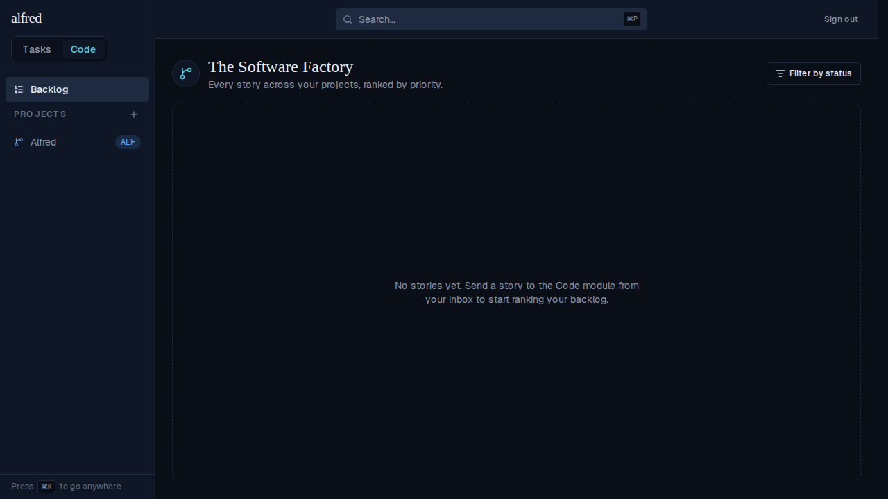

# Priority pinned above folders and made the tasks default view

*2026-07-05T23:20:17.445Z*

ALF-95 makes the By-Priority list the tasks module's default view and pins it at the top of the sidebar, above the folders.

Two changes:
1. The sidebar's Priority link moves above the Folders section (Completed stays below the folders).
2. The Tasks ⇄ Code switcher's "Tasks" segment now lands on `/priority` instead of the `/` capture screen. Capture-first is preserved: the `alfred` wordmark still opens the capture landing.

### 1. Sidebar: Priority pinned above the folders

The By-Priority view is now the first entry in the tasks sidebar — above the Folders section — with Completed kept below the folders.

### 2. Tasks module's default view is By-Priority

Entering the Tasks module lands on the By-Priority list. From the Code module (below)…

…clicking the **Tasks** switcher segment lands on `/priority` (not the `/` capture screen), with the Tasks segment and the sidebar Priority link both highlighted.

