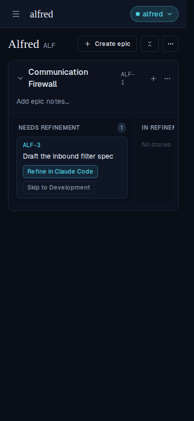
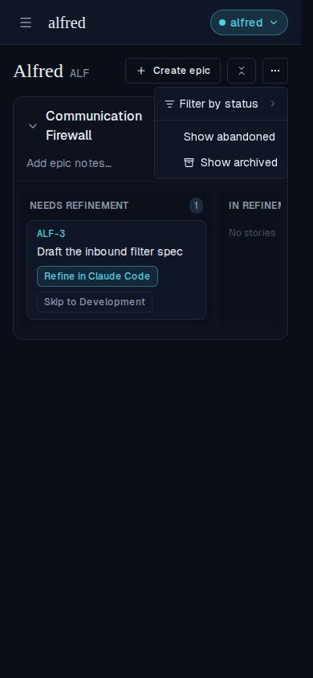
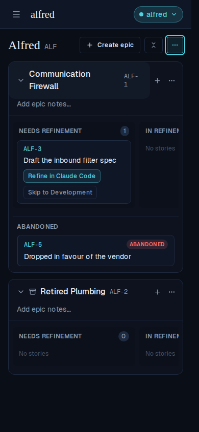
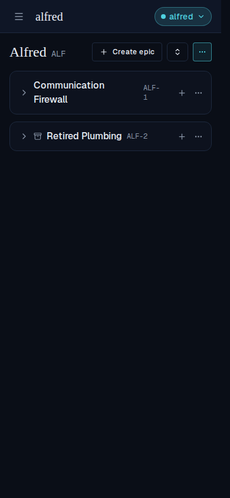
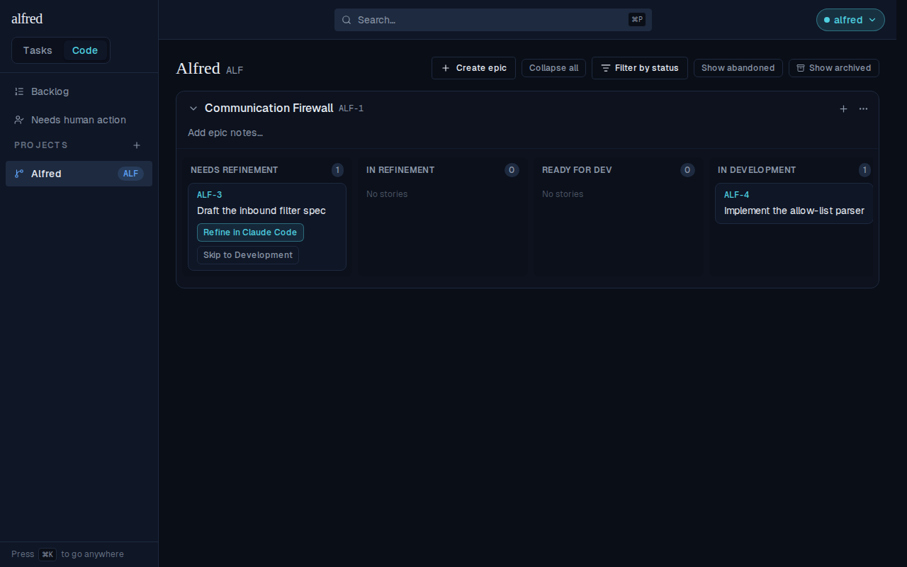
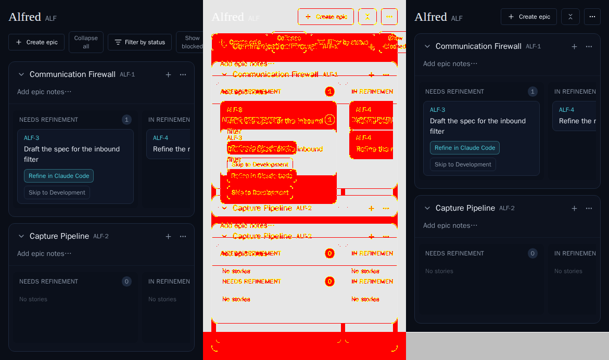

# Project board controls fold into a ⋯ menu on mobile (ALF-134)

*2026-07-26T04:00:58.623Z*

On a phone the project board header used to wrap onto a second row: **Create epic**, **Collapse all**, **Filter by status**, **Show abandoned** and **Show archived** all competed for 390px. The three *view filters* now fold into a single ⋯ menu below `md`, and **Collapse all / Open all** condenses to a chevron glyph. **Create epic** stays a visible button — it's the board's primary action.

## The mobile header at rest

One tidy row: `Create epic` · the collapse-all glyph · ⋯ — all three the same height, so the header reads as a single bar.

## Tapping ⋯ opens the three folded-away filters

`Filter by status` keeps its full checkbox list, one level in as a submenu; `Show abandoned` and `Show archived` become checkbox items that reflect the current state.

## The menu still drives the board

Checking **Show archived** and **Show abandoned** reveals the archived epic (*Retired Plumbing*) and the abandoned story (*ALF-5*) — and the ⋯ trigger picks up the teal treatment its folded-away controls carry, so an active filter is not invisible on a phone.

## The collapse-all glyph still collapses everything

The label is `sr-only` below `md` rather than removed, so the button is still announced as "Collapse all" / "Open all" — only the pixels are saved.

## Desktop is untouched

From `md` up all five controls stay inline, exactly as before, and there is no ⋯ menu.

## The committed mobile snapshot moves

The `Code/Board → MobileBoard` story is captured at 390×844, so the snapshot gate caught the change. Baseline (left) · changed pixels (middle) · new render (right): the header collapses from two wrapped rows to one, and the whole board shifts up 54px.

