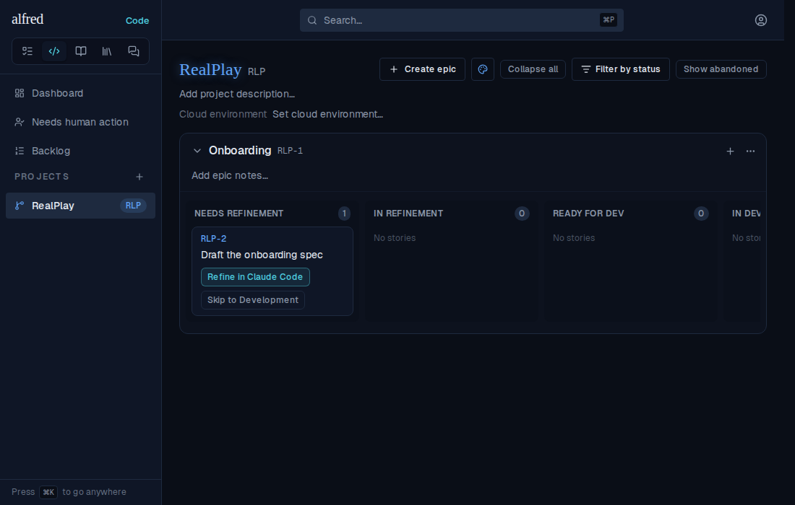
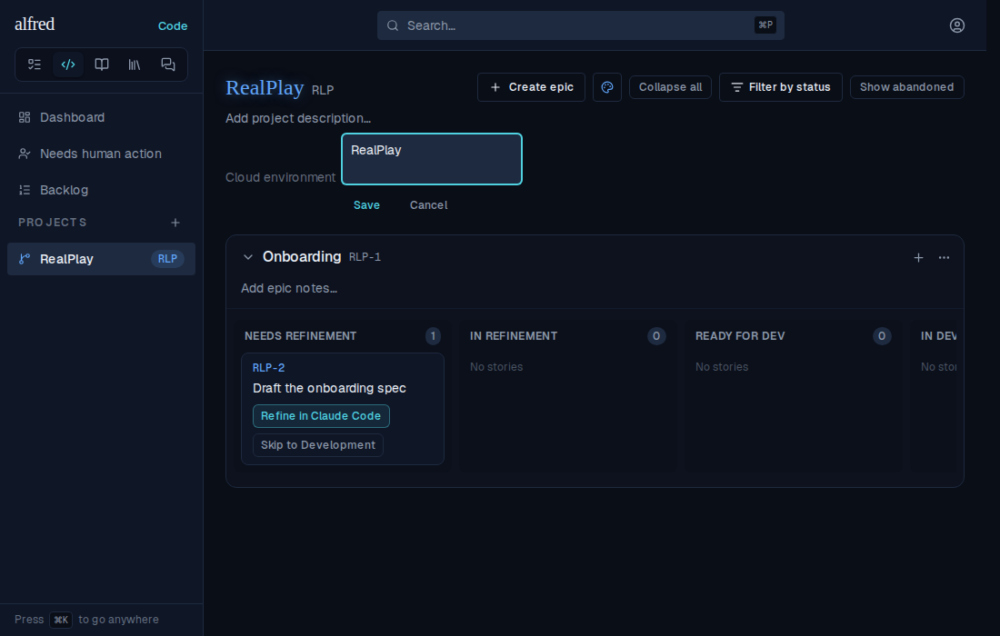
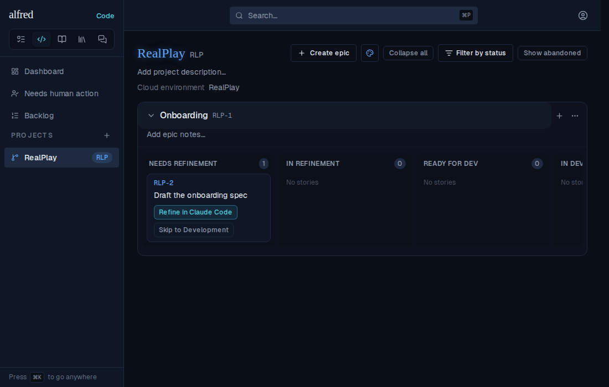
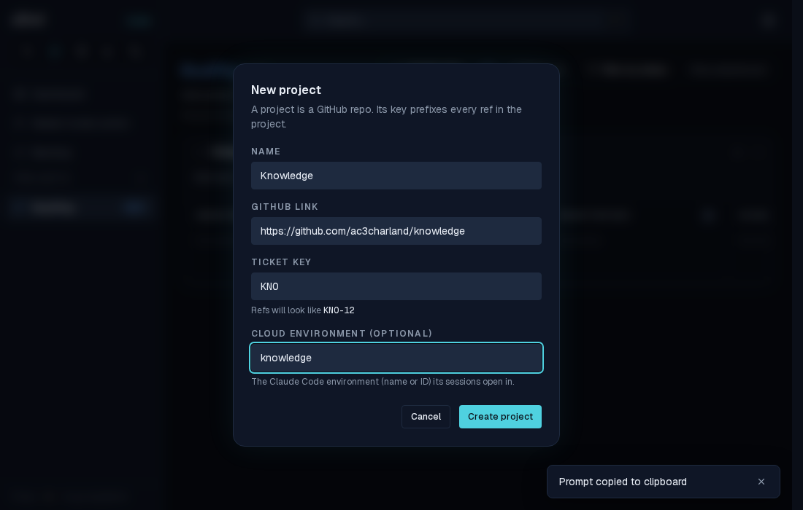

# A project's cloud environment, preselected by every launch link

*2026-10-02T19:15:00.783Z*

ALF-279. Each project can name the Claude Code cloud environment (name or `env_…` id) its sessions should start in. Every launch link (refine, implement, skip-refinement, spike, bug, epic refine/implement) then carries claude.ai/code's documented `environment` query param, so RealPlay opens in the RealPlay environment and Alfred in alfred. A project with none set omits the param, leaving the choice to claude.ai/code as before.

**1. Board header, nothing set yet.** A labelled "Cloud environment" line sits under the project description, inviting a value.



**2. Editing in place** — the same inline editor the description uses.



**3. Saved, and still there after a reload** (persisted through `PATCH /api/projects/[id]`, not just applied optimistically).



**4. The launch link.** Clicking *Refine in Claude Code* on RLP-2 opened a claude.ai/code URL whose params decode to:

```
repo=ac3charland/realplay
environment=RealPlay
```

```output
```

**5. New-project dialog.** The environment can also be named when the project is created; it's optional, and blank means none.


