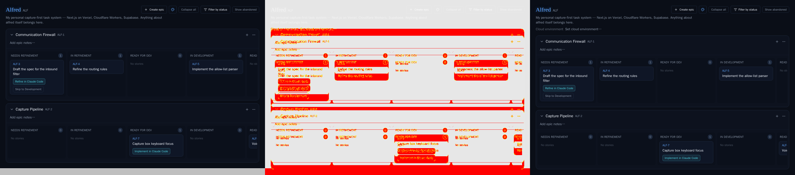

# A project's cloud environment, preselected by every launch link

*2026-10-02T19:46:41.389Z*

ALF-279. Each project can name the Claude Code cloud environment (name or `env_…` id) its sessions should start in. Every launch link (refine, implement, skip-refinement, spike, bug, epic refine/implement) then carries claude.ai/code's documented `environment` query param. A project with none set omits the param, leaving the choice to claude.ai/code as before. Everything below was driven through the running app (Playwright against the in-memory Supabase mock), with `window.open` stubbed to record the launched URLs.

**1. Board header, nothing set yet.** A labelled "Cloud environment" line sits under the project description.


**2. Editing in place**, with the same inline editor the description uses.


**3. Saved, and still there after a reload** (persisted through `PATCH /api/projects/[id]`, not just applied optimistically).


**4. The launch links.** *Refine in Claude Code* was clicked on RLP-2 before step 2 and on RLP-3 after step 3. The capture spec decoded the URL each click opened and wrote it to `launched-urls.txt` beside this doc:

```bash
cat docs/demos/project-cloud-environment/launched-urls.txt
```

```output
RLP-2, launched before an environment was set:
  repo=ac3charland/realplay
  environment=(absent)
RLP-3, launched after setting RealPlay:
  repo=ac3charland/realplay
  environment=RealPlay
```

**5. New-project dialog.** The environment can also be named at creation. It's optional, and blank means none (the key is left out of the request).


**6. The created project**, after a reload, wears the environment it was created with.


**7. Board story snapshots.** The new header line moves the Board stories down by one row (28px). Snapshot diff for `Code/Board — With description` (old · diff · new). The five Board baselines are re-approved in this PR.


