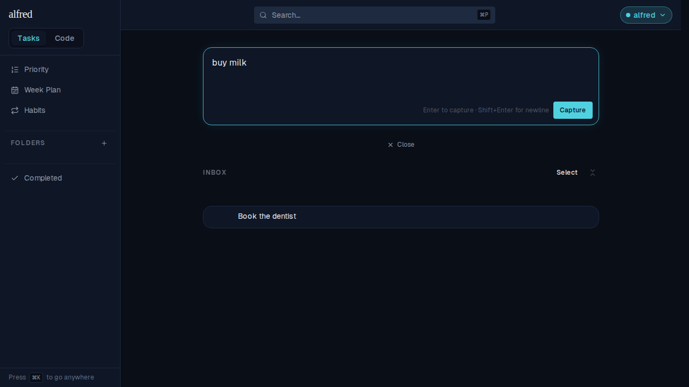
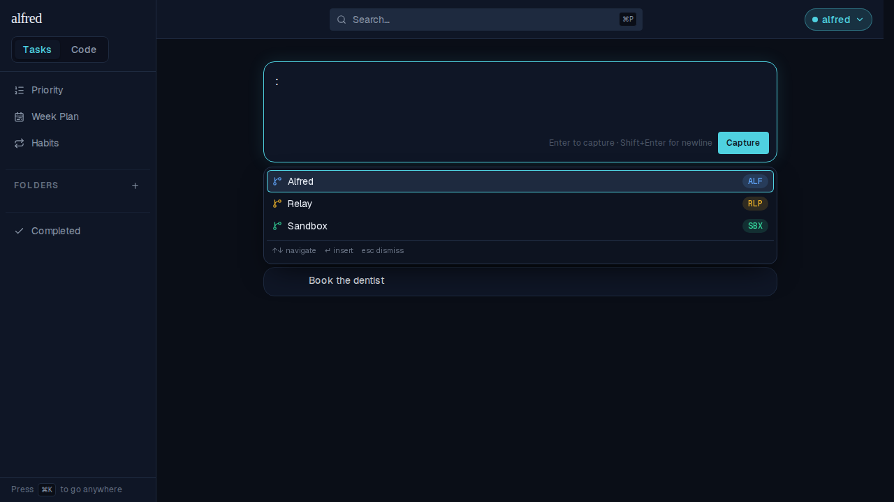
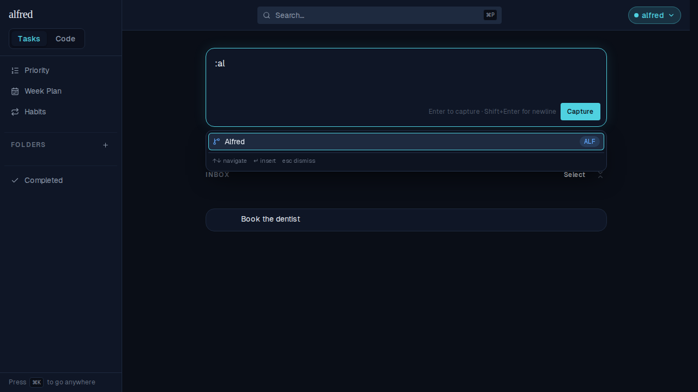
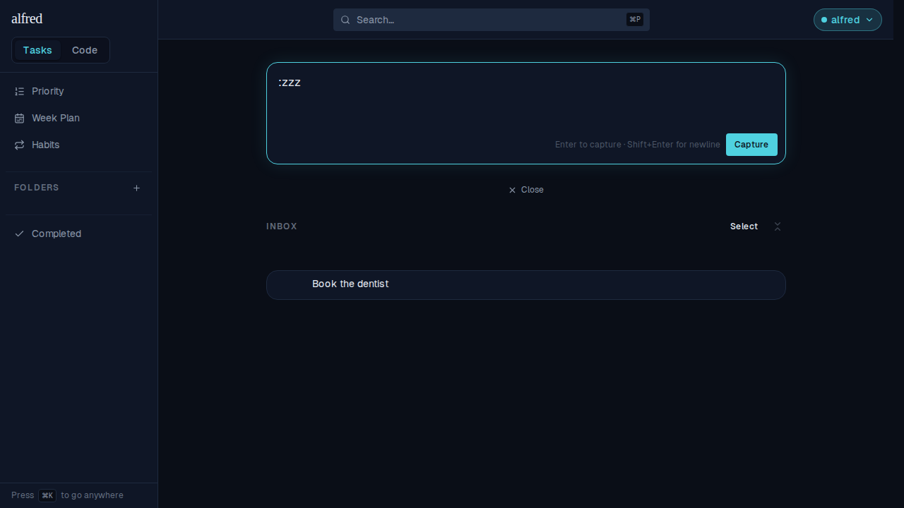
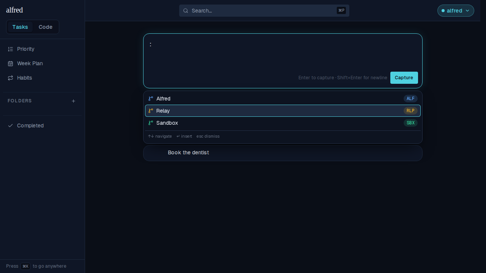
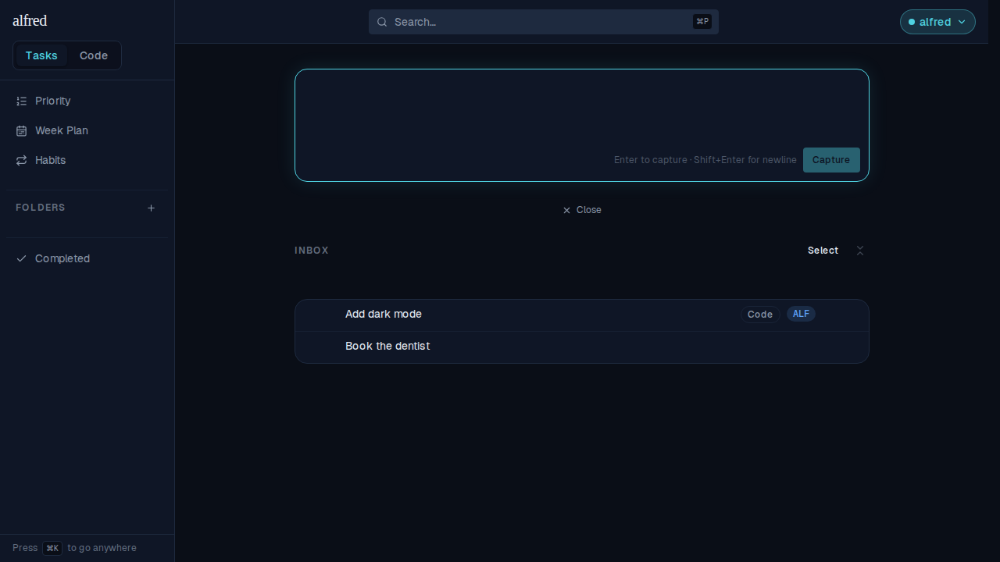
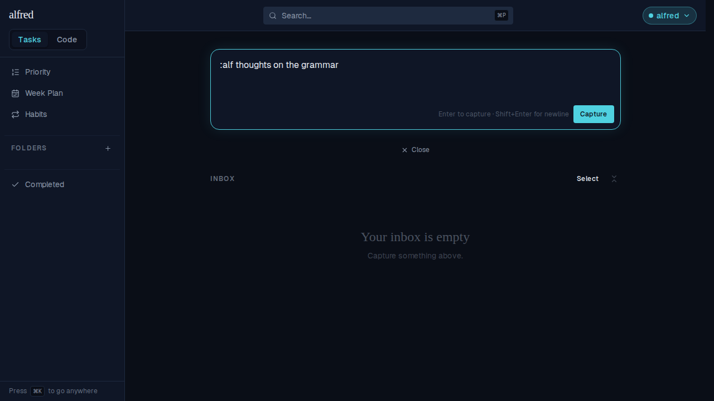
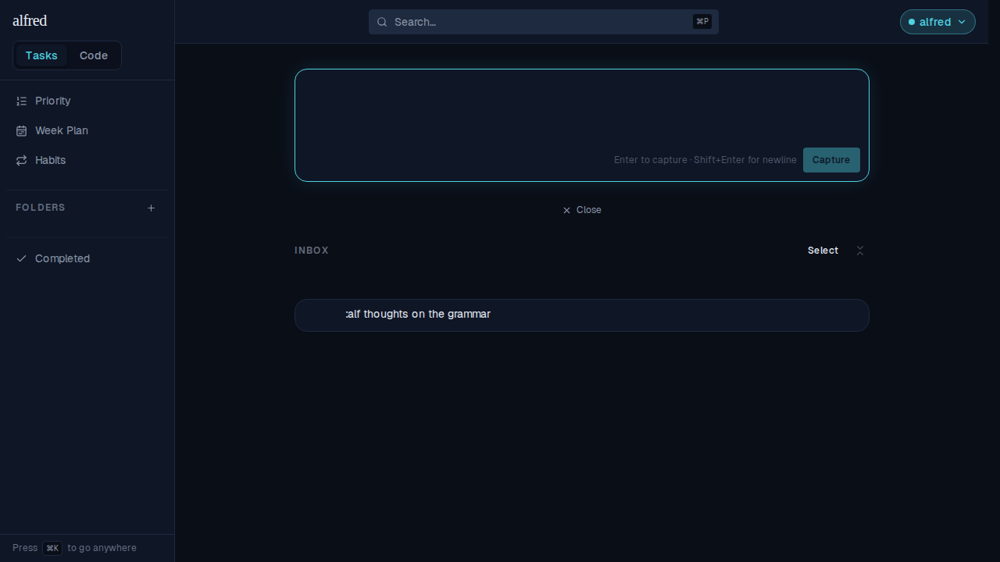
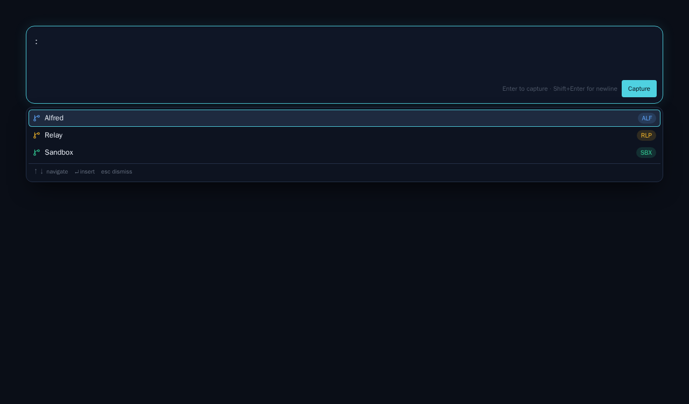

# Auto-suggest projects for code items with a leading ":"

*2026-08-06T16:16:22.664Z*

Starting an Inbox capture with a bare `:` now drops the project list under the box. Arrow to one, hit Enter, and the box becomes `ALF: ` — ready for the title. The existing prefix parse then classifies the capture exactly as it did before; this change only makes the prefix easy to *type*.

Every shot below is the real, authenticated app driven through Playwright against the in-memory Supabase mock, seeded with three projects — Alfred (`ALF`), Relay (`RLP`) and Sandbox (`SBX`).

## The cost for an ordinary capture is zero

The list opens on a **literal leading colon** and nothing else. Typing an everyday thought never summons a dropdown.

## A bare `:` lists every project

In nav order, first row active. Each row carries the project's `GitBranch` glyph in its assigned colour, its name, and its key as a tinted mono pill — the same pill the captured item ends up wearing. The footer names the three keys.

## Typing after the colon filters the list

`:al` prefixes Alfred's key, so it's the only match left. Key and name are both matched case-insensitively, prefix matches sort ahead of substring matches, and ties keep the store's order.

## A query with no matches closes the panel entirely

`:zzz` matches nothing, so there is no panel at all — not an empty one, and no "no matches" line. The list disappearing *is* the "that's not a project" signal, and it leaves the app's hero surface unobstructed. Backspacing to a matching query brings it straight back.

## Arrow keys move the active row

One press of ↓ from the full list makes Relay active — amber glyph, amber pill, teal ring. ↑/↓ clamp at both ends, and hovering a row makes it active too, so pointer and keyboard never disagree.

## Enter inserts the prefix — and captures nothing

↑ back to Alfred, then Enter. The box reads `ALF: ` with the caret at the end, focus never left the field, and the panel is gone the instant the value stops leading with a colon. Crucially the Inbox is unchanged: Enter was claimed by the list, so no half-typed `:alf` was captured. Tab and a click on a row do the same thing.

## Finishing the capture goes down the existing path

Type the title and hit Enter: the prefix parse classifies the item as **Code**, assigns Alfred, and strips the prefix — so the row reads "Add dark mode" with the Code badge and the blue `ALF` pill. Nothing new is stored on the component and nothing new is sent to the API; the box's text is the whole state.

## Escape dismisses the list without touching the text

A capture that legitimately starts with a colon isn't held hostage. Escape shuts the panel and leaves `:alf thoughts on the grammar` exactly as typed; the panel stays shut for the rest of this trigger session and re-arms once the value stops starting with a colon.

A following Enter then captures that text verbatim, as an ordinary unclassified item.

## The panel in isolation

The new Storybook story (`Tasks/CaptureBox → ProjectSuggestionsOpen`) types the colon in a play function and is locked by a committed image-snapshot baseline, so the panel's chrome and the three palette colours can't drift unnoticed.

## Where the dropdown never appears

Suggestions ride the same single `parseProjectPrefix` flag that gates the prefix parse, so the list can never appear on a surface that wouldn't honour the prefix it inserts: folder capture boxes, inline subtask boxes and the New Story dialog render a plain textbox and are untouched. It also stays shut when the project list is empty, and for any value whose colon isn't leading (`Note: buy milk`).
