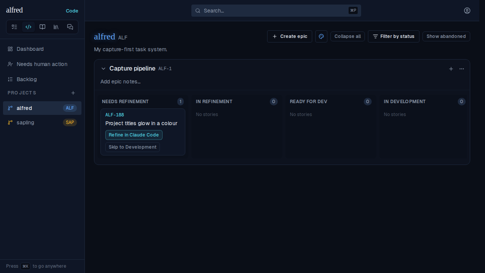
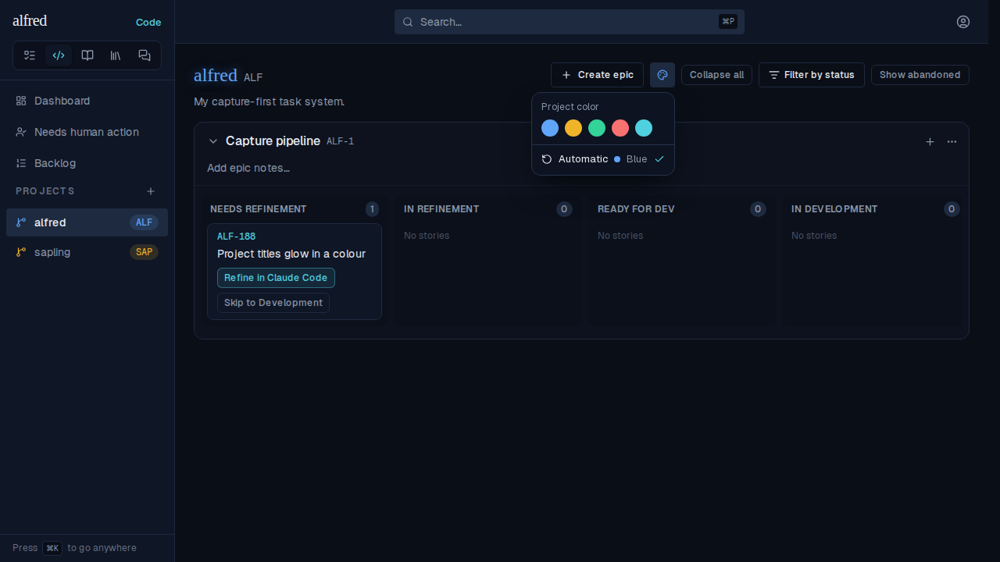
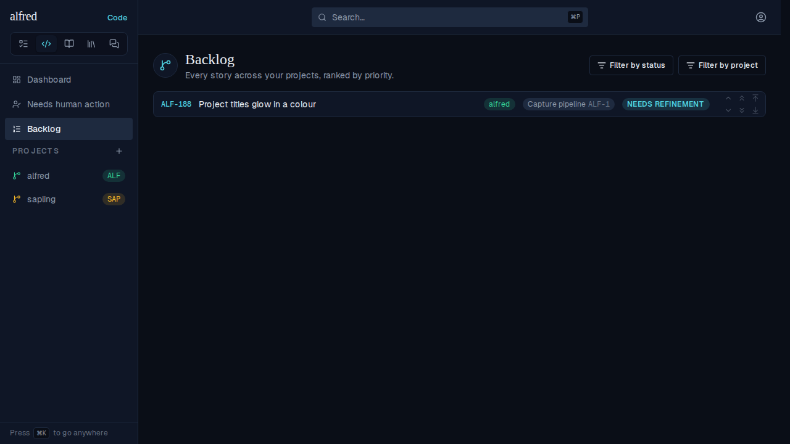
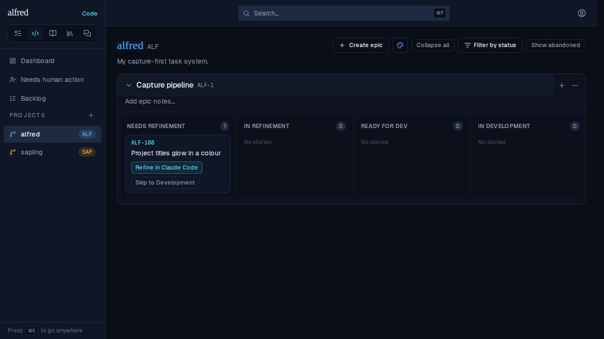
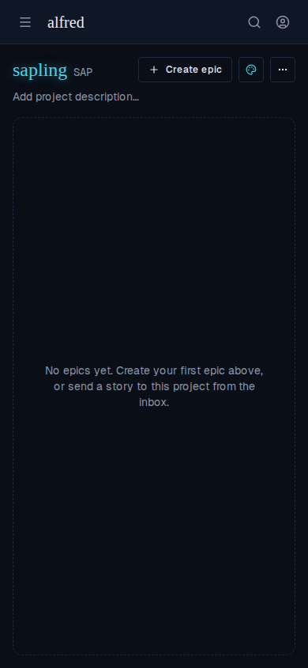

# Project titles glow in a colour you can pick

*2026-09-28T19:35:02.319Z*

A Code project board's title now glows in the project's colour, and a palette button in the board toolbar lets the owner pick that colour from the five-accent palette (or return to Automatic). The pick is stored on the project row, so it follows the project to every coloured surface and across reloads and devices. Captured through the Playwright mock-backend harness against the real app, seeded with two projects: alfred (creation slot 1 → blue) and sapling (slot 2 → amber).

**1. At rest.** No pick yet, so alfred wears its creation-slot colour: the title glows blue. The new palette button sits right after Create epic, with its glyph in the same blue. The sidebar is unchanged from before this change.

**2. Picker open.** Clicking the palette button (accessible name *Project color: Blue (automatic)*) opens the picker end-aligned below it, with the button pressed while it is open. It offers the five palette swatches and then **Automatic**, which names the slot colour it returns to (Blue). The current choice is checked.

**3. Picked green.** One click recolours the project at once (optimistic): the board title glow, the toolbar glyph, and the sidebar's branch glyph and ALF pill. sapling keeps its amber.

**4. After a reload.** The pick is persisted on `projects.color`: a full reload reads it back, and the picker now shows Green ringed and checked, with Automatic unchecked.

**5. Everywhere else it wears a colour.** The Backlog's project badge follows the pick too (it resolves through the same `projectColorFor`), and only the board title glows. Sidebar names and badges get no glow.

**6. Back to Automatic.** Picking Automatic clears the stored colour (`color: null`). After a reload, alfred is back on its creation-slot blue.

**7. Phone width.** Unlike the view filters, the palette button does not fold into the ⋯ menu. It stays inline in the toolbar row at the same 32px height. Here sapling has a teal pick.

**8. The API accepts only the palette.** PATCH /api/projects/[id], as the browser session calls it: off-palette values are a 400 before any database write, a palette key saves, and null resets to Automatic. The migration's check constraint backs this up at the database.

- `PATCH {"color":"violet"} → 400 "Invalid request body"`
- `PATCH {"color":"#ff0000"} → 400 "Invalid request body"`
- `PATCH {"color":3} → 400 "Invalid request body"`
- `PATCH {"color":"teal"} → 200 color="teal"`
- `PATCH {"color":null} → 200 color=null`
