# Reader: Send to Instapaper replaces Open

*2026-10-04T15:46:45.752Z*

The Reader row's primary verb is now **Send to Instapaper**. One press saves the post to the owner's Instapaper (through the Full API, signed OAuth 1.0a, server-side) **and** archives it. The original stays one quiet **Original ↗** link away. Everything below runs against the in-memory Supabase mock, whose `/api/1/bookmarks/add` handler stands in for Instapaper (`INSTAPAPER_API_URL`) — no real Instapaper call is made.

## Journey 1 — send from the reading list

The selected row leads with **Send to Instapaper** (`i`). With its panel open, **Original** sits in the footer beside Re-summarise (`o`). Panel-less rows (failed, pending) end their verb row with Original instead. The `(untitled)` row has no web link and no body, so its Send is disabled (title: "No link and no stored text to send.").

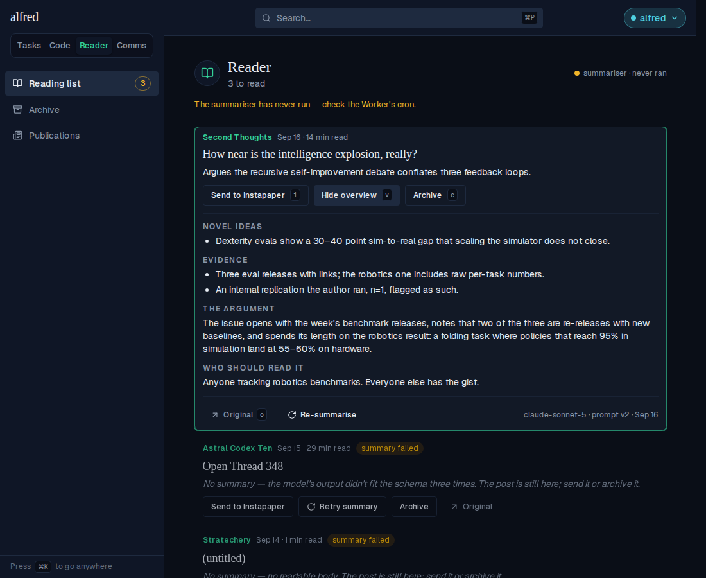

After pressing Send, the row plays the archive collapse and leaves — 2 to read.

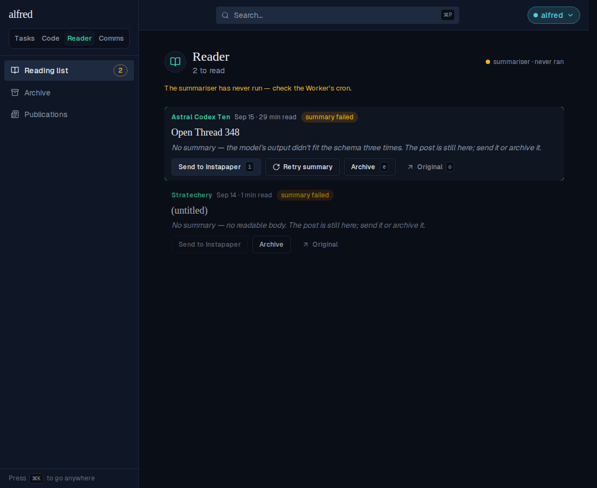

The post is now in the archive, badged **in Instapaper** (sending from here would add the badge in place, without moving the row).

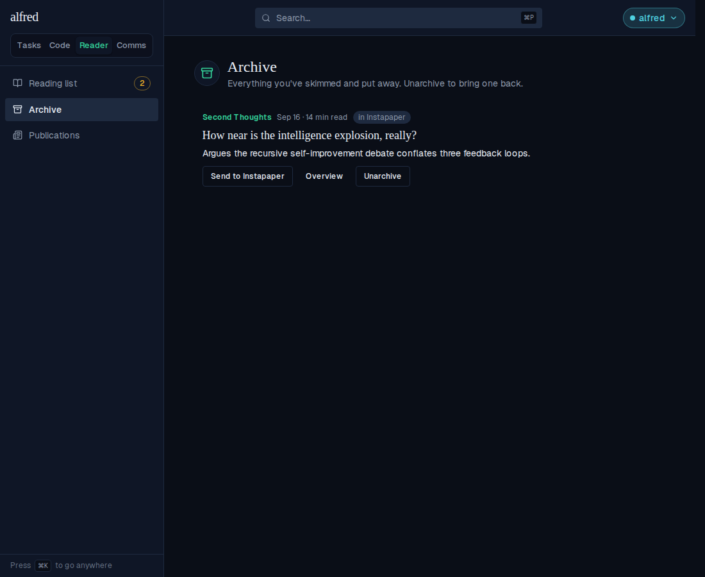

What the Instapaper stand-in recorded for that press (nonce, signature and timestamp elided), and the row stamp the route wrote back. The `content` is the email HTML kept at intake; the gist rides as `description`; no tags, no folder.

    {
      "authorization": "OAuth oauth_consumer_key=\"e2e-consumer-key\", oauth_nonce=\"…\", oauth_signature=\"…\", oauth_signature_method=\"HMAC-SHA1\", oauth_timestamp=\"…\", oauth_token=\"e2e-access-token\", oauth_version=\"1.0\"",
      "params": {
        "url": "https://secondthoughts.substack.com/p/how-near-is-the-intelligence-explosion",
        "title": "How near is the intelligence explosion, really?",
        "description": "Argues the recursive self-improvement debate conflates three feedback loops.",
        "content": "<html><body><h1>How near</h1><p>The whole post, images and all.</p></body></html>"
      },
      "row": {
        "archived_at": "<stamped>",
        "instapaper_sent_at": "<stamped>",
        "instapaper_bookmark_id": 1001
      }
    }


The route refuses a post with nothing to send (no web link, no stored body) without calling Instapaper — `POST /api/reader/posts/<untitled>/instapaper`:

    409 {"error":"Nothing to send — this post has no link and no stored text"}


## Journey 2 — a refused send

With the stand-in answering error 1221, the row comes back and the toast gives the route's sentence. (The selection had already moved on as the exit started, exactly as Archive behaves.)

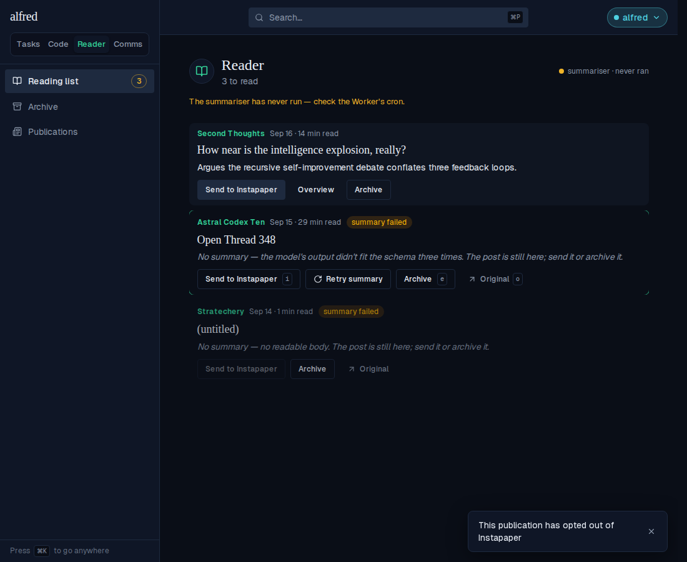

## The one-off token exchange

`npm run instapaper:token -w frontend` trades the owner's Instapaper username/password (once, by hand) for the access token pair, reusing the app's own signer. Here it runs against a throwaway local stand-in that answers like Instapaper's `oauth/access_token`; the password is read, sent, and never written anywhere.

```bash
node -e "require('http').createServer((q,r)=>{q.resume();q.on('end',()=>r.end('oauth_token=demo-token&oauth_token_secret=demo-secret'))}).listen(47124)" & M=$!; sleep 1; printf 'ck\ncs\nowner@example.com\nhunter2\n' | INSTAPAPER_API_URL=http://127.0.0.1:47124 npm run --silent instapaper:token -w frontend; kill $M
```

```output
Consumer key: Consumer secret: 
Instapaper username (email): Instapaper password: 

Set these on the deployment (server-side only), beside the consumer pair:
INSTAPAPER_ACCESS_TOKEN=demo-token
INSTAPAPER_ACCESS_TOKEN_SECRET=demo-secret
```

## The moved Storybook baselines

Each diff is the snapshot gate's own 3-panel output — old baseline | changed pixels | new render: Open → Send to Instapaper, the `i` keycap, Original ↗ at the end of panel-less rows or in the panel footer, and the "send it" copy.

`Reader/PostRow — selected-collapsed`

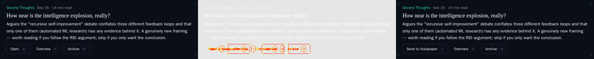

`Reader/PostRow — selected-expanded`


`Reader/PostRow — failed`

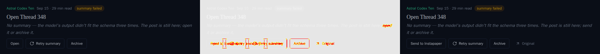

`Reader/PostRow — pending`


`Reader/PostRow — refused`

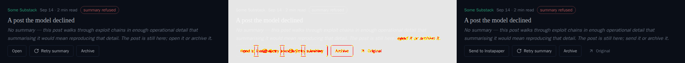

`Reader/PostRow — no-link`

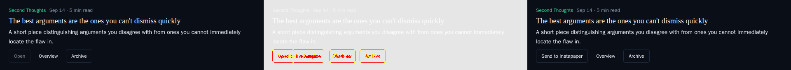

`Reader/PostRow — archived-and-selected`

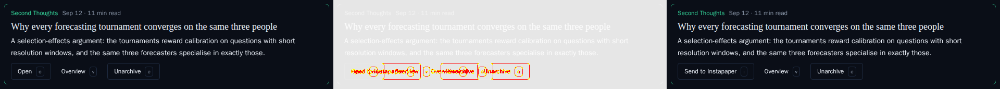

`Reader/ReadingListView — selected-collapsed`

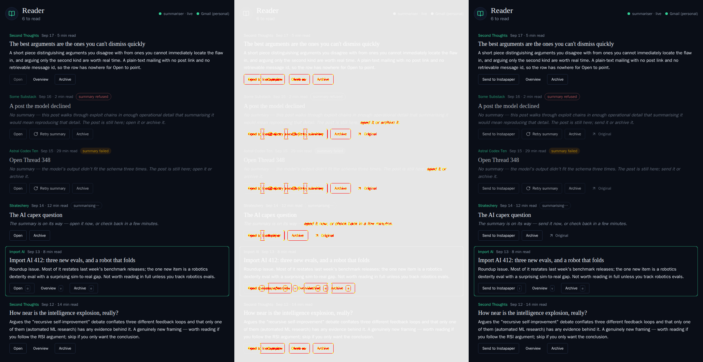

Seven more baselines changed by less than the gate's 1% threshold, so the gate passed them while they still showed **Open**; they were deleted and regenerated: PostRow done-collapsed, done-expanded, resummarising, refused-and-swept; ReadingListView populated, selected-expanded; ArchiveView populated. Before and after for done-collapsed:

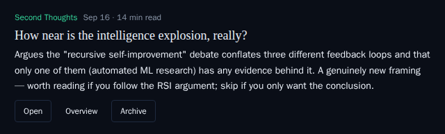

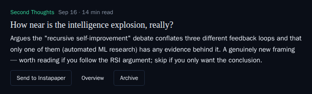

## New stories

Send disabled because there is nothing to send (no link, no body) — Original still offers the Gmail permalink:

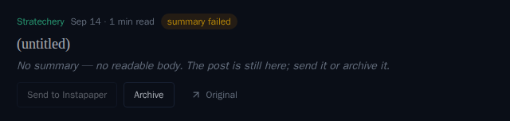

Send disabled on a deployment without Instapaper credentials (title: "Instapaper isn't set up on this deployment."):

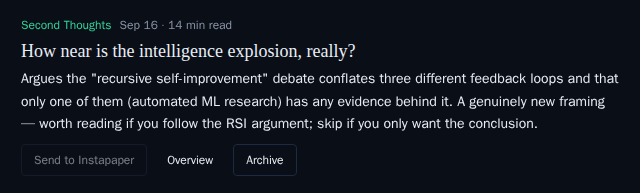

A sent post in the archive — the in Instapaper badge, Unarchive in Archive's slot:

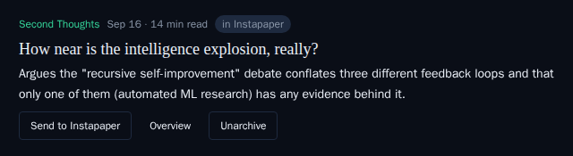

At phone width (343 px list column), the three verbs fit on one line:


The refusal toast:


## After deploy (owner)

A real send can only be proved against Instapaper itself. Once the four `INSTAPAPER_*` vars are set on the Personal instance: send one free post, one paid post and one link-less post, then confirm in Instapaper that the paid post arrived complete (not as a teaser), that the link-less one arrived as a private article, and whether the email chrome ("READ IN APP", the footer) crowds the article.
