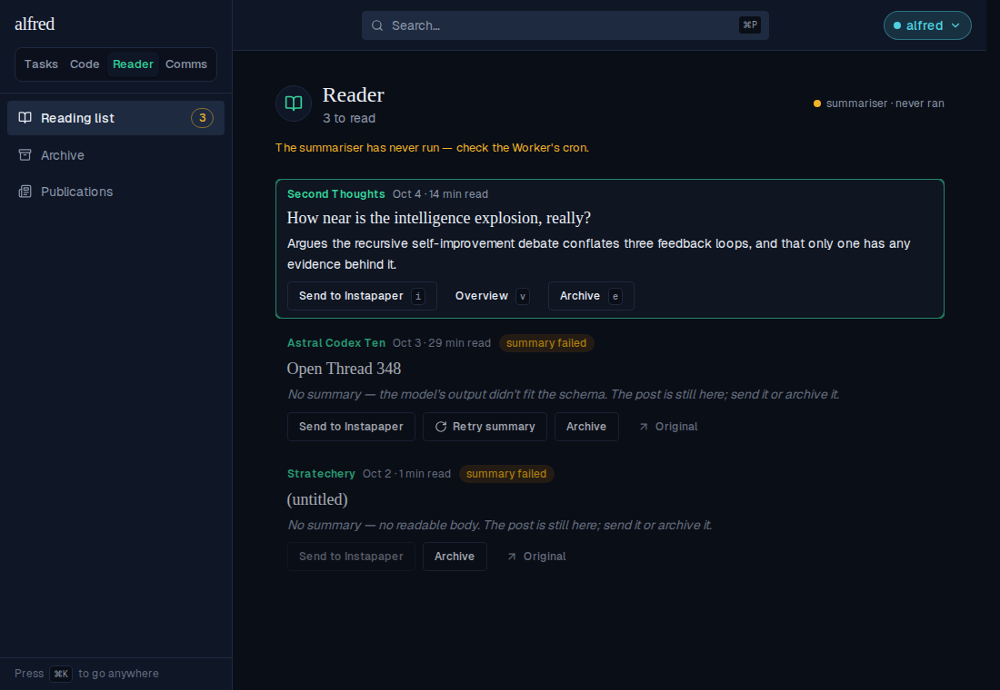
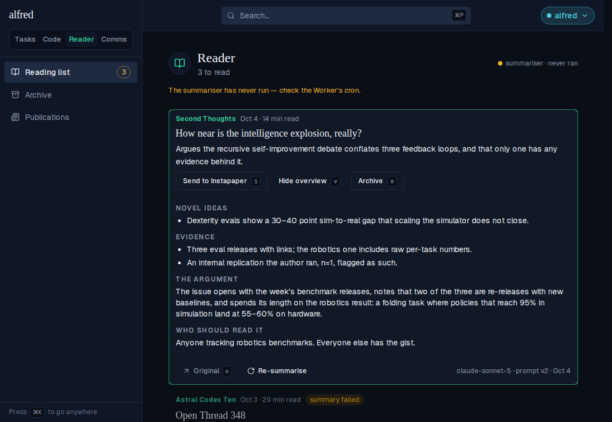
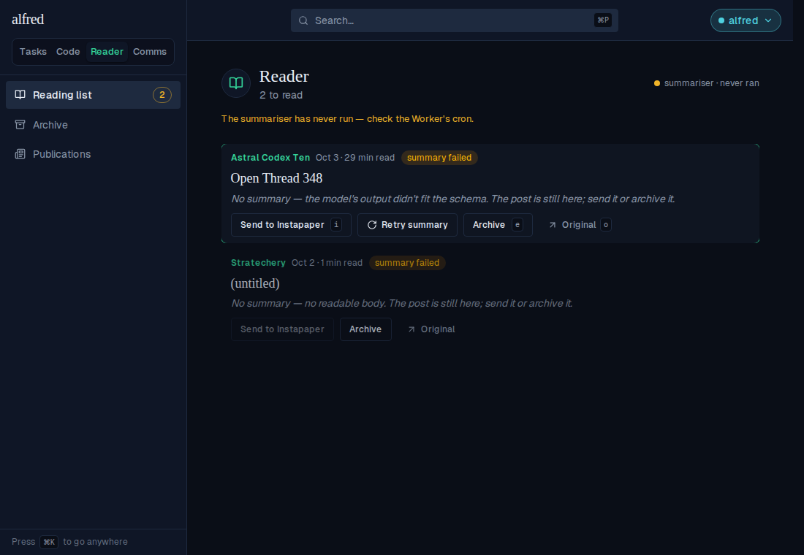
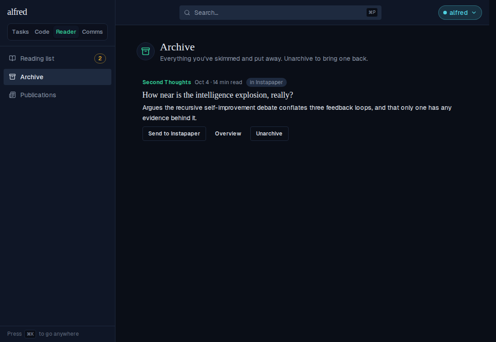
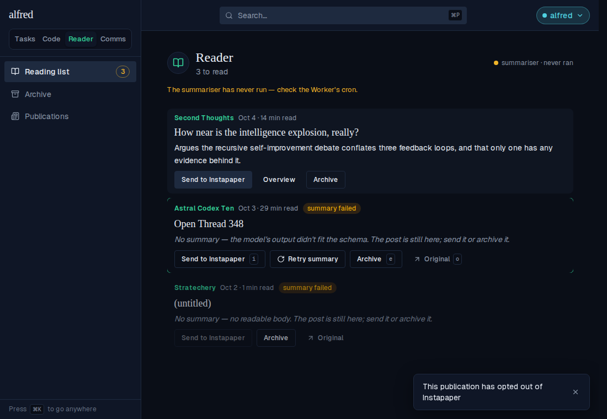
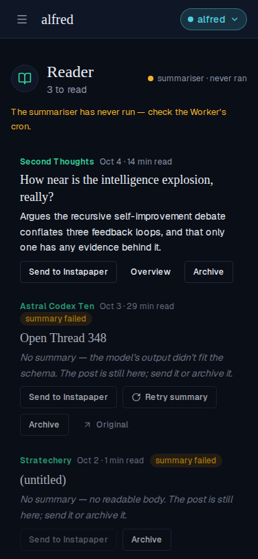
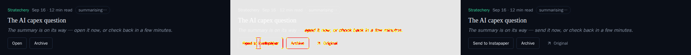
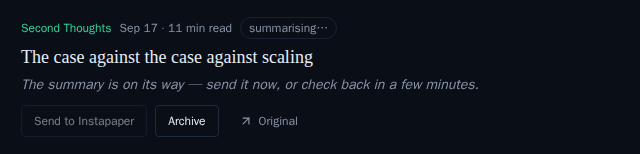

# Reader: Send to Instapaper replaces Open

*2026-10-04T15:35:18.138Z*

The Reader row's primary verb is now **Send to Instapaper**. One press saves the post to the owner's Instapaper account — signed server-side with OAuth 1.0a, carrying the post's own email HTML so a paid post arrives whole — and archives it here. The original stays one quiet **Original ↗** link away. Every shot below is the real app driven through the Playwright harness against the in-memory backend, with Instapaper's `bookmarks/add` played by the same mock (so no real Instapaper account or credential was used).

**1 · The reading list, a row selected.** Send leads the verb row with its `i` keycap. A failed or first-time pending row has no overview panel, so **Original ↗** ends its verb row instead. The bottom row has no web link and no stored text, so Send is disabled (its title says why); Original still gets the owner to the mail.



**2 · The overview open (`v`).** On a row with a panel, Original sits in the footer beside Re-summarise, with its `o` keycap now that it is visible.



**3 · `i` sends it.** The row plays Archive's exit collapse and leaves the reading list (3 → 2 to read).



**4 · It is in the archive, wearing an *in Instapaper* badge.** Send stays live there — sending from the archive adds or keeps the badge in place, with no collapse.



**What left the server for that send** — the one request the Instapaper stand-in recorded during step 3, saved as it arrived (only the per-request nonce, timestamp and signature are blanked, since they differ every time). An OAuth 1.0a header with all seven `oauth_*` fields, a form body carrying the link, the title, the gist as the description and the email HTML as `content` — no tags, no folder — and the row stamped sent and archived with the bookmark id Instapaper returned. The credentials are the E2E suite's fake ones.

```bash
cat docs/demos/reader-instapaper-send/instapaper-request.json
```

```output
{
  "requestsReceived": 1,
  "authorization": [
    "OAuth oauth_consumer_key=\"mock_instapaper_consumer_key\"",
    "oauth_nonce=\"<random>\"",
    "oauth_signature=\"<HMAC-SHA1>\"",
    "oauth_signature_method=\"HMAC-SHA1\"",
    "oauth_timestamp=\"<now>\"",
    "oauth_token=\"mock_instapaper_access_token\"",
    "oauth_version=\"1.0\""
  ],
  "contentType": "application/x-www-form-urlencoded; charset=utf-8",
  "form": {
    "title": "How near is the intelligence explosion, really?",
    "url": "https://secondthoughts.substack.com/p/how-near-is-the-intelligence-explosion",
    "content": "<html><body><h1>How near is the intelligence explosion?</h1><p>A paragraph only paying subscribers ever see.</p></body></html>",
    "description": "Argues the recursive self-improvement debate conflates three feedback loops, and that only one has any evidence behind it."
  },
  "storedRow": {
    "archived": true,
    "instapaper_sent": true,
    "instapaper_bookmark_id": 1000001
  }
}
```

**5 · A refused send.** Here the stand-in answers Instapaper's error 1221 (the publication opted out). The row comes back where it was, nothing is written to it, and the toast says why in the route's own words — never Instapaper's raw message.



**6 · At phone width (375 px).** The done row's three verbs — Send to Instapaper, Overview, Archive — still fit on one line; hints are hidden below `md`.



**Getting the credentials.** `npm run instapaper:token -w frontend` is the one-off xAuth exchange: it prompts for the app's consumer key/secret and the Instapaper login, signs `/api/1/oauth/access_token` with the same `lib/instapaper/oauth.ts` signer the app uses, prints the two token lines, and never writes the password anywhere. (Shown with `--help` only — no network call.)

```bash
npm run --silent instapaper:token -w frontend -- --help
```

```output
Usage: npm run instapaper:token -w frontend

Exchanges your Instapaper login for the OAuth access token the app signs its requests with.
Prompts for, in order:
  - the application's consumer key
  - the application's consumer secret   (hidden as you type)
  - your Instapaper username (email)
  - your Instapaper password            (hidden as you type; never stored or printed)

Prints INSTAPAPER_ACCESS_TOKEN and INSTAPAPER_ACCESS_TOKEN_SECRET for frontend/.env.local and
the deployment's environment. Set INSTAPAPER_API_URL to call somewhere other than https://www.instapaper.com.
```

## Visual snapshots — moved and new baselines

The row's committed Storybook baselines moved, so each diff below is the snapshot gate's own output (old baseline | changed pixels in red | new render), and the regenerated PNGs are committed with this doc. Shots of the remaining stale-but-under-threshold baselines (the collapsed/expanded done row, the re-summarising and swept rows, the archive and reading-list views) were regenerated the same way.

**A — a done row, selected:** Open → Send to Instapaper, keycap `o` → `i`.


**B — the same row, overview open:** Original ↗ (with `o`) joins Re-summarise in the footer.


**C — a failed row:** no panel, so Original ↗ ends the verb row; the tail now reads "send it or archive it".


**D — a first-time pending row:** "…send it now, or check back in a few minutes."



**E — Send disabled, two new stories.** No link and no stored text (title: *No link and no stored text to send.*), and a deployment with no Instapaper credentials (title: *Instapaper isn't set up on this deployment.*). Original stays the way out in both.




**F — a sent post in the archive (new story):** the *in Instapaper* badge, Unarchive in Archive's place.


**G — the refusal toast (new story).**


## After deploy (owner)

A real send can only be proved against the real service. Once the four `INSTAPAPER_*` credentials are set on the Personal instance's Vercel project (Production) and it has redeployed: send one free post, one paid post and one link-less post, then confirm in Instapaper that the paid post arrived complete rather than as the teaser, and that the link-less post arrived as a private article. Also check whether the email chrome ("READ IN APP", the footer) crowds the article. The Work instance stays unset and shows the disabled verb.
